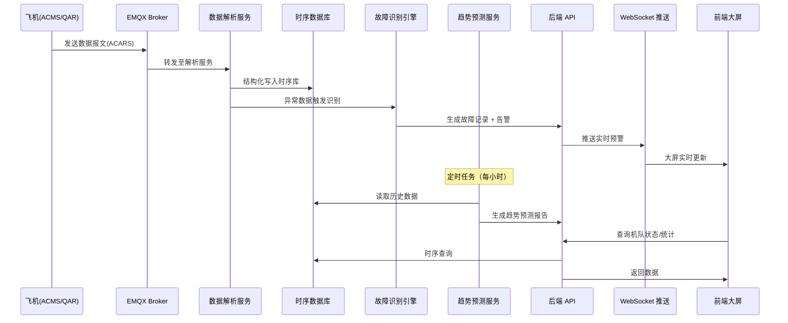
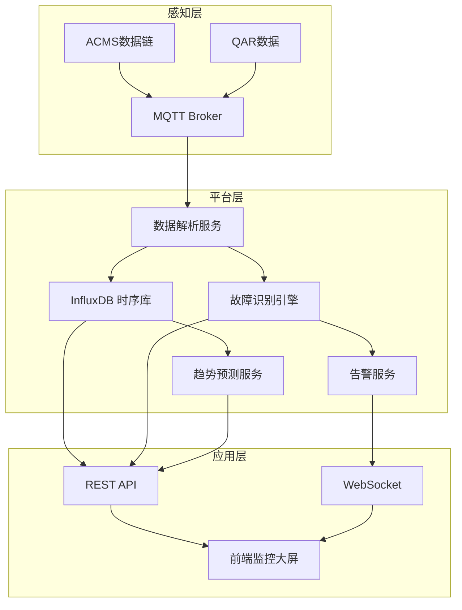

# Plan: 飞机健康管理与预测性维护

## 1. 技术选型与对比

| 方案 | 优点 | 缺点 | 选择 |
|------|------|------|------|
| 时序数据库: InfluxDB 3.0 | 生态成熟、InfluxQL 查询便捷、云原生支持 | 商业版授权费用高 | ✓ |
| 时序数据库: TDengine | 国产、高压缩比、SQL 兼容 | 生态较小、社区活跃度不如 InfluxDB | 备选 |
| 消息接入: EMQX (MQTT) | 百万级连接、规则引擎内置、集群高可用 | 企业版付费 | ✓ |
| 消息队列: Kafka | 高吞吐、事件溯源、生态丰富 | 运维复杂度稍高 | ✓ |
| AI 预测模型: Python + scikit-learn/PyTorch | 灵活、算法库丰富 | 需自建模型训练流水线 | ✓ |
| 前端实时: WebSocket (Spring WebSocket) | 与后端栈一致、实现简单 | 大规模推送需网关配合 | ✓ |
| 数据可视化: ECharts | 社区活跃、图表丰富、与 Vue 3 集成好 | 3D 能力弱（本模块不需要） | ✓ |

## 2. 阶段划分

| 里程碑 | 内容 | 交付物 | 预计工期 |
|--------|------|--------|----------|
| P1: 数据接入层 | MQTT Broker 部署 + 数据报文解析 + InfluxDB 写入 | 数据采集服务、解析器、时序存储 | 2 周 |
| P2: 故障识别引擎 | 异常检测算法 + 故障自动识别 + 告警生成 | 故障识别服务、告警模块 | 3 周 |
| P3: 趋势预测 | 预测模型训练 + 推理服务 + 报告生成 | 预测服务、报告模板 | 3 周 |
| P4: 后端 API | REST API + WebSocket 推送 + 权限集成 | 后端接口全量交付 | 2 周 |
| P5: 前端页面 | 监控大屏 + 预警管理 + 报告查看 + 统计分析 | 前端页面全量交付 | 3 周 |
| P6: 联调与验收 | 端到端联调 + 性能测试 + 安全审计 | 验收报告 | 1 周 |

## 3. 架构图 / 时序图

## 4. 风险与回滚预案

| 风险 | 影响 | 缓解 | 回滚 |
|------|------|------|------|
| ACMS 数据接入协议不明确 | P1 延期 | 提前与航空公司对接，获取报文样本；先用模拟数据开发 | 回退到模拟数据模式 |
| AI 预测模型准确率不达标 | P3 延期 | 采用渐进式策略，先上规则引擎兜底，再迭代 AI 模型 | 降级为规则引擎预警 |
| 时序数据高并发写入性能瓶颈 | 数据丢失 | InfluxDB 分片策略 + Kafka 缓冲；提前压测 | 增加 Kafka 缓冲深度 |
| WebSocket 大规模推送不稳定 | 前端实时性下降 | 引入 API Gateway 管理连接；降级为轮询 | 切换为 30s 轮询模式 |

## 5. 测试策略

- 单元测试：数据解析器（各类报文格式）、故障识别规则、预警阈值计算
- 集成测试：MQTT→解析→InfluxDB 写入链路；API→数据库查询；WebSocket 推送
- 端到端：模拟飞机数据源→全链路→前端大屏显示（含预警触发）
- 性能测试：InfluxDB 并发写入 ≥ 1000 points/s；API P95 < 2s
- 安全测试：TLS 传输验证；权限隔离验证

## 6. 关联 ADR

- ADR-004: MRO 数据架构 — 时序数据存储选型依据
- ADR-005: MRO 技术栈扩展 — MQTT/Kafka/InfluxDB 选型依据
