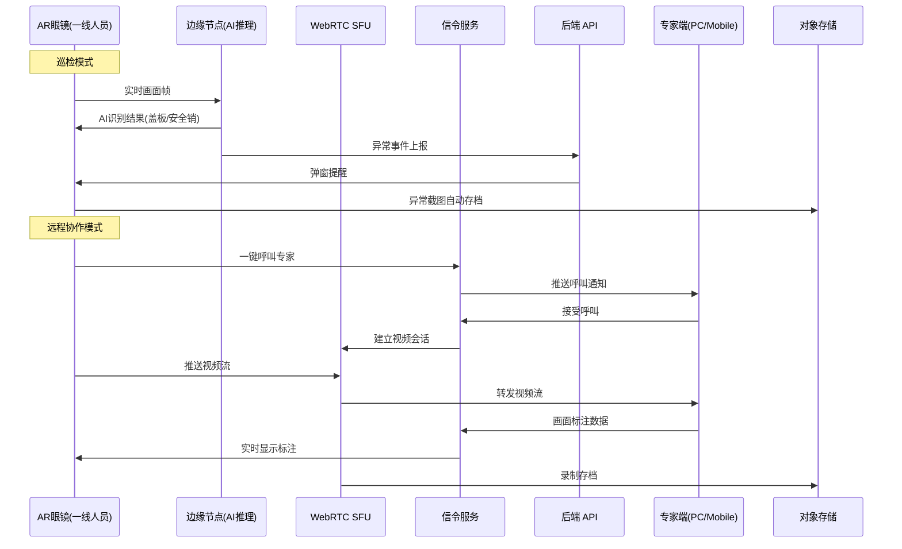

# Plan: AR智慧维修协作平台

## 1. 技术选型与对比

| 方案 | 优点 | 缺点 | 选择 |
|------|------|------|------|
| 视频协作: WebRTC + SFU (mediasoup) | 低延迟、P2P 优先、开源 | SFU 需自建运维 | ✓ |
| 视频协作: 第三方 SDK (声网/腾讯云) | 开箱即用、全球加速 | 费用按分钟计、数据出境风险 | 备选 |
| AI 视觉识别: YOLOv8 + 自定义训练 | 检测速度快、适合实时场景 | 需采集大量航空标注数据 | ✓ |
| AI 部署: 边缘推理 (Jetson) | 低延迟、不依赖网络 | 算力有限、模型更新需 OTA | ✓ |
| AR 信令: WebSocket | 与后端栈一致、实现简单 | — | ✓ |
| 影像存储: MinIO (对象存储) | 私有化部署、S3 兼容 | 需运维 | ✓ |
| 前端画面标注: Canvas + WebSocket 同步 | 实时性好、实现灵活 | 需处理多端同步一致性 | ✓ |

## 2. 阶段划分

| 里程碑 | 内容 | 交付物 | 预计工期 |
|--------|------|--------|----------|
| P1: AR 基础设施 | WebRTC SFU 部署 + 信令服务 + MinIO 存储 | 视频通信基础、存储服务 | 2 周 |
| P2: AI 视觉识别 | 数据标注 + YOLOv8 训练 + 边缘推理部署 | AI 模型、推理服务 | 4 周 |
| P3: 巡检引导 | 巡检路径模板 + AR 叠加引导 + 异常检测联动 | 巡检任务模块 | 3 周 |
| P4: 远程协作 | 一键呼叫 + 多方视频 + 画面标注 + 手册推送 | 远程协作全功能 | 3 周 |
| P5: 后端 API + 前端管理 | REST API + 影像回放 + 管理后台 | 后端接口 + 管理页面 | 2 周 |
| P6: 联调与验收 | AR 眼镜端联调 + 性能/安全测试 | 验收报告 | 2 周 |

## 3. 架构图 / 时序图



```mermaid
graph TB
    subgraph AR眼镜端
        A[摄像头] --> B[AI推理(边缘)]
        A --> C[视频编码]
        B --> D[AR叠加渲染]
    end
    subgraph 通信层
        C --> E[WebRTC SFU]
        F[信令服务WebSocket] --> E
    end
    subgraph 平台层
        E --> G[录像服务]
        G --> H[MinIO对象存储]
        I[后端API] --> H
        I --> J[MySQL业务数据]
    end
    subgraph 专家端
        E --> K[专家视频窗口]
        F --> L[标注工具]
    end
```

## 4. 风险与回滚预案

| 风险 | 影响 | 缓解 | 回滚 |
|------|------|------|------|
| AR 眼镜 SDK 不兼容 | P3/P4 延期 | 提前获取开发者版本验证；预留抽象层 | 降级为手机/平板 AR 模式 |
| AI 识别准确率不足 | 误报/漏报多 | 渐进式上线：先辅助模式（人工确认），再自动模式 | 关闭自动检测，保留人工巡检+录像 |
| 5G 网络覆盖不足 | 视频卡顿/中断 | WiFi 6 备份网络；本地缓存录像后同步 | 降级为离线录制+事后回传 |
| WebRTC 延迟超标 (>500ms) | 远程协作体验差 | SFU 部署于同局域网/边缘机房；码率自适应 | 降级为异步标注（截图标注后推送） |

## 5. 测试策略

- 单元测试：信令协议处理、标注数据编解码、AI 模型推理结果解析
- 集成测试：WebRTC 连通性、SFU 多方转发、MinIO 存储/回放链路
- 端到端：AR 眼镜→AI 识别→异常上报→弹窗；一键呼叫→视频→标注→录像
- 性能测试：视频推流延迟 ≤ 500ms；AI 识别 ≤ 1s
- 兼容性测试：多品牌 AR 眼镜验证（如有）；专家端 Chrome/移动端验证

## 6. 关联 ADR

- ADR-005: MRO 技术栈扩展 — WebRTC/边缘计算/AR SDK 选型依据
