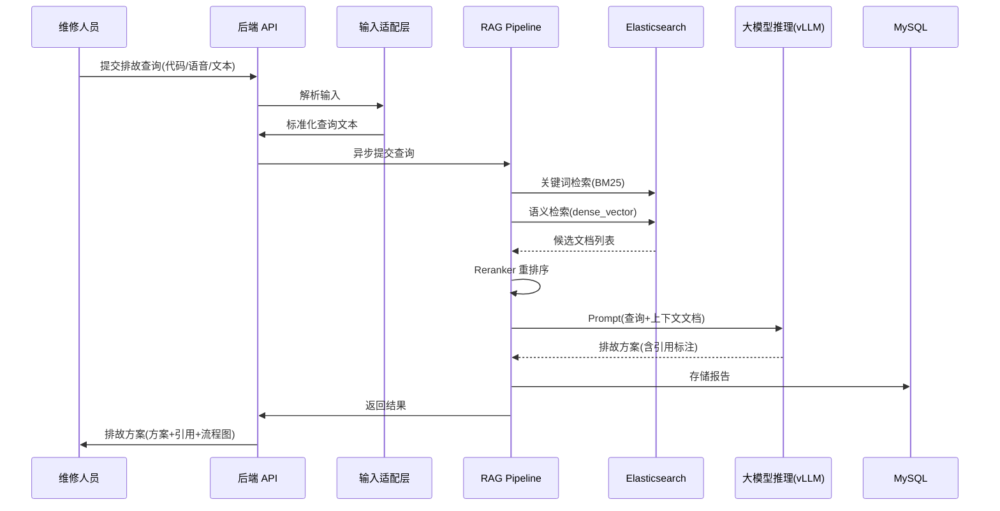
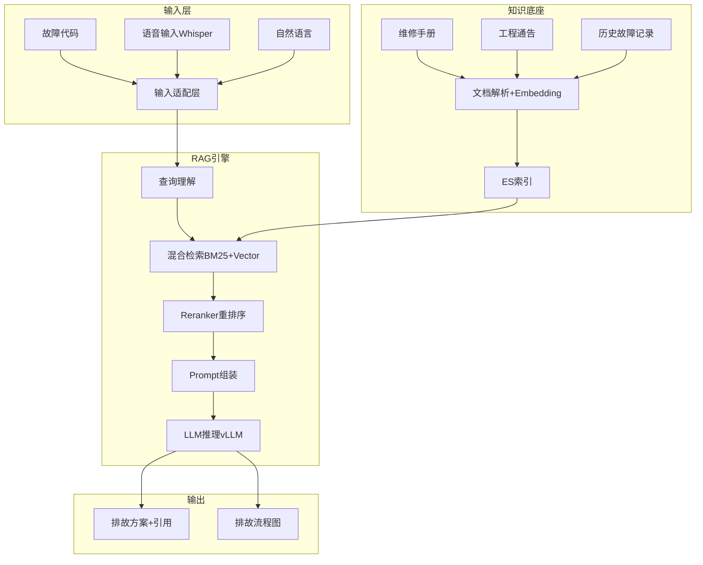

# Plan: 智能排故助手

## 1. 技术选型与对比

| 方案 | 优点 | 缺点 | 选择 |
|------|------|------|------|
| LLM 推理: vLLM | 高吞吐批量推理、PagedAttention 内存优化 | 需 GPU 资源 | ✓ |
| LLM 推理: Ollama | 部署简单 | 不适合生产级高并发 | 开发环境 |
| RAG 检索: ES dense_vector + BM25 混合 | 复用已有 ES 集群、关键词+语义双路 | 向量维度有限 | ✓ |
| RAG 检索: Milvus | 专用向量库、性能更优 | 新增运维组件 | 备选 |
| Embedding 模型: BGE-large-zh | 中文语义效果好、开源免费 | 需 GPU 生成 embedding | ✓ |
| 工作流编排: LangChain | RAG Pipeline 成熟、社区活跃 | Python 生态，需桥接 Java 后端 | ✓ |
| 语音输入: Whisper (本地部署) | 离线可用、中文识别准确率高 | 需额外 GPU 资源 | ✓ |

## 2. 阶段划分

| 里程碑 | 内容 | 交付物 | 预计工期 |
|--------|------|--------|----------|
| P1: 知识库基础 | ES 向量索引配置 + 文档解析 + embedding 生成 | 知识库管理服务 | 3 周 |
| P2: RAG Pipeline | 混合检索 + Reranker + Prompt 模板 + LLM 调用 | 排故推理服务 | 3 周 |
| P3: 排故工作流 | 异步查询 + 方案生成 + 引用标注 + 流程图 | 完整排故链路 | 2 周 |
| P4: 多输入支持 | 语音识别(Whisper) + 故障代码解析 + 自然语言理解 | 多输入适配层 | 2 周 |
| P5: 后端 API + 前端 | REST API + 排故界面 + 历史统计 | 全功能交付 | 3 周 |
| P6: 联调与验收 | 多机型知识库验证 + 性能 + 准确率评估 | 验收报告 | 2 周 |

## 3. 架构图 / 时序图

## 4. 风险与回滚预案

| 风险 | 影响 | 缓解 | 回滚 |
|------|------|------|------|
| LLM 幻觉导致错误方案 | 安全风险 | 强制引用标注、置信度低于阈值时标记"仅供参考" | 降级为纯检索模式（不经 LLM） |
| 3 分钟内无法完成推理 | 体验差 | 流式输出（SSE）+ 异步通知；优化 Prompt 长度 | 返回 Top-K 检索结果（无 LLM 总结） |
| 知识库数据质量不佳 | 方案质量低 | 文档预处理管线（去重/去噪/分段）+ 人工审核机制 | 标记低质量知识库为"待验证" |
| GPU 资源不足 | 并发受限 | vLLM 动态批处理 + 队列排队机制 | 降级为小模型或 API 调用 |

## 5. 测试策略

- 单元测试：文档解析器（各格式）、Embedding 生成、Prompt 模板渲染、引用提取器
- 集成测试：知识库上传→向量化→检索链路；查询→RAG→结果生成
- 端到端：多种输入方式→排故方案生成→引用验证→导出
- 准确率评估：构建测试集（已知故障+正确方案），评估 Top-1/Top-3 命中率
- 性能测试：方案生成时间 ≤ 3min；并发查询 ≥ 10 同时

## 6. 关联 ADR

- ADR-004: MRO 数据架构 — 知识库向量存储 + 结构化维修记录选型
- ADR-005: MRO 技术栈扩展 — vLLM/ES/RAG 技术选型
