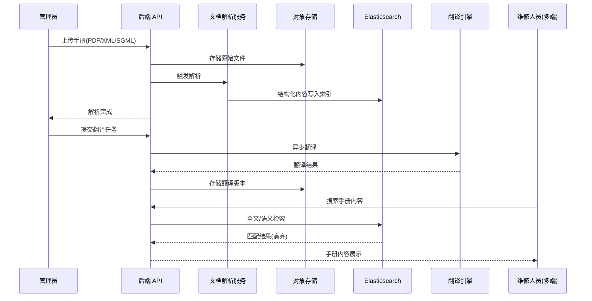
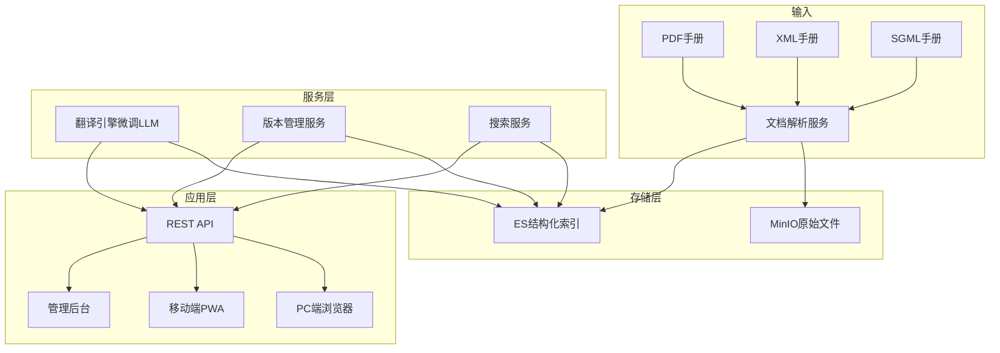

# Plan: 智慧维修手册管理

## 1. 技术选型与对比

| 方案 | 优点 | 缺点 | 选择 |
|------|------|------|------|
| 文档解析: Apache Tika + 自定义 SGML 解析器 | 支持多格式、Java 生态一致 | SGML 需定制 DTD 适配 | ✓ |
| 全文搜索: Elasticsearch | BM25 + 语义检索、高亮、分页成熟 | 内存开销大 | ✓ |
| 翻译引擎: 微调 LLM (航空双语语料) | 领域准确率高、可离线部署 | 需 GPU + 训练投入 | ✓ |
| 翻译引擎: 通用翻译 API (Google/DeepL) | 开箱即用 | 航空术语准确率不足、数据出境风险 | 备选 |
| 文件存储: MinIO | S3 兼容、私有化 | 需运维 | ✓ |
| 多端适配: 响应式 Web + PWA | 一套代码多端、离线缓存能力 | iOS 限制较多 | ✓ |
| 版本管理: Git-like diff | 修订历史可视化、变更追踪 | 实现复杂度稍高 | ✓ |

## 2. 阶段划分

| 里程碑 | 内容 | 交付物 | 预计工期 |
|--------|------|--------|----------|
| P1: 文档解析引擎 | PDF/XML/SGML 解析 + 结构化存储 + MinIO | 解析服务、存储方案 | 3 周 |
| P2: 搜索与索引 | ES 全文索引 + 语义检索 + 搜索 API | 搜索服务 | 2 周 |
| P3: 翻译引擎 | 领域微调模型训练 + 翻译任务服务 | 翻译服务 | 3 周 |
| P4: 版本管理 | 客户化修订 + 版本历史 + diff 对比 | 版本管理模块 | 2 周 |
| P5: 后端 API + 前端 | REST API + PC/移动端手册浏览 + 管理后台 | 全功能交付 | 3 周 |
| P6: 联调与验收 | 系统对接(工卡/健康管理) + 翻译评估 + 性能测试 | 验收报告 | 2 周 |

## 3. 架构图 / 时序图

## 4. 风险与回滚预案

| 风险 | 影响 | 缓解 | 回滚 |
|------|------|------|------|
| SGML 格式 DTD 差异大 | P1 延期 | 提前获取主要厂商 SGML 样本；先支持 PDF/XML，SGML 渐进添加 | 暂不支持 SGML，提供人工上传 |
| 翻译准确率不达 95% | 质量不合格 | 迭代训练 + 人工校对反馈闭环 | 降级为标注"机翻仅供参考" |
| 移动端离线手册过大 | 存储/流量问题 | 按章节粒度缓存 + 用户选择性下载 | 仅在线浏览，取消离线功能 |
| 手册版权合规风险 | 法律风险 | 仅存储已授权手册；翻译结果标注"内部使用" | 停止对外分发功能 |

## 5. 测试策略

- 单元测试：各格式解析器（PDF/XML/SGML 边界 case）、翻译质量评分器、版本 diff 算法
- 集成测试：上传→解析→ES 索引链路；翻译任务全流程；搜索→高亮→返回
- 端到端：管理员上传→解析→翻译→发布→用户多端检索浏览
- 翻译评估：构建评测集（100 组），BLEU ≥ 0.85 + 人工抽检术语准确率 ≥ 95%
- 性能测试：搜索响应 ≤ 2s；解析 100 页 PDF ≤ 60s

## 6. 关联 ADR

- ADR-005: MRO 技术栈扩展 — ES/LLM/MinIO 选型依据
