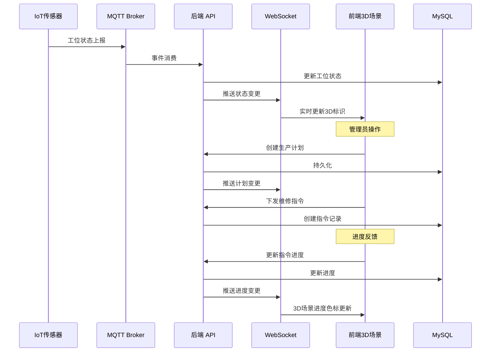
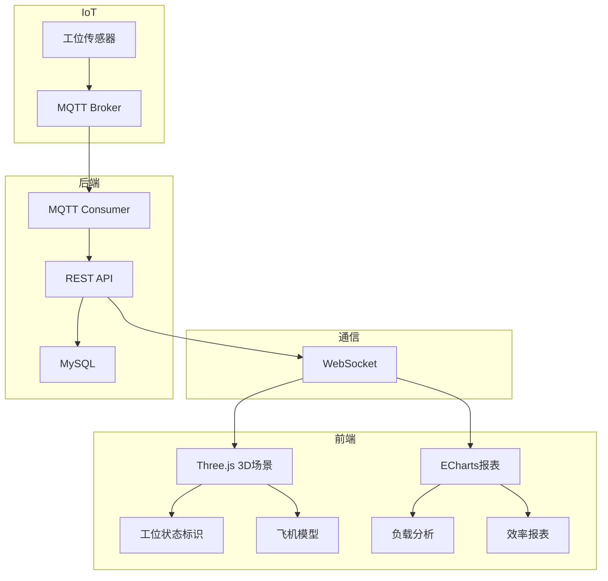

# Plan: 数字孪生机库管理

## 1. 技术选型与对比

| 方案 | 优点 | 缺点 | 选择 |
|------|------|------|------|
| 3D 引擎: Three.js | 社区大、Vue 3 集成案例多、轻量 | 大场景需手动优化 LOD | ✓ |
| 3D 引擎: Babylon.js | 内置物理引擎、PBR 渲染优秀 | 社区较 Three.js 小 | 备选 |
| 3D 模型格式: glTF 2.0 | Web 标准、压缩高效、Three.js 原生支持 | 需从建模软件导出 | ✓ |
| 实时推送: WebSocket | 与后端栈一致、双向通信 | 大量连接需网关 | ✓ |
| IoT 数据接入: MQTT→Kafka→API | 复用已有 IoT 中台架构 | 链路稍长 | ✓ |
| 前端状态管理: Pinia | Vue 3 官方推荐、响应式 | — | ✓ |
| 数据可视化: ECharts + Three.js 内嵌 | 2D 图表+3D 场景融合 | 需处理渲染层协调 | ✓ |

## 2. 阶段划分

| 里程碑 | 内容 | 交付物 | 预计工期 |
|--------|------|--------|----------|
| P1: 3D 基础框架 | Three.js 场景搭建 + glTF 模型加载 + 相机控制 | 3D 可视化基础框架 | 2 周 |
| P2: 机库数据模型 | 工位/计划/指令数据建模 + CRUD API | 业务数据层 | 2 周 |
| P3: 实时数据映射 | WebSocket 推送 + 工位状态实时更新 + 3D 标识联动 | 实时同步模块 | 2 周 |
| P4: 生产计划管理 | 计划编排 + 指令下发 + 进度反馈 + 归档 | 生产管理全流程 | 3 周 |
| P5: 可视化分析 | 工位负载分析 + 维修效率 + ECharts 报表 | 数据分析模块 | 2 周 |
| P6: 联调与验收 | IoT 数据接入联调 + 性能优化 + 测试 | 验收报告 | 2 周 |

## 3. 架构图 / 时序图





## 4. 风险与回滚预案

| 风险 | 影响 | 缓解 | 回滚 |
|------|------|------|------|
| 3D 大场景渲染性能差 | 前端卡顿 | LOD 分级 + 模型轻量化(Draco压缩) + 视锥剔除 | 降级为 2D 平面图模式 |
| glTF 模型制作周期长 | P1 延期 | 先用简化模型开发，精细模型后续替换 | 使用占位符方块代替 |
| IoT 传感器部署困难 | 实时数据缺失 | 预留人工上报入口；先用模拟数据开发 | 纯人工上报模式 |
| WebSocket 大量连接不稳定 | 推送丢失 | 心跳检测 + 断线重连 + 消息序号校验 | 降级为 30s 轮询 |

## 5. 测试策略

- 单元测试：3D 坐标计算、生产计划状态机、指令分配逻辑
- 集成测试：MQTT→API→WebSocket→前端更新链路；计划→指令→进度全流程
- 端到端：IoT 模拟→工位状态变更→3D 场景实时更新；管理员全流程操作
- 性能测试：3D 首屏加载 ≤ 5s；WebSocket 推送延迟 ≤ 5s；50 工位同时更新无卡顿
- 兼容性测试：Chrome/Edge/Firefox WebGL 渲染验证

## 6. 关联 ADR

- ADR-004: MRO 数据架构 — IoT 数据接入与存储策略
- ADR-005: MRO 技术栈扩展 — Three.js/MQTT/边缘计算选型

---

## 7. v1.1.0 增量实施计划 — 任务包管理 / 人员排班 / 运营看板 (FR-6/7/8)

> **For agentic workers:** REQUIRED SUB-SKILL: Use superpowers:subagent-driven-development (recommended) or superpowers:executing-plans to implement this plan task-by-task. Steps use checkbox (`- [ ]`) syntax for tracking.

**Goal:** 在 digital-twin-service 中新增任务包管理、人员排班、运营看板三个子模块，通过 manage-web 暴露 6 个 REST 接口。

**Architecture:** `DtwinController`（manage-web）→ `@DubboReference DtwinDubboService`（digital-twin-service）→ Service 层 → MySQL `task_package` / `personnel_assignment` 表。运营看板聚合多表数据，每30秒前端轮询刷新。

**Tech Stack:** Java 21 records, Spring Boot 3, Dubbo 3, MyBatis-Plus, MySQL 8, Flyway

### 文件清单

| 角色 | 路径 |
|------|------|
| DB 迁移 | `digital-twin-service/src/main/resources/db/migration/V005_01__add_task_package_assignment.sql` |
| Entity × 2 | `digital-twin-service/src/.../entity/{TaskPackage,PersonnelAssignment}.java` |
| Mapper × 2 | `digital-twin-service/src/.../mapper/{TaskPackageMapper,PersonnelAssignmentMapper}.java` |
| DTO records | `digital-twin-service/src/.../dto/{TaskPackageDTO,CreateTaskPackageCommand,TaskPackageQueryParam,PersonnelAssignmentDTO,SaveAssignmentCommand,AssignmentQueryParam,OperationDashboardDTO,BayStatusDTO,DashboardAlertDTO}.java` |
| Service × 2 | `digital-twin-service/src/.../service/{TaskPackageService,PersonnelAssignmentService}.java` |
| Dubbo接口扩展 | `digital-twin-service/src/.../api/DtwinDubboService.java` |
| Dubbo实现扩展 | `digital-twin-service/src/.../dubbo/DtwinDubboServiceImpl.java` |
| Controller新增方法 | `manage-web/src/.../controller/DtwinController.java` |
| 单元测试 | `digital-twin-service/src/test/.../service/{TaskPackageServiceTest,PersonnelAssignmentServiceTest}.java` |
| Controller测试 | `manage-web/src/test/.../controller/DtwinControllerV11Test.java` |

---

### Task 1: DB 迁移 — task_package + personnel_assignment 表

**Files:**
- Create: `digital-twin-service/src/main/resources/db/migration/V005_01__add_task_package_assignment.sql`

- [ ] **Step 1: 编写 DDL**

```sql
CREATE TABLE IF NOT EXISTS `task_package` (
  `id`         BIGINT        NOT NULL AUTO_INCREMENT COMMENT '任务包 ID',
  `plan_id`    BIGINT        NOT NULL                COMMENT '关联生产计划',
  `name`       VARCHAR(128)  NOT NULL                COMMENT '任务包名称',
  `priority`   ENUM('high','normal','low') NOT NULL DEFAULT 'normal',
  `status`     ENUM('pending','executing','completed') NOT NULL DEFAULT 'pending',
  `created_at` DATETIME(3)   NOT NULL DEFAULT CURRENT_TIMESTAMP(3),
  PRIMARY KEY (`id`),
  INDEX `idx_plan_id` (`plan_id`),
  INDEX `idx_status` (`status`)
) ENGINE=InnoDB DEFAULT CHARSET=utf8mb4 COMMENT='任务包';

CREATE TABLE IF NOT EXISTS `task_package_order` (
  `task_package_id` BIGINT NOT NULL,
  `order_id`        BIGINT NOT NULL,
  PRIMARY KEY (`task_package_id`, `order_id`)
) ENGINE=InnoDB DEFAULT CHARSET=utf8mb4 COMMENT='任务包-维修指令关联';

CREATE TABLE IF NOT EXISTS `personnel_assignment` (
  `id`             BIGINT      NOT NULL AUTO_INCREMENT COMMENT '排班记录 ID',
  `workstation_id` BIGINT      NOT NULL                COMMENT '关联工位',
  `user_id`        BIGINT      NOT NULL                COMMENT '人员',
  `shift`          ENUM('day','evening','night') NOT NULL,
  `shift_date`     DATE        NOT NULL                COMMENT '排班日期',
  `status`         ENUM('scheduled','on_duty','off_duty') NOT NULL DEFAULT 'scheduled',
  PRIMARY KEY (`id`),
  UNIQUE KEY `uk_station_user_shift_date` (`workstation_id`,`user_id`,`shift`,`shift_date`),
  INDEX `idx_workstation_date` (`workstation_id`,`shift_date`)
) ENGINE=InnoDB DEFAULT CHARSET=utf8mb4 COMMENT='人员工位排班';
```

- [ ] **Step 2: 执行迁移**

```bash
mvn flyway:migrate -pl digital-twin-service
```

预期: `Successfully applied 1 migration`

- [ ] **Step 3: Commit**

```bash
git add digital-twin-service/src/main/resources/db/migration/V005_01__add_task_package_assignment.sql
git commit -m "feat(dtwin): add task_package and personnel_assignment DDL

Refs: MRO-005"
```

---

### Task 2: Entity + Mapper + DTO Records

**Files:**
- Create: `digital-twin-service/src/.../entity/TaskPackage.java`
- Create: `digital-twin-service/src/.../entity/PersonnelAssignment.java`
- Create: `digital-twin-service/src/.../mapper/TaskPackageMapper.java`
- Create: `digital-twin-service/src/.../mapper/PersonnelAssignmentMapper.java`
- Create: DTO records (9个)

- [ ] **Step 1: 创建 TaskPackage 实体**

```java
@TableName("task_package")
@Data
public class TaskPackage {
    @TableId(type = IdType.AUTO)
    private Long id;
    private Long planId;
    private String name;
    private String priority;   // high/normal/low
    private String status;     // pending/executing/completed
    private LocalDateTime createdAt;
}
```

- [ ] **Step 2: 创建 PersonnelAssignment 实体**

```java
@TableName("personnel_assignment")
@Data
public class PersonnelAssignment {
    @TableId(type = IdType.AUTO)
    private Long id;
    private Long workstationId;
    private Long userId;
    private String shift;      // day/evening/night
    private LocalDate shiftDate;
    private String status;     // scheduled/on_duty/off_duty
}
```

- [ ] **Step 3: 创建 Mapper**

```java
@Mapper
public interface TaskPackageMapper extends BaseMapper<TaskPackage> {}

@Mapper
public interface PersonnelAssignmentMapper extends BaseMapper<PersonnelAssignment> {}
```

- [ ] **Step 4: 创建 DTO records**

```java
public record TaskPackageDTO(
    Long id, Long planId, String name, String priority, String status,
    int orderCount, int completedOrders, Instant createdAt
) implements Serializable {}

public record CreateTaskPackageCommand(
    Long planId, String name, String priority, List<Long> orderIds, Long createdBy
) implements Serializable {}

public record TaskPackageQueryParam(
    Long planId, String status, int pageNum, int pageSize
) implements Serializable {}

public record PersonnelAssignmentDTO(
    Long id, Long workstationId, String workstationName,
    Long userId, String userName, String shift, LocalDate shiftDate, String status
) implements Serializable {}

public record SaveAssignmentCommand(
    Long workstationId, Long userId, String shift, LocalDate shiftDate, Long operatorId
) implements Serializable {}

public record AssignmentQueryParam(
    Long workstationId, LocalDate shiftDate, int pageNum, int pageSize
) implements Serializable {}

public record OperationDashboardDTO(
    int totalWorkcards, int inProgress, int pendingSign,
    int overdue, int completedToday, int openNcr,
    List<BayStatusDTO> bayStatus, List<DashboardAlertDTO> alerts
) implements Serializable {}

public record BayStatusDTO(
    Long bayId, String bayName, String status, String aircraftId, int completionRate
) implements Serializable {}

public record DashboardAlertDTO(
    Long workcardId, String cardNo, String title, double hoursUntilDue, String level
) implements Serializable {}
```

- [ ] **Step 5: 编译验证**

```bash
mvn compile -pl digital-twin-service -q
```

预期: BUILD SUCCESS

- [ ] **Step 6: Commit**

```bash
git add digital-twin-service/src/main/java/
git commit -m "feat(dtwin): add TaskPackage, PersonnelAssignment entities, mappers, DTOs

Refs: MRO-005"
```

---

### Task 3: TaskPackageService 业务逻辑

**Files:**
- Create: `digital-twin-service/src/.../service/TaskPackageService.java`
- Create: `digital-twin-service/src/test/.../service/TaskPackageServiceTest.java`

- [ ] **Step 1: 编写失败的单元测试**

```java
@ExtendWith(MockitoExtension.class)
class TaskPackageServiceTest {
    @Mock TaskPackageMapper taskPackageMapper;
    @Mock MaintenanceOrderMapper orderMapper;
    @InjectMocks TaskPackageService service;

    @Test
    void updateStatus_throws4608_whenCompleted() {
        TaskPackage pkg = new TaskPackage();
        pkg.setId(4001L); pkg.setStatus("completed");
        when(taskPackageMapper.selectById(4001L)).thenReturn(pkg);
        assertThatThrownBy(() -> service.updateStatus(4001L, "executing", 101L))
            .hasMessageContaining("4608");
    }

    @Test
    void createPackage_throws4609_whenOrdersNotInSamePlan() {
        TaskPackage pkg = new TaskPackage();
        pkg.setPlanId(2001L);
        // order 3999 belongs to plan 9999, not 2001
        MaintenanceOrder order = new MaintenanceOrder();
        order.setId(3999L); order.setPlanId(9999L);
        when(orderMapper.selectById(3999L)).thenReturn(order);
        assertThatThrownBy(() -> service.createPackage(
            new CreateTaskPackageCommand(2001L, "测试包", "high", List.of(3999L), 101L)))
            .hasMessageContaining("4609");
    }

    @Test
    void updateStatus_succeeds_whenPending() {
        TaskPackage pkg = new TaskPackage();
        pkg.setId(4001L); pkg.setStatus("pending");
        when(taskPackageMapper.selectById(4001L)).thenReturn(pkg);
        service.updateStatus(4001L, "executing", 101L);
        verify(taskPackageMapper).updateById(argThat(p -> "executing".equals(p.getStatus())));
    }
}
```

- [ ] **Step 2: 确认测试失败**

```bash
mvn test -pl digital-twin-service -Dtest=TaskPackageServiceTest -q
```

预期: FAILURE

- [ ] **Step 3: 实现 TaskPackageService**

```java
@Service
@Transactional
public class TaskPackageService {
    @Autowired private TaskPackageMapper taskPackageMapper;
    @Autowired private MaintenanceOrderMapper orderMapper;

    public Long createPackage(CreateTaskPackageCommand cmd) {
        // 校验所有 orderIds 属于同一计划
        for (Long orderId : cmd.orderIds()) {
            MaintenanceOrder order = orderMapper.selectById(orderId);
            if (order == null || !order.getPlanId().equals(cmd.planId())) {
                throw new BizException(4609, "任务包关联的维修指令不属于同一计划");
            }
        }
        TaskPackage pkg = new TaskPackage();
        pkg.setPlanId(cmd.planId());
        pkg.setName(cmd.name());
        pkg.setPriority(cmd.priority());
        pkg.setStatus("pending");
        pkg.setCreatedAt(LocalDateTime.now());
        taskPackageMapper.insert(pkg);
        // 插入关联关系
        if (cmd.orderIds() != null) {
            cmd.orderIds().forEach(oid ->
                taskPackageMapper.insertOrderRelation(pkg.getId(), oid));
        }
        return pkg.getId();
    }

    public void updateStatus(Long taskId, String newStatus, Long operatorId) {
        TaskPackage pkg = taskPackageMapper.selectById(taskId);
        if (pkg == null) throw new BizException(4607, "任务包不存在");
        if ("completed".equals(pkg.getStatus())) {
            throw new BizException(4608, "任务包状态不允许该操作");
        }
        pkg.setStatus(newStatus);
        taskPackageMapper.updateById(pkg);
    }
}
```

- [ ] **Step 4: 运行测试确认通过**

```bash
mvn test -pl digital-twin-service -Dtest=TaskPackageServiceTest -q
```

预期: Tests run: 3, Failures: 0

- [ ] **Step 5: Commit**

```bash
git add digital-twin-service/src/main/java/.../service/TaskPackageService.java
git add digital-twin-service/src/test/.../service/TaskPackageServiceTest.java
git commit -m "feat(dtwin): implement TaskPackageService with plan-order validation

Refs: MRO-005"
```

---

### Task 4: PersonnelAssignmentService + OperationDashboard 聚合

**Files:**
- Create: `digital-twin-service/src/.../service/PersonnelAssignmentService.java`
- Create: `digital-twin-service/src/test/.../service/PersonnelAssignmentServiceTest.java`

- [ ] **Step 1: 编写失败的单元测试**

```java
@ExtendWith(MockitoExtension.class)
class PersonnelAssignmentServiceTest {
    @Mock PersonnelAssignmentMapper assignmentMapper;
    @InjectMocks PersonnelAssignmentService service;

    @Test
    void save_throws4612_whenDateInPast() {
        assertThatThrownBy(() -> service.saveAssignment(new SaveAssignmentCommand(
            101L, 201L, "day", LocalDate.now().minusDays(1), 301L)))
            .hasMessageContaining("4612");
    }

    @Test
    void save_throws4611_whenDuplicateExists() {
        when(assignmentMapper.selectOne(any())).thenReturn(new PersonnelAssignment());
        assertThatThrownBy(() -> service.saveAssignment(new SaveAssignmentCommand(
            101L, 201L, "day", LocalDate.now().plusDays(1), 301L)))
            .hasMessageContaining("4611");
    }

    @Test
    void save_succeeds_forFutureDate() {
        when(assignmentMapper.selectOne(any())).thenReturn(null);
        service.saveAssignment(new SaveAssignmentCommand(
            101L, 201L, "day", LocalDate.now().plusDays(1), 301L));
        verify(assignmentMapper).insert(any());
    }
}
```

- [ ] **Step 2: 确认测试失败**

```bash
mvn test -pl digital-twin-service -Dtest=PersonnelAssignmentServiceTest -q
```

预期: FAILURE

- [ ] **Step 3: 实现 PersonnelAssignmentService**

```java
@Service
@Transactional
public class PersonnelAssignmentService {
    @Autowired private PersonnelAssignmentMapper assignmentMapper;

    public void saveAssignment(SaveAssignmentCommand cmd) {
        if (cmd.shiftDate().isBefore(LocalDate.now())) {
            throw new BizException(4612, "排班日期不得早于今日");
        }
        PersonnelAssignment existing = assignmentMapper.selectOne(
            new LambdaQueryWrapper<PersonnelAssignment>()
                .eq(PersonnelAssignment::getWorkstationId, cmd.workstationId())
                .eq(PersonnelAssignment::getUserId, cmd.userId())
                .eq(PersonnelAssignment::getShift, cmd.shift())
                .eq(PersonnelAssignment::getShiftDate, cmd.shiftDate()));
        if (existing != null) throw new BizException(4611, "排班记录已存在");
        PersonnelAssignment a = new PersonnelAssignment();
        a.setWorkstationId(cmd.workstationId());
        a.setUserId(cmd.userId());
        a.setShift(cmd.shift());
        a.setShiftDate(cmd.shiftDate());
        a.setStatus("scheduled");
        assignmentMapper.insert(a);
    }
}
```

- [ ] **Step 4: 运行测试确认通过**

```bash
mvn test -pl digital-twin-service -Dtest=PersonnelAssignmentServiceTest -q
```

预期: Tests run: 3, Failures: 0

- [ ] **Step 5: Commit**

```bash
git add digital-twin-service/src/main/java/.../service/PersonnelAssignmentService.java
git add digital-twin-service/src/test/.../service/PersonnelAssignmentServiceTest.java
git commit -m "feat(dtwin): implement PersonnelAssignmentService with date/duplicate validation

Refs: MRO-005"
```

---

### Task 5: DtwinDubboService 接口扩展 + 实现

**Files:**
- Modify: `digital-twin-service/src/.../api/DtwinDubboService.java`
- Modify: `digital-twin-service/src/.../dubbo/DtwinDubboServiceImpl.java`

- [ ] **Step 1: 在接口末尾追加 6 个方法**

```java
// 追加到 DtwinDubboService 接口末尾
PageResult<TaskPackageDTO> listTaskPackages(TaskPackageQueryParam param);
Long createTaskPackage(CreateTaskPackageCommand cmd);
void updateTaskPackageStatus(Long taskId, String status, Long operatorId);
PageResult<PersonnelAssignmentDTO> listAssignments(AssignmentQueryParam param);
void saveAssignment(SaveAssignmentCommand cmd);
OperationDashboardDTO getOperationDashboard(UserContextDTO ctx);
```

- [ ] **Step 2: 在实现类中实现新方法**

```java
@Override
public PageResult<TaskPackageDTO> listTaskPackages(TaskPackageQueryParam param) {
    LambdaQueryWrapper<TaskPackage> w = new LambdaQueryWrapper<>();
    if (param.planId() != null) w.eq(TaskPackage::getPlanId, param.planId());
    if (param.status() != null) w.eq(TaskPackage::getStatus, param.status());
    Page<TaskPackage> page = taskPackageMapper.selectPage(
        new Page<>(param.pageNum(), param.pageSize()), w);
    return new PageResult<>(page.getRecords().stream().map(this::toTaskDTO).toList(),
        page.getTotal(), param.pageNum(), param.pageSize());
}

@Override
public Long createTaskPackage(CreateTaskPackageCommand cmd) {
    return taskPackageService.createPackage(cmd);
}

@Override
public void updateTaskPackageStatus(Long taskId, String status, Long operatorId) {
    taskPackageService.updateStatus(taskId, status, operatorId);
}

@Override
public PageResult<PersonnelAssignmentDTO> listAssignments(AssignmentQueryParam param) {
    LambdaQueryWrapper<PersonnelAssignment> w = new LambdaQueryWrapper<>();
    if (param.workstationId() != null) w.eq(PersonnelAssignment::getWorkstationId, param.workstationId());
    if (param.shiftDate() != null) w.eq(PersonnelAssignment::getShiftDate, param.shiftDate());
    Page<PersonnelAssignment> page = assignmentMapper.selectPage(
        new Page<>(param.pageNum(), param.pageSize()), w);
    return new PageResult<>(page.getRecords().stream().map(this::toAssignmentDTO).toList(),
        page.getTotal(), param.pageNum(), param.pageSize());
}

@Override
public void saveAssignment(SaveAssignmentCommand cmd) {
    personnelAssignmentService.saveAssignment(cmd);
}

@Override
public OperationDashboardDTO getOperationDashboard(UserContextDTO ctx) {
    // 聚合 workcard, workstation, ncr 等多表数据
    int totalWorkcards = workcardMapper.countAll();
    int inProgress = workcardMapper.countByStatus("in_progress");
    int pendingSign = workcardMapper.countByStatus("completed"); // 已完成待质检
    int overdue = workcardMapper.countOverdue();
    int completedToday = workcardMapper.countCompletedToday();
    int openNcr = ncrMapper.countByStatus("open");
    List<BayStatusDTO> bayStatus = workstationMapper.listWithStatus().stream()
        .map(ws -> new BayStatusDTO(ws.getId(), ws.getName(), ws.getStatus(),
            ws.getCurrentAircraftId(), calcCompletionRate(ws.getId())))
        .toList();
    List<DashboardAlertDTO> alerts = workcardMapper.listAlerts().stream()
        .map(a -> new DashboardAlertDTO(a.getId(), a.getCardNo(), a.getTitle(),
            a.getHoursUntilDue(), a.getHoursUntilDue() < 24 ? "warning" : "info"))
        .toList();
    return new OperationDashboardDTO(totalWorkcards, inProgress, pendingSign,
        overdue, completedToday, openNcr, bayStatus, alerts);
}
```

- [ ] **Step 3: 编译**

```bash
mvn compile -pl digital-twin-service -q
```

预期: BUILD SUCCESS

- [ ] **Step 4: Commit**

```bash
git add digital-twin-service/src/main/java/
git commit -m "feat(dtwin): extend DtwinDubboService with task, assignment, dashboard methods

Refs: MRO-005"
```

---

### Task 6: manage-web DtwinController 新增 6 个端点

**Files:**
- Modify: `manage-web/src/.../controller/DtwinController.java`
- Create: `manage-web/src/test/.../controller/DtwinControllerV11Test.java`

- [ ] **Step 1: 编写 MockMvc 测试**

```java
@WebMvcTest(DtwinController.class)
class DtwinControllerV11Test {
    @Autowired MockMvc mockMvc;
    @MockBean DtwinDubboService dtwinDubboService;

    @Test
    void listTasks_returns200() throws Exception {
        when(dtwinDubboService.listTaskPackages(any())).thenReturn(
            new PageResult<>(List.of(new TaskPackageDTO(4001L, 2001L, "发动机分解-A",
                "high", "executing", 3, 1, Instant.now())), 1, 1, 20));
        mockMvc.perform(get("/api/dtwin/tasks?planId=2001").header("Authorization","Bearer t"))
            .andExpect(status().isOk())
            .andExpect(jsonPath("$.data.list[0].id").value(4001));
    }

    @Test
    void createTask_returns200() throws Exception {
        when(dtwinDubboService.createTaskPackage(any())).thenReturn(4001L);
        mockMvc.perform(post("/api/dtwin/tasks")
                .contentType(MediaType.APPLICATION_JSON)
                .content("{\"planId\":2001,\"name\":\"发动机分解-A\",\"priority\":\"high\",\"orderIds\":[3001]}")
                .header("Authorization","Bearer t"))
            .andExpect(status().isOk())
            .andExpect(jsonPath("$.data.id").value(4001));
    }

    @Test
    void getDashboard_returns200() throws Exception {
        when(dtwinDubboService.getOperationDashboard(any())).thenReturn(
            new OperationDashboardDTO(28, 12, 3, 2, 5, 4, List.of(), List.of()));
        mockMvc.perform(get("/api/dtwin/dashboard/operation").header("Authorization","Bearer t"))
            .andExpect(status().isOk())
            .andExpect(jsonPath("$.data.totalWorkcards").value(28));
    }
}
```

- [ ] **Step 2: 确认测试失败**

```bash
mvn test -pl manage-web -Dtest=DtwinControllerV11Test -q
```

预期: FAILURE

- [ ] **Step 3: 在 DtwinController 中追加 6 个端点**

```java
// 追加到 DtwinController 中（已有 @DubboReference DtwinDubboService dtwinDubboService）

// GET /api/dtwin/tasks
@GetMapping("/api/dtwin/tasks")
@RequiresPermission("dtwin:plan")
public R<PageResult<TaskPackageDTO>> listTasks(
        @RequestParam(required=false) Long planId,
        @RequestParam(required=false) String status,
        @RequestParam(defaultValue="1") int pageNum,
        @RequestParam(defaultValue="20") int pageSize) {
    return R.ok(dtwinDubboService.listTaskPackages(
        new TaskPackageQueryParam(planId, status, pageNum, pageSize)));
}

// POST /api/dtwin/tasks
@PostMapping("/api/dtwin/tasks")
@RequiresPermission("dtwin:plan")
public R<Map<String,Long>> createTask(@RequestBody CreateTaskPackageCommand cmd,
        @AuthenticationPrincipal UserContext ctx) {
    Long id = dtwinDubboService.createTaskPackage(
        new CreateTaskPackageCommand(cmd.planId(), cmd.name(), cmd.priority(), cmd.orderIds(), ctx.getUserId()));
    return R.ok(Map.of("id", id));
}

// PUT /api/dtwin/tasks/{id}/status
@PutMapping("/api/dtwin/tasks/{id}/status")
@RequiresPermission("dtwin:monitor")
public R<Void> updateTaskStatus(@PathVariable Long id,
        @RequestBody UpdateStatusBody body, @AuthenticationPrincipal UserContext ctx) {
    dtwinDubboService.updateTaskPackageStatus(id, body.status(), ctx.getUserId());
    return R.ok(null);
}

// GET /api/dtwin/assignments
@GetMapping("/api/dtwin/assignments")
@RequiresPermission("dtwin:plan")
public R<PageResult<PersonnelAssignmentDTO>> listAssignments(
        @RequestParam(required=false) Long workstationId,
        @RequestParam(required=false) @DateTimeFormat(iso=ISO.DATE) LocalDate shiftDate,
        @RequestParam(defaultValue="1") int pageNum,
        @RequestParam(defaultValue="20") int pageSize) {
    return R.ok(dtwinDubboService.listAssignments(
        new AssignmentQueryParam(workstationId, shiftDate, pageNum, pageSize)));
}

// POST /api/dtwin/assignments
@PostMapping("/api/dtwin/assignments")
@RequiresPermission("dtwin:plan")
public R<Void> saveAssignment(@RequestBody SaveAssignmentCommand cmd,
        @AuthenticationPrincipal UserContext ctx) {
    dtwinDubboService.saveAssignment(
        new SaveAssignmentCommand(cmd.workstationId(), cmd.userId(), cmd.shift(),
            cmd.shiftDate(), ctx.getUserId()));
    return R.ok(null);
}

// GET /api/dtwin/dashboard/operation
@GetMapping("/api/dtwin/dashboard/operation")
@RequiresPermission("dtwin:monitor")
public R<OperationDashboardDTO> getDashboard(@AuthenticationPrincipal UserContext ctx) {
    return R.ok(dtwinDubboService.getOperationDashboard(UserContextDTO.from(ctx)));
}

record UpdateStatusBody(String status) {}
```

- [ ] **Step 4: 确认测试通过**

```bash
mvn test -pl manage-web -Dtest=DtwinControllerV11Test -q
```

预期: Tests run: 3, Failures: 0

- [ ] **Step 5: Commit**

```bash
git add manage-web/src/main/java/.../controller/DtwinController.java
git add manage-web/src/test/.../controller/DtwinControllerV11Test.java
git commit -m "feat(web): DtwinController v1.1 — task, assignment, dashboard endpoints

Refs: MRO-005"
```

---

### Task 7: 前端 Mock 同步

**Files:**
- Modify: `frontend/src/mock/dtwin.ts` (或对应 mock 文件)

- [ ] **Step 1: 添加 6 个新 mock 端点**

```typescript
// GET /api/dtwin/tasks
{ url: '/api/dtwin/tasks', method: 'get',
  response: () => ({ code: 0, msg: 'ok', timestamp: Date.now(),
    data: { list: [{ id: 4001, planId: 2001, name: '发动机分解检查-A',
      priority: 'high', status: 'executing', orderCount: 3, completedOrders: 1,
      createdAt: '2026-05-20T08:00:00Z' }], total: 8, pageNum: 1, pageSize: 20 }})},
// POST /api/dtwin/tasks
{ url: '/api/dtwin/tasks', method: 'post',
  response: () => ({ code: 0, msg: 'ok', data: { id: 4001 }, timestamp: Date.now() })},
// PUT /api/dtwin/tasks/:id/status
{ url: '/api/dtwin/tasks/:id/status', method: 'put',
  response: () => ({ code: 0, msg: 'ok', data: null, timestamp: Date.now() })},
// GET /api/dtwin/assignments
{ url: '/api/dtwin/assignments', method: 'get',
  response: () => ({ code: 0, msg: 'ok', timestamp: Date.now(),
    data: { list: [{ id: 5001, workstationId: 101, workstationName: 'C检工位A',
      userId: 101, userName: '王工程师', shift: 'day', shiftDate: '2026-05-28',
      status: 'on_duty' }], total: 12, pageNum: 1, pageSize: 20 }})},
// POST /api/dtwin/assignments
{ url: '/api/dtwin/assignments', method: 'post',
  response: () => ({ code: 0, msg: 'ok', data: null, timestamp: Date.now() })},
// GET /api/dtwin/dashboard/operation
{ url: '/api/dtwin/dashboard/operation', method: 'get',
  response: () => ({ code: 0, msg: 'ok', timestamp: Date.now(),
    data: { totalWorkcards: 28, inProgress: 12, pendingSign: 3, overdue: 2,
      completedToday: 5, openNcr: 4,
      bayStatus: [
        { bayId: 101, bayName: 'C检工位A', status: 'occupied', aircraftId: 'B-1234', completionRate: 45 },
        { bayId: 102, bayName: 'C检工位B', status: 'idle', aircraftId: null, completionRate: 0 }
      ],
      alerts: [{ workcardId: 1001, cardNo: 'WC-2026-05-001', title: 'B-1234 液压系统检查',
        hoursUntilDue: 20.5, level: 'warning' }]
    }})}
```

- [ ] **Step 2: Commit**

```bash
git add frontend/src/mock/
git commit -m "feat(mock): add dtwin v1.1 task/assignment/dashboard mock APIs

Refs: MRO-005"
```

---

### 验收检查

- [ ] `uk_station_user_shift_date` 唯一约束正确生效
- [ ] `task_package_order` 关联表正确维护
- [ ] 运营看板跨表聚合逻辑有集成测试覆盖
- [ ] 错误码 4607-4612 在 `GlobalExceptionHandler` 中注册
- [ ] 6 个接口均有 `@RequiresPermission` 权限注解
- [ ] `mvn test -pl digital-twin-service,manage-web` 全部绿灯
