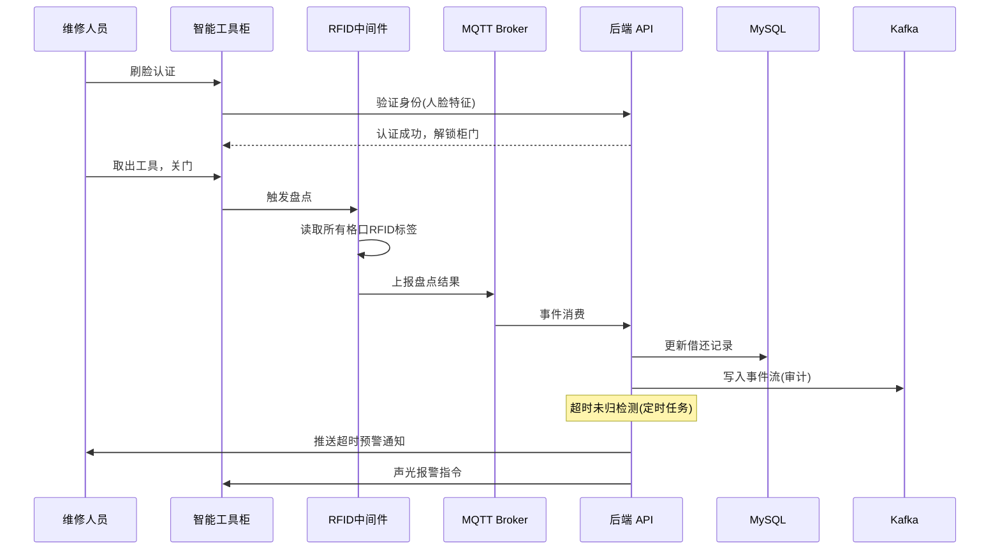
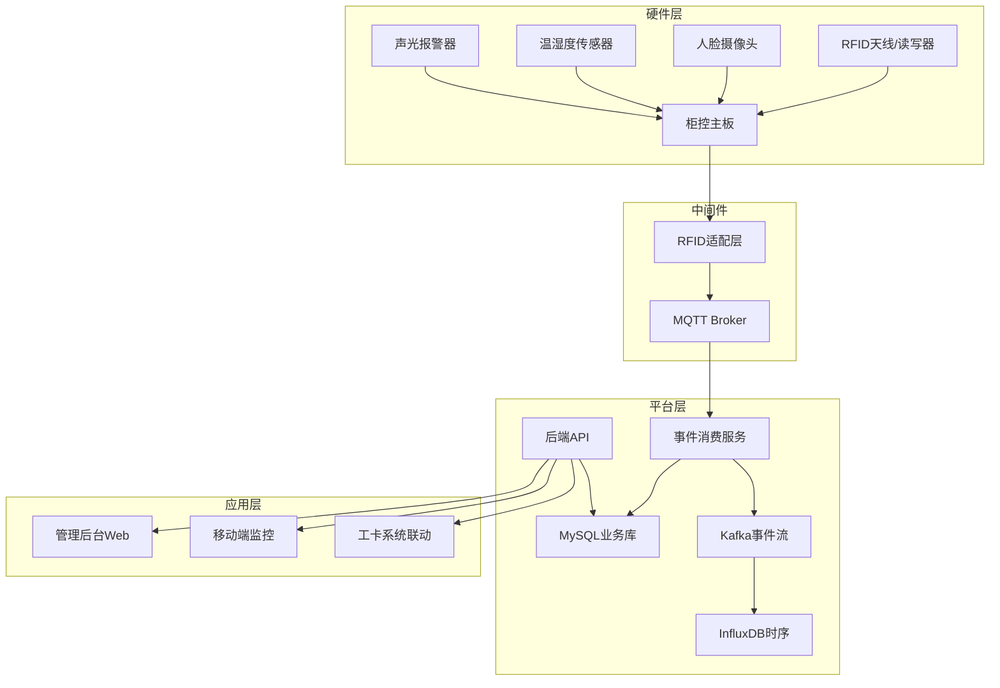

# Plan: 智能工具间与航材管理

## 1. 技术选型与对比

| 方案 | 优点 | 缺点 | 选择 |
|------|------|------|------|
| RFID 中间件: 自研适配层 | 灵活对接多品牌读写器、可定制 | 开发工作量大 | ✓ |
| RFID 中间件: 商用 (Impinj/Zebra SDK) | 开箱即用 | 品牌锁定、定制困难 | 参考 |
| IoT 通信: MQTT (EMQX) | 复用已有 Broker、QoS 保证 | — | ✓ |
| 身份验证: 人脸识别 (InsightFace) | 开源、准确率高、可离线 | 需 GPU 边缘部署 | ✓ |
| 身份验证: 二维码扫码 | 简单可靠、低成本 | 可伪造风险 | ✓(辅助) |
| 事件缓冲: Kafka | 高吞吐、事件溯源 | — | ✓ |
| 存储: MySQL + InfluxDB | 业务数据+IoT 事件时序分离 | 两套库维护 | ✓ |

## 2. 阶段划分

| 里程碑 | 内容 | 交付物 | 预计工期 |
|--------|------|--------|----------|
| P1: RFID 中间件 | 读写器适配层 + MQTT 事件上报 + 协议解析 | RFID 中间件服务 | 3 周 |
| P2: 工具柜软件 | 柜控软件(身份验证+格口控制+盘点逻辑) | 柜控服务 | 3 周 |
| P3: 工具管理后端 | 工具 CRUD + 借还 + 预警 + 生命周期 | 工具管理 API | 3 周 |
| P4: 航材管理后端 | 航材库存 + 补货预警 + 送修流程 | 航材管理 API | 2 周 |
| P5: 前端 + 移动端 | 管理后台 + 移动端监控 | 前端全功能 | 3 周 |
| P6: 工卡联动 + 联调 | 与工卡系统集成 + 硬件联调 + 测试 | 验收报告 | 2 周 |

## 3. 架构图 / 时序图





## 4. 风险与回滚预案

| 风险 | 影响 | 缓解 | 回滚 |
|------|------|------|------|
| RFID 金属环境干扰严重 | 识别率下降 | 圆极化天线 + 功率调节 + 抗金属标签；实测后调参 | 降级为二维码扫码模式 |
| 多品牌读写器协议不一致 | 适配工作量大 | 抽象接口层+工厂模式；优先适配 1-2 个主流品牌 | 限定单一品牌 |
| 人脸识别误拒率高 | 用户体验差 | 多特征融合(人脸+员工卡)；阈值可调 | 降级为工牌扫码 |
| 工具柜断网 | 无法同步 | 本地缓存+来电恢复后同步；UPS 保电 | 离线模式：本地记录后批量上传 |
| 工卡联动阻断过于严格 | 影响维修效率 | 配置化开关（阻断/提醒两种模式） | 切换为仅提醒模式 |

## 5. 测试策略

- 单元测试：RFID 协议解析、盘点差异计算、借还状态机、补货预警逻辑
- 集成测试：RFID→MQTT→API→DB 链路；人脸认证→解锁→盘点→记录
- 端到端：完整借还流程（刷脸→取工具→关门→记录更新→超时预警）
- 硬件联调：真实工具柜 + RFID 标签 + 200 件批量识别 ≤ 5s
- 性能测试：身份验证 ≤ 3s；RFID 盘点 ≤ 5s/200件；API P95 < 2s

## 6. 关联 ADR

- ADR-004: MRO 数据架构 — RFID 事件流存储策略(Kafka→InfluxDB)
- ADR-005: MRO 技术栈扩展 — MQTT/RFID/边缘计算选型

---

## 7. v1.1.0 增量实施计划 — 航材领料申请 (FR-15)

> **For agentic workers:** REQUIRED SUB-SKILL: Use superpowers:subagent-driven-development (recommended) or superpowers:executing-plans to implement this plan task-by-task. Steps use checkbox (`- [ ]`) syntax for tracking.

**Goal:** 在 tooling-material-service 微服务中实现航材领料申请的创建、审批、领取全流程，并通过 manage-web 暴露 7 个 REST 接口。

**Architecture:** `MaterialRequestController`（manage-web）→ `@DubboReference MaterialDubboService`（tooling-material-service）→ `MaterialRequestService`（业务逻辑 + 事务）→ MySQL `material_request` 表。领取确认时在同一事务内扣减 `material_item.stock_qty`。

**Tech Stack:** Java 21 records, Spring Boot 3, Dubbo 3, MyBatis-Plus, MySQL 8, Flyway

### 文件清单

| 角色 | 路径 |
|------|------|
| DB 迁移 | `tooling-material-service/src/main/resources/db/migration/V006_01__add_material_request.sql` |
| Entity | `tooling-material-service/src/.../entity/MaterialRequest.java` |
| Mapper | `tooling-material-service/src/.../mapper/MaterialRequestMapper.java` |
| DTO records | `tooling-material-service/src/.../dto/{WorkcardBomDTO,BomItemDTO,CreateMaterialRequestCommand,RequestItemCommand,MaterialRequestDTO,MaterialRequestQueryParam}.java` |
| Service | `tooling-material-service/src/.../service/MaterialRequestService.java` |
| Dubbo接口扩展 | `tooling-material-service/src/.../api/MaterialDubboService.java` |
| Dubbo实现扩展 | `tooling-material-service/src/.../dubbo/MaterialDubboServiceImpl.java` |
| Controller | `manage-web/src/.../controller/MaterialRequestController.java` |
| 单元测试 | `tooling-material-service/src/test/.../service/MaterialRequestServiceTest.java` |
| Controller测试 | `manage-web/src/test/.../controller/MaterialRequestControllerTest.java` |

---

### Task 1: DB 迁移 — material_request 表

**Files:**
- Create: `tooling-material-service/src/main/resources/db/migration/V006_01__add_material_request.sql`

- [ ] **Step 1: 编写 DDL**

```sql
CREATE TABLE IF NOT EXISTS `material_request` (
  `id`              BIGINT         NOT NULL AUTO_INCREMENT COMMENT '领料申请 ID',
  `workcard_id`     BIGINT         NOT NULL                COMMENT '关联工卡',
  `requester_id`    BIGINT         NOT NULL                COMMENT '申请人',
  `status`          ENUM('pending','approved','rejected','received')
                                   NOT NULL DEFAULT 'pending',
  `items`           JSON           NOT NULL                COMMENT '领料明细 [{partNo,name,qty}]',
  `approved_by`     BIGINT         NULL,
  `approve_comment` VARCHAR(512)   NULL,
  `received_at`     DATETIME(3)    NULL,
  `created_at`      DATETIME(3)    NOT NULL DEFAULT CURRENT_TIMESTAMP(3),
  PRIMARY KEY (`id`),
  INDEX `idx_workcard_id` (`workcard_id`),
  INDEX `idx_requester_id` (`requester_id`),
  INDEX `idx_status` (`status`)
) ENGINE=InnoDB DEFAULT CHARSET=utf8mb4 COMMENT='航材领料申请';
```

- [ ] **Step 2: 执行迁移**

```bash
mvn flyway:migrate -pl tooling-material-service
```

预期: `Successfully applied 1 migration`

- [ ] **Step 3: Commit**

```bash
git add tooling-material-service/src/main/resources/db/migration/V006_01__add_material_request.sql
git commit -m "feat(material): add material_request table DDL

Refs: MRO-006"
```

---

### Task 2: Entity + Mapper + DTO Records

**Files:**
- Create: `tooling-material-service/src/main/java/.../entity/MaterialRequest.java`
- Create: `tooling-material-service/src/main/java/.../mapper/MaterialRequestMapper.java`
- Create: `tooling-material-service/src/main/java/.../dto/WorkcardBomDTO.java` (及其他 5 个 record)

- [ ] **Step 1: 创建 MaterialRequest 实体**

```java
@TableName("material_request")
@Data
public class MaterialRequest {
    @TableId(type = IdType.AUTO)
    private Long id;
    private Long workcardId;
    private Long requesterId;
    private String status;          // pending/approved/rejected/received
    private String items;           // JSON string
    private Long approvedBy;
    private String approveComment;
    private LocalDateTime receivedAt;
    private LocalDateTime createdAt;
}
```

- [ ] **Step 2: 创建 Mapper**

```java
@Mapper
public interface MaterialRequestMapper extends BaseMapper<MaterialRequest> {}
```

- [ ] **Step 3: 创建 DTO records（按规范放在 api 共享模块或 dto 包）**

```java
public record WorkcardBomDTO(Long workcardId, List<BomItemDTO> items) implements Serializable {}

public record BomItemDTO(String partNo, String name, int requiredQty, int stockQty, String location) implements Serializable {}

public record CreateMaterialRequestCommand(Long workcardId, List<RequestItemCommand> items, Long requesterId) implements Serializable {}

public record RequestItemCommand(String partNo, String name, int qty) implements Serializable {}

public record MaterialRequestDTO(
    Long id, Long workcardId, String workcardNo, String requesterName,
    String status, int itemCount, Instant createdAt
) implements Serializable {}

public record MaterialRequestQueryParam(Long workcardId, String status, int pageNum, int pageSize) implements Serializable {}
```

- [ ] **Step 4: 编译验证**

```bash
mvn compile -pl tooling-material-service -q
```

预期: BUILD SUCCESS

- [ ] **Step 5: Commit**

```bash
git add tooling-material-service/src/main/java/
git commit -m "feat(material): add MaterialRequest entity, mapper, DTO records

Refs: MRO-006"
```

---

### Task 3: MaterialRequestService 核心业务逻辑

**Files:**
- Create: `tooling-material-service/src/main/java/.../service/MaterialRequestService.java`
- Create: `tooling-material-service/src/test/java/.../service/MaterialRequestServiceTest.java`

- [ ] **Step 1: 编写失败的单元测试**

```java
@ExtendWith(MockitoExtension.class)
class MaterialRequestServiceTest {
    @Mock MaterialRequestMapper requestMapper;
    @Mock MaterialItemMapper itemMapper;
    @InjectMocks MaterialRequestService service;

    @Test
    void receive_deductsStock_whenApproved() {
        MaterialRequest req = new MaterialRequest();
        req.setId(8001L); req.setStatus("approved");
        req.setItems("[{\"partNo\":\"B737-SEAL-029\",\"qty\":2}]");
        when(requestMapper.selectById(8001L)).thenReturn(req);

        MaterialItem item = new MaterialItem();
        item.setPartNo("B737-SEAL-029"); item.setStockQty(10);
        when(itemMapper.selectOne(any())).thenReturn(item);

        service.receiveRequest(8001L, 101L);

        verify(itemMapper).update(argThat(i -> i.getStockQty() == 8), any());
        verify(requestMapper).updateById(argThat(r -> "received".equals(r.getStatus())));
    }

    @Test
    void receive_throws4711_whenNotApproved() {
        MaterialRequest req = new MaterialRequest();
        req.setId(8001L); req.setStatus("pending");
        when(requestMapper.selectById(8001L)).thenReturn(req);
        assertThatThrownBy(() -> service.receiveRequest(8001L, 101L))
            .hasMessageContaining("4711");
    }

    @Test
    void receive_throws4712_whenStockInsufficient() {
        MaterialRequest req = new MaterialRequest();
        req.setId(8001L); req.setStatus("approved");
        req.setItems("[{\"partNo\":\"B737-SEAL-029\",\"qty\":20}]");
        when(requestMapper.selectById(8001L)).thenReturn(req);

        MaterialItem item = new MaterialItem();
        item.setPartNo("B737-SEAL-029"); item.setStockQty(5);
        when(itemMapper.selectOne(any())).thenReturn(item);

        assertThatThrownBy(() -> service.receiveRequest(8001L, 101L))
            .hasMessageContaining("4712");
    }
}
```

- [ ] **Step 2: 确认测试失败**

```bash
mvn test -pl tooling-material-service -Dtest=MaterialRequestServiceTest -q
```

预期: FAILURE — `MaterialRequestService` not found

- [ ] **Step 3: 实现 MaterialRequestService**

```java
@Service
@Transactional
public class MaterialRequestService {
    @Autowired private MaterialRequestMapper requestMapper;
    @Autowired private MaterialItemMapper itemMapper;

    public Long createRequest(CreateMaterialRequestCommand cmd) {
        // 工卡状态校验由 Controller 层或调用前完成，此处仅持久化
        MaterialRequest req = new MaterialRequest();
        req.setWorkcardId(cmd.workcardId());
        req.setRequesterId(cmd.requesterId());
        req.setStatus("pending");
        req.setItems(JsonUtils.toJson(cmd.items()));
        req.setCreatedAt(LocalDateTime.now());
        requestMapper.insert(req);
        return req.getId();
    }

    public void approveRequest(Long requestId, String comment, Long approverId) {
        MaterialRequest req = getOrThrow(requestId);
        if (!"pending".equals(req.getStatus())) throw new BizException(4711, "状态不允许审批");
        req.setStatus("approved");
        req.setApprovedBy(approverId);
        req.setApproveComment(comment);
        requestMapper.updateById(req);
    }

    public void rejectRequest(Long requestId, String comment, Long approverId) {
        MaterialRequest req = getOrThrow(requestId);
        if (!"pending".equals(req.getStatus())) throw new BizException(4711, "状态不允许驳回");
        req.setStatus("rejected");
        req.setApprovedBy(approverId);
        req.setApproveComment(comment);
        requestMapper.updateById(req);
    }

    public void receiveRequest(Long requestId, Long operatorId) {
        MaterialRequest req = getOrThrow(requestId);
        if (!"approved".equals(req.getStatus())) throw new BizException(4711, "状态不允许领取");
        List<RequestItemCommand> items = JsonUtils.fromJson(
            req.getItems(), new TypeReference<>() {});
        for (RequestItemCommand item : items) {
            MaterialItem mi = itemMapper.selectOne(
                new LambdaQueryWrapper<MaterialItem>().eq(MaterialItem::getPartNo, item.partNo()));
            if (mi == null) throw new BizException(4706, "航材不存在: " + item.partNo());
            if (mi.getStockQty() < item.qty()) throw new BizException(4712, "库存不足: " + item.partNo());
            mi.setStockQty(mi.getStockQty() - item.qty());
            itemMapper.update(mi, new LambdaQueryWrapper<MaterialItem>()
                .eq(MaterialItem::getPartNo, item.partNo()));
        }
        req.setStatus("received");
        req.setReceivedAt(LocalDateTime.now());
        requestMapper.updateById(req);
    }

    public MaterialRequest getOrThrow(Long id) {
        MaterialRequest req = requestMapper.selectById(id);
        if (req == null) throw new BizException(4710, "领料申请不存在");
        return req;
    }
}
```

- [ ] **Step 4: 运行测试确认通过**

```bash
mvn test -pl tooling-material-service -Dtest=MaterialRequestServiceTest -q
```

预期: Tests run: 3, Failures: 0

- [ ] **Step 5: Commit**

```bash
git add tooling-material-service/src/main/java/.../service/MaterialRequestService.java
git add tooling-material-service/src/test/.../service/MaterialRequestServiceTest.java
git commit -m "feat(material): implement MaterialRequestService with transactional stock deduction

Refs: MRO-006"
```

---

### Task 4: MaterialDubboService 接口扩展 + 实现

**Files:**
- Modify: `tooling-material-service/src/main/java/.../api/MaterialDubboService.java`
- Modify: `tooling-material-service/src/main/java/.../dubbo/MaterialDubboServiceImpl.java`

- [ ] **Step 1: 在接口末尾追加 7 个方法**

```java
// 追加到 MaterialDubboService 接口末尾
WorkcardBomDTO getWorkcardBom(Long workcardId);
Long createMaterialRequest(CreateMaterialRequestCommand cmd);
PageResult<MaterialRequestDTO> listMaterialRequests(MaterialRequestQueryParam param);
MaterialRequestDTO getMaterialRequest(Long requestId);
void approveMaterialRequest(Long requestId, String comment, Long approverId);
void rejectMaterialRequest(Long requestId, String comment, Long approverId);
void receiveMaterialRequest(Long requestId, Long operatorId);
```

- [ ] **Step 2: 在 MaterialDubboServiceImpl 中实现新方法**

```java
@Override
public WorkcardBomDTO getWorkcardBom(Long workcardId) {
    WorkcardDetailDTO workcard = workcardDubboService.getWorkcard(workcardId);
    List<BomItemDTO> bomItems = workcard.steps().stream()
        .flatMap(s -> s.requiredMaterials().stream())
        .map(m -> {
            String partNo = m.get("partNo");
            MaterialItem mi = materialItemMapper.selectOne(
                new LambdaQueryWrapper<MaterialItem>().eq(MaterialItem::getPartNo, partNo));
            return new BomItemDTO(partNo, m.get("name"),
                Integer.parseInt(m.getOrDefault("qty", "1")),
                mi != null ? mi.getStockQty() : 0,
                mi != null ? mi.getLocation() : "");
        }).toList();
    return new WorkcardBomDTO(workcardId, bomItems);
}

@Override
public Long createMaterialRequest(CreateMaterialRequestCommand cmd) {
    return materialRequestService.createRequest(cmd);
}

@Override
public PageResult<MaterialRequestDTO> listMaterialRequests(MaterialRequestQueryParam param) {
    LambdaQueryWrapper<MaterialRequest> w = new LambdaQueryWrapper<>();
    if (param.workcardId() != null) w.eq(MaterialRequest::getWorkcardId, param.workcardId());
    if (param.status() != null) w.eq(MaterialRequest::getStatus, param.status());
    Page<MaterialRequest> page = requestMapper.selectPage(
        new Page<>(param.pageNum(), param.pageSize()), w);
    return new PageResult<>(page.getRecords().stream().map(this::toDTO).toList(),
        page.getTotal(), param.pageNum(), param.pageSize());
}

@Override
public MaterialRequestDTO getMaterialRequest(Long requestId) {
    return toDTO(materialRequestService.getOrThrow(requestId));
}

@Override
public void approveMaterialRequest(Long requestId, String comment, Long approverId) {
    materialRequestService.approveRequest(requestId, comment, approverId);
}

@Override
public void rejectMaterialRequest(Long requestId, String comment, Long approverId) {
    materialRequestService.rejectRequest(requestId, comment, approverId);
}

@Override
public void receiveMaterialRequest(Long requestId, Long operatorId) {
    materialRequestService.receiveRequest(requestId, operatorId);
}

private MaterialRequestDTO toDTO(MaterialRequest r) {
    int itemCount = JsonUtils.fromJson(r.getItems(), List.class).size();
    return new MaterialRequestDTO(r.getId(), r.getWorkcardId(),
        workcardDubboService.getWorkcard(r.getWorkcardId()).cardNo(),
        userService.getUserName(r.getRequesterId()),
        r.getStatus(), itemCount,
        r.getCreatedAt().toInstant(ZoneOffset.UTC));
}
```

- [ ] **Step 3: 编译**

```bash
mvn compile -pl tooling-material-service -q
```

预期: BUILD SUCCESS

- [ ] **Step 4: Commit**

```bash
git add tooling-material-service/src/main/java/
git commit -m "feat(material): extend MaterialDubboService with 7 request workflow methods

Refs: MRO-006"
```

---

### Task 5: manage-web MaterialRequestController

**Files:**
- Create: `manage-web/src/main/java/.../controller/MaterialRequestController.java`
- Create: `manage-web/src/test/java/.../controller/MaterialRequestControllerTest.java`

- [ ] **Step 1: 编写 MockMvc 测试**

```java
@WebMvcTest(MaterialRequestController.class)
class MaterialRequestControllerTest {
    @Autowired MockMvc mockMvc;
    @MockBean MaterialDubboService materialDubboService;

    @Test
    void getBom_returns200() throws Exception {
        when(materialDubboService.getWorkcardBom(1001L)).thenReturn(
            new WorkcardBomDTO(1001L, List.of(
                new BomItemDTO("B737-SEAL-029", "液压密封圈", 2, 8, "B区-架位12"))));
        mockMvc.perform(get("/api/workcards/1001/bom").header("Authorization","Bearer t"))
            .andExpect(status().isOk())
            .andExpect(jsonPath("$.data.workcardId").value(1001));
    }

    @Test
    void createRequest_returns200() throws Exception {
        when(materialDubboService.createMaterialRequest(any())).thenReturn(8001L);
        mockMvc.perform(post("/api/material/requests")
                .contentType(MediaType.APPLICATION_JSON)
                .content("{\"workcardId\":1001,\"items\":[{\"partNo\":\"B737-SEAL-029\",\"name\":\"密封圈\",\"qty\":2}]}")
                .header("Authorization","Bearer t"))
            .andExpect(status().isOk())
            .andExpect(jsonPath("$.data.requestId").value(8001));
    }

    @Test
    void approveRequest_returns200() throws Exception {
        doNothing().when(materialDubboService).approveMaterialRequest(any(), any(), any());
        mockMvc.perform(post("/api/material/requests/8001/approve")
                .contentType(MediaType.APPLICATION_JSON)
                .content("{\"comment\":\"同意\"}")
                .header("Authorization","Bearer t"))
            .andExpect(status().isOk())
            .andExpect(jsonPath("$.code").value(0));
    }
}
```

- [ ] **Step 2: 确认测试失败**

```bash
mvn test -pl manage-web -Dtest=MaterialRequestControllerTest -q
```

预期: FAILURE

- [ ] **Step 3: 实现 Controller**

```java
@RestController
@RequiredArgsConstructor
public class MaterialRequestController {

    @DubboReference
    private MaterialDubboService materialDubboService;

    @GetMapping("/api/workcards/{id}/bom")
    @RequiresPermission("material:request")
    public R<WorkcardBomDTO> getBom(@PathVariable Long id) {
        return R.ok(materialDubboService.getWorkcardBom(id));
    }

    @GetMapping("/api/material/requests")
    @RequiresPermission("material:request")
    public R<PageResult<MaterialRequestDTO>> list(
            @RequestParam(defaultValue="1") int pageNum,
            @RequestParam(defaultValue="20") int pageSize,
            @RequestParam(required=false) String status,
            @RequestParam(required=false) Long workcardId) {
        return R.ok(materialDubboService.listMaterialRequests(
            new MaterialRequestQueryParam(workcardId, status, pageNum, pageSize)));
    }

    @PostMapping("/api/material/requests")
    @RequiresPermission("material:request")
    public R<Map<String,Long>> create(@RequestBody CreateReqBody body,
            @AuthenticationPrincipal UserContext ctx) {
        Long id = materialDubboService.createMaterialRequest(
            new CreateMaterialRequestCommand(body.workcardId(), body.items(), ctx.getUserId()));
        return R.ok(Map.of("requestId", id));
    }

    @GetMapping("/api/material/requests/{id}")
    @RequiresPermission("material:request")
    public R<MaterialRequestDTO> get(@PathVariable Long id) {
        return R.ok(materialDubboService.getMaterialRequest(id));
    }

    @PostMapping("/api/material/requests/{id}/approve")
    @RequiresPermission("material:approve")
    public R<Void> approve(@PathVariable Long id, @RequestBody CommentBody body,
            @AuthenticationPrincipal UserContext ctx) {
        materialDubboService.approveMaterialRequest(id, body.comment(), ctx.getUserId());
        return R.ok(null);
    }

    @PostMapping("/api/material/requests/{id}/reject")
    @RequiresPermission("material:approve")
    public R<Void> reject(@PathVariable Long id, @RequestBody CommentBody body,
            @AuthenticationPrincipal UserContext ctx) {
        materialDubboService.rejectMaterialRequest(id, body.comment(), ctx.getUserId());
        return R.ok(null);
    }

    @PostMapping("/api/material/requests/{id}/receive")
    @RequiresPermission("material:receive")
    public R<Void> receive(@PathVariable Long id, @AuthenticationPrincipal UserContext ctx) {
        materialDubboService.receiveMaterialRequest(id, ctx.getUserId());
        return R.ok(null);
    }

    record CreateReqBody(Long workcardId, List<RequestItemCommand> items) {}
    record CommentBody(String comment) {}
}
```

- [ ] **Step 4: 确认测试通过**

```bash
mvn test -pl manage-web -Dtest=MaterialRequestControllerTest -q
```

预期: Tests run: 3, Failures: 0

- [ ] **Step 5: Commit**

```bash
git add manage-web/src/main/java/.../controller/MaterialRequestController.java
git add manage-web/src/test/.../controller/MaterialRequestControllerTest.java
git commit -m "feat(web): MaterialRequestController — 7 material request REST APIs

Refs: MRO-006"
```

---

### Task 6: 前端 Mock 同步

**Files:**
- Modify: `frontend/src/mock/material.ts` (或对应 mock 文件)

- [ ] **Step 1: 添加 6 个新 mock 端点**

```typescript
// GET /api/workcards/:id/bom
{ url: '/api/workcards/:id/bom', method: 'get',
  response: () => ({ code: 0, msg: 'ok', timestamp: Date.now(),
    data: { workcardId: 1001, items: [
      { partNo: 'B737-SEAL-029', name: '液压系统密封圈', requiredQty: 2, stockQty: 8, location: 'B区-架位12' }
    ]}})},
// POST /api/material/requests
{ url: '/api/material/requests', method: 'post',
  response: () => ({ code: 0, msg: 'ok', data: { requestId: 8001 }, timestamp: Date.now() })},
// GET /api/material/requests
{ url: '/api/material/requests', method: 'get',
  response: () => ({ code: 0, msg: 'ok', timestamp: Date.now(),
    data: { list: [{ id: 8001, workcardId: 1001, workcardNo: 'WC-2026-05-001',
      requesterName: '王工程师', status: 'pending', itemCount: 2, createdAt: '2026-05-28T09:00:00Z' }],
      total: 1, pageNum: 1, pageSize: 20 }})},
// GET /api/material/requests/:id
{ url: '/api/material/requests/:id', method: 'get',
  response: () => ({ code: 0, msg: 'ok', timestamp: Date.now(),
    data: { id: 8001, workcardId: 1001, workcardNo: 'WC-2026-05-001',
      requesterName: '王工程师', status: 'pending', itemCount: 2, createdAt: '2026-05-28T09:00:00Z' }})},
// POST /api/material/requests/:id/approve
{ url: '/api/material/requests/:id/approve', method: 'post',
  response: () => ({ code: 0, msg: 'ok', data: null, timestamp: Date.now() })},
// POST /api/material/requests/:id/reject
{ url: '/api/material/requests/:id/reject', method: 'post',
  response: () => ({ code: 0, msg: 'ok', data: null, timestamp: Date.now() })},
// POST /api/material/requests/:id/receive
{ url: '/api/material/requests/:id/receive', method: 'post',
  response: () => ({ code: 0, msg: 'ok', data: null, timestamp: Date.now() })}
```

- [ ] **Step 2: Commit**

```bash
git add frontend/src/mock/
git commit -m "feat(mock): add material request workflow mock APIs

Refs: MRO-006"
```

---

### 验收检查

- [ ] Flyway 迁移脚本幂等（IF NOT EXISTS）
- [ ] `receiveRequest` 库存扣减在同一 `@Transactional` 事务内
- [ ] 错误码 4710-4715 在 `GlobalExceptionHandler` 中注册
- [ ] 7 个接口均有 `@RequiresPermission` 权限注解
- [ ] `mvn test -pl tooling-material-service,manage-web` 全部绿灯
