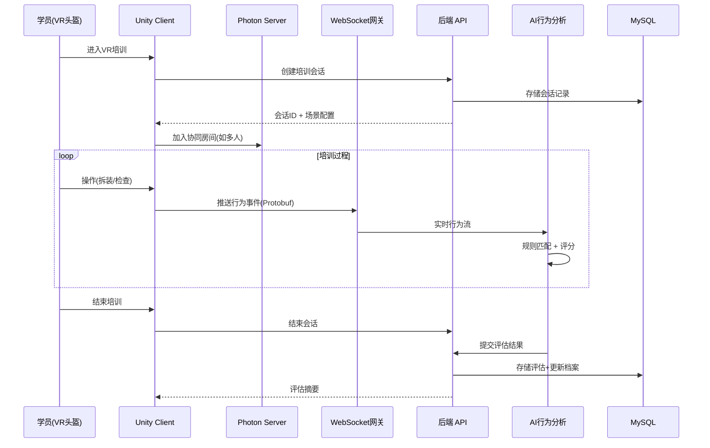
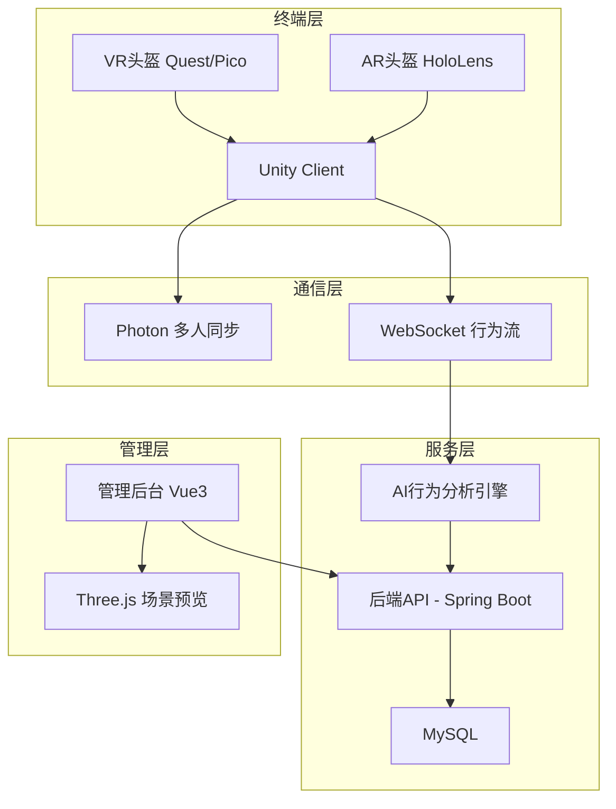

# Plan: VR/AR沉浸式培训

## 1. 技术选型与对比

| 方案 | 优点 | 缺点 | 选择 |
|------|------|------|------|
| 3D 引擎: Unity + XR Interaction Toolkit | 跨平台(Quest/Pico/HoloLens)、生态成熟、物理引擎强 | C# 技术栈、授权费 | ✓ |
| 3D 引擎: Unreal Engine 5 | 画质顶级、Nanite 几何 | 硬件要求高、开发周期长 | 备选 |
| Web 3D: Three.js + WebXR | 与前端栈统一、免安装 | 渲染能力有限、物理仿真弱 | ✓(管理后台3D预览) |
| 协同方案: Photon Engine | 成熟多人同步、低延迟 | 商用授权、带宽费 | ✓ |
| 协同方案: Mirror (开源) | 免费、Unity 原生 | 功能不如 Photon 成熟 | 备选 |
| AI 行为分析: 自研规则引擎 | 可定制、与业务紧耦合 | 开发量大 | ✓ |
| AI 行为分析: 端侧 ML (手势识别) | 实时性好 | 需要训练数据 | ✓(辅助) |
| 后端通信: WebSocket + Protobuf | 低延迟、高效序列化 | 调试不如 JSON 直观 | ✓ |

## 2. 阶段划分

| 里程碑 | 内容 | 交付物 | 预计工期 |
|--------|------|--------|----------|
| P1: 基础平台 | 后端服务(场景管理+学员管理+会话管理) + 数据库 | 培训管理 API | 2 周 |
| P2: 3D 场景框架 | Unity XR 项目骨架 + 通用交互系统 + 场景加载器 | VR 基础可运行 Demo | 3 周 |
| P3: AI 行为采集 | 行为事件采集 SDK + 规则引擎 + 评分算法 | 行为分析服务 | 3 周 |
| P4: 培训场景制作 | 航线绕机 + 发动机拆装 + 高危场景(至少3个) | 可体验的 VR 场景 | 4 周 |
| P5: 前端管理后台 | 场景管理 + 学员档案 + 考核报告 + 3D 预览 | 管理后台全功能 | 3 周 |
| P6: 协同与联调 | 多人协同(Photon) + AR 模式 + 系统联调 | 完整可验收系统 | 3 周 |

## 3. 架构图 / 时序图

## 4. 风险与回滚预案

| 风险 | 影响 | 缓解 | 回滚 |
|------|------|------|------|
| VR 渲染帧率不达标(< 72fps) | 用户眩晕 | LOD 分级渲染 + 遮挡剔除 + 固定注视点渲染 | 降低场景细节等级 |
| 多人协同延迟高 | 操作不同步 | 状态预测 + 内插补偿 + 就近服务器 | 限制协同人数为 4 人 |
| AR 注册精度不足(> 5mm) | 虚实不匹配 | 多标记点 + SLAM 增强 + 预校准 | 降级为纯 VR 模式 |
| 3D 模型制作周期过长 | 场景不足 | 优先核心 3 场景；模块化部件复用 | 使用简化模型代替 |
| AI 评分偏差大 | 评估不可信 | 专家标注数据校准 + A/B 对比测试 | 人工复核模式 |
| 头盔兼容性问题 | 部分设备不支持 | XR Interaction Toolkit 抽象层 | 限定单一头盔品牌 |

## 5. 测试策略

- 单元测试：评分算法、行为规则引擎、场景管理 CRUD、会话状态机
- 集成测试：行为事件→WebSocket→AI分析→评估存储 链路；场景加载→交互→评分 端到端
- 端到端：学员完整培训流程（选场景→进入VR→操作→评估→查看报告）
- 性能测试：VR 帧率 ≥ 72fps (Quest 3 基准)；10 人协同网络延迟 ≤ 100ms；API P95 < 2s
- 用户体验测试：连续 30 分钟 VR 使用无眩晕感调查

## 6. 关联 ADR

- ADR-005: MRO 技术栈扩展 — Unity/Three.js/WebRTC 选型决策

## 7. P5 前端管理后台实施方案

### 7.1 页面清单

| 页面 | 路由 | 功能 | 依赖 API |
|------|------|------|----------|
| ScenarioManagement.vue | /mro/training/scenarios | 场景 CRUD + 发布状态切换 | GET/POST/PUT/DELETE scenarios, PUT publish |
| TraineeList.vue | /mro/training/trainees | 学员列表（筛选技能等级） | GET trainees |
| TraineeProfile.vue | /mro/training/trainees/:id | 学员档案（雷达图+趋势+培训记录） | GET profile, GET individual report, GET sessions |
| SessionManagement.vue | /mro/training/sessions | 培训任务分配+进度查看 | GET/POST sessions, GET scenarios, GET trainees |
| AssessmentDetail.vue | /mro/training/assessments/:sessionId | AI 评估详情（多维得分柱状图） | GET assessments/{sessionId} |

### 7.2 技术方案

- **框架**: Vue 3 Composition API (`<script setup>`) + Element Plus 2
- **可视化**: echarts 5 按需引入（RadarChart, LineChart, BarChart）
- **路由**: Vue Router 4 嵌套路由，父级 `router-view` 渲染
- **数据层**: Mock-first（vite-plugin-mock），API 层使用 axios 封装
- **权限**: `permissions: ['train:assign']` / `['train:assess']`

### 7.3 实施步骤

1. Mock 层补充（PUT/DELETE 场景端点）
2. API 层补充（updateScenario, deleteScenario, publishScenario）
3. 5 个页面开发（按依赖顺序：Scenario → Trainee → Session → Assessment）
4. 路由注册 + 侧边栏菜单更新
5. 构建验证 + 功能测试
