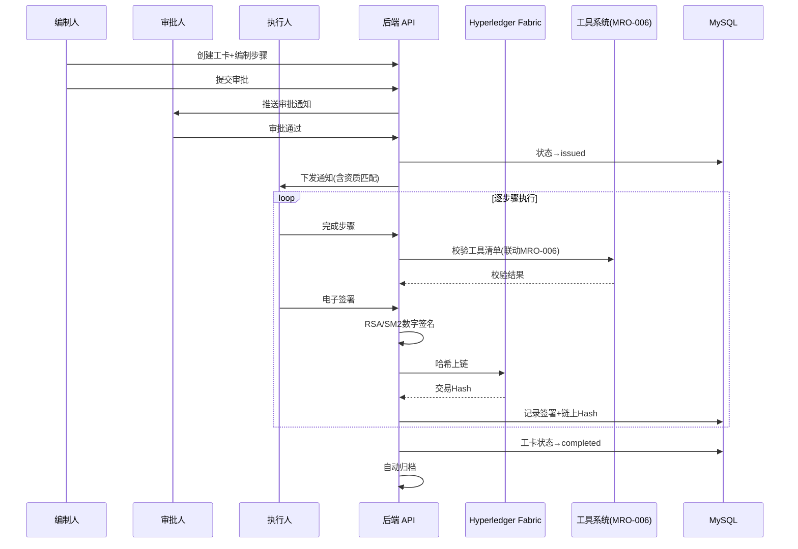
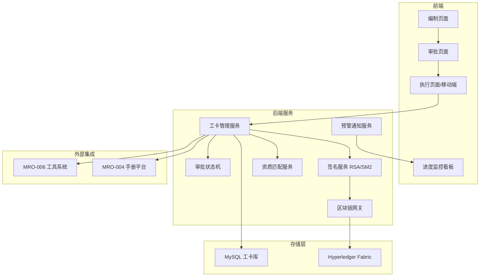

# Plan: 无纸化电子工卡

## 1. 技术选型与对比

| 方案 | 优点 | 缺点 | 选择 |
|------|------|------|------|
| 电子签名: RSA-2048 + X.509 证书 | 法律效力强、标准成熟 | 需 CA 基础设施 | ✓ |
| 电子签名: SM2 国密算法 | 国内合规、自主可控 | 生态较小 | ✓(双轨支持) |
| 区块链: Hyperledger Fabric | 联盟链、无 gas、性能可控 | 部署运维复杂 | ✓ |
| 区块链: 以太坊私链 | 工具链成熟 | gas 机制、性能瓶颈 | 不采用 |
| 审批引擎: Activiti/Camunda | 标准 BPMN、可视化流程 | 重量级 | 参考 |
| 审批引擎: 自研轻量状态机 | 贴合业务、轻量 | 功能有限 | ✓ |
| 离线方案: Service Worker + IndexedDB | 免安装、Web 标准 | 存储有限 | ✓ |
| 离线方案: 原生 App + SQLite | 离线能力强 | 双端维护 | 备选 |

## 2. 阶段划分

| 里程碑 | 内容 | 交付物 | 预计工期 |
|--------|------|--------|----------|
| P1: 工卡核心模型 | 工卡 CRUD + 步骤管理 + 审批状态机 | 工卡管理 API | 2 周 |
| P2: 电子签名 | 数字签名服务 + 证书管理 + 签署接口 | 签署服务 | 2 周 |
| P3: 区块链存证 | Fabric 网络部署 + 链码开发 + 上链/验证 API | 区块链存证服务 | 3 周 |
| P4: 资质匹配与预警 | 人员资质管理 + 动态匹配 + 到期提醒 | 资质匹配服务 | 2 周 |
| P5: 前端 + 移动端 | 编制/审批/执行页面 + 进度看板 + 离线签署 | 前端全功能 | 3 周 |
| P6: 集成联调 | 工具系统联动(MRO-006) + 手册平台对接 + E2E测试 | 验收报告 | 2 周 |

## 3. 架构图 / 时序图





## 4. 风险与回滚预案

| 风险 | 影响 | 缓解 | 回滚 |
|------|------|------|------|
| 区块链网络不稳定 | 上链失败导致签署阻塞 | 异步上链+本地先存签名→后续补链 | 降级为仅数字签名（无区块链） |
| 电子签名法律效力存疑 | 合规风险 | 接入第三方 CA（如 CFCA）提供可信时间戳 | 保留纸质签字备份通道 |
| 工具联动阻断影响效率 | 维修延误 | 可配置：阻断/提醒两种模式 | 切换为仅提醒模式 |
| 离线签署数据冲突 | 数据不一致 | 乐观锁+冲突检测+人工仲裁 | 强制联网签署 |
| Fabric 网络性能不足 | 高峰期上链延迟 | 批量上链（每 N 分钟打包一次） | 增加 Peer 节点 |

## 5. 测试策略

- 单元测试：审批状态机、资质匹配算法、数字签名生成/验证、预警触发逻辑
- 集成测试：工卡全流程(编制→审批→下发→执行→签署→归档)；区块链上链+验证链路
- 端到端：完整工卡生命周期 + 工具联动 + 手册跳转
- 安全测试：签名伪造检测；区块链篡改检测；越权操作拦截
- 性能测试：工卡列表查询 ≤ 2s；签署响应 ≤ 1s；上链延迟 ≤ 5s

## 6. 关联 ADR

- ADR-004: MRO 数据架构 — 工卡数据存储策略
- ADR-005: MRO 技术栈扩展 — Hyperledger Fabric 选型

## 7. v1.1.0 增量实施计划（质检签署 / NCR 管理 / 工卡签到）

> **对应 Spec**: MRO-008 v1.1.0 FR-8 / FR-9 / FR-10
> **服务**: `paperless-checkin-service`（或现有 workcard-service）
> **前提**: v1.0.0 工卡核心已上线

### Task 1: DB 迁移 — 新增质检/NCR/签到表

**Files:**
- Create: `paperless-checkin-service/src/main/resources/db/migration/V008_01__add_quality_ncr_checkin.sql`

- [ ] **Step 1: 编写 Flyway DDL**

```sql
-- V008_01__add_quality_ncr_checkin.sql
CREATE TABLE quality_sign_record (
    id            BIGINT AUTO_INCREMENT PRIMARY KEY,
    workcard_id   BIGINT       NOT NULL,
    inspector_id  BIGINT       NOT NULL,
    result        ENUM('pass','fail') NOT NULL,
    remark        TEXT,
    digital_signature TEXT     NOT NULL,
    signed_at     DATETIME(3)  NOT NULL,
    INDEX idx_workcard (workcard_id),
    INDEX idx_inspector (inspector_id)
) ENGINE=InnoDB DEFAULT CHARSET=utf8mb4;

CREATE TABLE ncr (
    id                BIGINT AUTO_INCREMENT PRIMARY KEY,
    workcard_id       BIGINT       NOT NULL,
    title             VARCHAR(256) NOT NULL,
    description       TEXT         NOT NULL,
    severity          ENUM('critical','major','minor') NOT NULL,
    status            ENUM('open','in_progress','closed') NOT NULL DEFAULT 'open',
    assignee_id       BIGINT,
    corrective_action TEXT,
    closed_by         BIGINT,
    closed_at         DATETIME(3),
    created_at        DATETIME(3)  NOT NULL DEFAULT CURRENT_TIMESTAMP(3),
    INDEX idx_workcard (workcard_id),
    INDEX idx_status (status)
) ENGINE=InnoDB DEFAULT CHARSET=utf8mb4;

CREATE TABLE workcard_checkin (
    id           BIGINT AUTO_INCREMENT PRIMARY KEY,
    workcard_id  BIGINT      NOT NULL,
    user_id      BIGINT      NOT NULL,
    checkin_type ENUM('start','end') NOT NULL,
    checked_at   DATETIME(3) NOT NULL DEFAULT CURRENT_TIMESTAMP(3),
    INDEX idx_workcard_user (workcard_id, user_id)
) ENGINE=InnoDB DEFAULT CHARSET=utf8mb4;
```

- [ ] **Step 2: 执行迁移验证**

```bash
cd paperless-checkin-service
./mvnw flyway:migrate -Dflyway.url=jdbc:mysql://localhost:3306/mro_workcard
# 期望: Successfully applied 1 migration (V008_01)
```

- [ ] **Step 3: Commit**

```bash
git add paperless-checkin-service/src/main/resources/db/migration/V008_01__add_quality_ncr_checkin.sql
git commit -m "feat(mro-008): add quality_sign_record, ncr, workcard_checkin tables

Refs: MRO-008"
```

---

### Task 2: 实体 + Mapper + DTO Records

**Files:**
- Create: `paperless-checkin-service/src/main/java/com/mro/workcard/entity/QualitySignRecord.java`
- Create: `paperless-checkin-service/src/main/java/com/mro/workcard/entity/Ncr.java`
- Create: `paperless-checkin-service/src/main/java/com/mro/workcard/entity/WorkcardCheckin.java`
- Create: `paperless-checkin-service/src/main/java/com/mro/workcard/mapper/QualitySignRecordMapper.java`
- Create: `paperless-checkin-service/src/main/java/com/mro/workcard/mapper/NcrMapper.java`
- Create: `paperless-checkin-service/src/main/java/com/mro/workcard/mapper/WorkcardCheckinMapper.java`
- Modify: `paperless-checkin-service/src/main/java/com/mro/workcard/dto/` (新增 DTO records)

- [ ] **Step 1: 编写实体类**

```java
// QualitySignRecord.java
@Data
@TableName("quality_sign_record")
public class QualitySignRecord {
    @TableId(type = IdType.AUTO)
    private Long id;
    private Long workcardId;
    private Long inspectorId;
    private String result;
    private String remark;
    private String digitalSignature;
    private LocalDateTime signedAt;
}

// Ncr.java
@Data
@TableName("ncr")
public class Ncr {
    @TableId(type = IdType.AUTO)
    private Long id;
    private Long workcardId;
    private String title;
    private String description;
    private String severity;
    private String status;
    private Long assigneeId;
    private String correctiveAction;
    private Long closedBy;
    private LocalDateTime closedAt;
    private LocalDateTime createdAt;
}

// WorkcardCheckin.java
@Data
@TableName("workcard_checkin")
public class WorkcardCheckin {
    @TableId(type = IdType.AUTO)
    private Long id;
    private Long workcardId;
    private Long userId;
    private String checkinType;
    private LocalDateTime checkedAt;
}
```

- [ ] **Step 2: 编写 Mapper 接口**

```java
// QualitySignRecordMapper.java
@Mapper
public interface QualitySignRecordMapper extends BaseMapper<QualitySignRecord> {
    QualitySignRecord selectByWorkcardId(Long workcardId);
}

// NcrMapper.java
@Mapper
public interface NcrMapper extends BaseMapper<Ncr> {
    List<Ncr> selectByWorkcardId(Long workcardId);
}

// WorkcardCheckinMapper.java
@Mapper
public interface WorkcardCheckinMapper extends BaseMapper<WorkcardCheckin> {
    WorkcardCheckin selectLatestByWorkcardAndUser(Long workcardId, Long userId);
}
```

- [ ] **Step 3: 编写 DTO Records**

```java
// QualitySignCommand.java
public record QualitySignCommand(
    Long workcardId, String result, String remark,
    String digitalSignature, Long inspectorId
) implements Serializable {}

// QualitySignResultDTO.java
public record QualitySignResultDTO(
    Long signRecordId, String result, Long ncrId, Instant signedAt
) implements Serializable {}

// NcrDTO.java
public record NcrDTO(
    Long id, Long workcardId, String workcardNo, String title, String description,
    String severity, String status, Long assigneeId, String assigneeName,
    String correctiveAction, Long closedBy, Instant closedAt, Instant createdAt
) implements Serializable {}

// CreateNcrCommand.java
public record CreateNcrCommand(
    Long workcardId, String title, String description,
    String severity, Long assigneeId, Long createdBy
) implements Serializable {}

// UpdateNcrCommand.java
public record UpdateNcrCommand(
    Long ncrId, String correctiveAction, Long assigneeId, Long operatorId
) implements Serializable {}

// CloseNcrCommand.java
public record CloseNcrCommand(
    Long ncrId, String closeReason, String digitalSignature, Long closedBy
) implements Serializable {}

// NcrQueryParam.java
public record NcrQueryParam(
    Long workcardId, String status, String severity, int pageNum, int pageSize
) implements Serializable {}

// WorkcardCheckinCommand.java
public record WorkcardCheckinCommand(
    Long workcardId, String checkinType, Long userId
) implements Serializable {}
```

- [ ] **Step 4: Commit**

```bash
git add paperless-checkin-service/src/main/java/com/mro/workcard/entity/ \
        paperless-checkin-service/src/main/java/com/mro/workcard/mapper/ \
        paperless-checkin-service/src/main/java/com/mro/workcard/dto/
git commit -m "feat(mro-008): add QualitySign/Ncr/Checkin entities, mappers, DTOs

Refs: MRO-008"
```

---

### Task 3: Service 层业务逻辑

**Files:**
- Create: `paperless-checkin-service/src/main/java/com/mro/workcard/service/QualitySignService.java`
- Create: `paperless-checkin-service/src/main/java/com/mro/workcard/service/NcrService.java`
- Create: `paperless-checkin-service/src/main/java/com/mro/workcard/service/WorkcardCheckinService.java`
- Create: `paperless-checkin-service/src/test/java/com/mro/workcard/service/QualitySignServiceTest.java`
- Create: `paperless-checkin-service/src/test/java/com/mro/workcard/service/NcrServiceTest.java`
- Create: `paperless-checkin-service/src/test/java/com/mro/workcard/service/WorkcardCheckinServiceTest.java`

- [ ] **Step 1: 编写 QualitySignService 失败测试**

```java
// QualitySignServiceTest.java
@ExtendWith(MockitoExtension.class)
class QualitySignServiceTest {

    @Mock QualitySignRecordMapper qualitySignRecordMapper;
    @Mock NcrMapper ncrMapper;
    @Mock WorkcardMapper workcardMapper;
    @InjectMocks QualitySignService qualitySignService;

    @Test
    void qualitySign_pass_noNcrCreated() {
        Workcard wc = new Workcard();
        wc.setId(1L);
        wc.setStatus("completed");
        when(workcardMapper.selectById(1L)).thenReturn(wc);

        QualitySignCommand cmd = new QualitySignCommand(1L, "pass", null, "SIG", 10L);
        QualitySignResultDTO result = qualitySignService.qualitySign(cmd);

        assertThat(result.result()).isEqualTo("pass");
        assertThat(result.ncrId()).isNull();
        verify(ncrMapper, never()).insert(any());
    }

    @Test
    void qualitySign_fail_autoCreatesNcr() {
        Workcard wc = new Workcard();
        wc.setId(1L);
        wc.setStatus("completed");
        when(workcardMapper.selectById(1L)).thenReturn(wc);

        QualitySignCommand cmd = new QualitySignCommand(1L, "fail", "步骤3压力不足", "SIG", 10L);
        QualitySignResultDTO result = qualitySignService.qualitySign(cmd);

        assertThat(result.result()).isEqualTo("fail");
        assertThat(result.ncrId()).isNotNull();
        verify(ncrMapper, times(1)).insert(any(Ncr.class));
    }

    @Test
    void qualitySign_workcardNotCompleted_throwsException() {
        Workcard wc = new Workcard();
        wc.setId(1L);
        wc.setStatus("in_progress");
        when(workcardMapper.selectById(1L)).thenReturn(wc);

        QualitySignCommand cmd = new QualitySignCommand(1L, "pass", null, "SIG", 10L);
        assertThatThrownBy(() -> qualitySignService.qualitySign(cmd))
            .isInstanceOf(BizException.class)
            .hasMessageContaining("4909");
    }
}
```

- [ ] **Step 2: 运行测试确认失败**

```bash
cd paperless-checkin-service
./mvnw test -pl . -Dtest=QualitySignServiceTest -q
# 期望: FAIL — QualitySignService not found
```

- [ ] **Step 3: 实现 QualitySignService**

```java
@Service
@RequiredArgsConstructor
public class QualitySignService {

    private final QualitySignRecordMapper qualitySignRecordMapper;
    private final NcrMapper ncrMapper;
    private final WorkcardMapper workcardMapper;

    @Transactional
    public QualitySignResultDTO qualitySign(QualitySignCommand cmd) {
        Workcard wc = workcardMapper.selectById(cmd.workcardId());
        if (wc == null) throw new BizException(4910, "工卡不存在");
        if (!"completed".equals(wc.getStatus())) {
            throw new BizException(4909, "工卡未完成所有步骤，不可质检签署");
        }

        QualitySignRecord record = new QualitySignRecord();
        record.setWorkcardId(cmd.workcardId());
        record.setInspectorId(cmd.inspectorId());
        record.setResult(cmd.result());
        record.setRemark(cmd.remark());
        record.setDigitalSignature(cmd.digitalSignature());
        record.setSignedAt(LocalDateTime.now());
        qualitySignRecordMapper.insert(record);

        Long ncrId = null;
        if ("fail".equals(cmd.result())) {
            Ncr ncr = new Ncr();
            ncr.setWorkcardId(cmd.workcardId());
            ncr.setTitle("质检不合格: " + wc.getTitle());
            ncr.setDescription(cmd.remark() != null ? cmd.remark() : "质检签署 fail");
            ncr.setSeverity("major");
            ncr.setStatus("open");
            ncr.setCreatedAt(LocalDateTime.now());
            ncrMapper.insert(ncr);
            ncrId = ncr.getId();
        } else {
            wc.setStatus("archived");
            workcardMapper.updateById(wc);
        }

        return new QualitySignResultDTO(record.getId(), cmd.result(), ncrId,
            record.getSignedAt().toInstant(ZoneOffset.UTC));
    }
}
```

- [ ] **Step 4: 编写 NcrService 失败测试**

```java
// NcrServiceTest.java
@ExtendWith(MockitoExtension.class)
class NcrServiceTest {

    @Mock NcrMapper ncrMapper;
    @InjectMocks NcrService ncrService;

    @Test
    void closeNcr_requiresDigitalSignature() {
        Ncr ncr = new Ncr();
        ncr.setId(1L);
        ncr.setStatus("in_progress");
        when(ncrMapper.selectById(1L)).thenReturn(ncr);

        CloseNcrCommand cmd = new CloseNcrCommand(1L, "整改完成", null, 10L);
        assertThatThrownBy(() -> ncrService.closeNcr(cmd))
            .isInstanceOf(BizException.class)
            .hasMessageContaining("4914");
    }

    @Test
    void closeNcr_alreadyClosed_throwsException() {
        Ncr ncr = new Ncr();
        ncr.setId(1L);
        ncr.setStatus("closed");
        when(ncrMapper.selectById(1L)).thenReturn(ncr);

        CloseNcrCommand cmd = new CloseNcrCommand(1L, "整改完成", "SIG", 10L);
        assertThatThrownBy(() -> ncrService.closeNcr(cmd))
            .isInstanceOf(BizException.class)
            .hasMessageContaining("4915");
    }

    @Test
    void createNcr_success() {
        CreateNcrCommand cmd = new CreateNcrCommand(1L, "液压不合格", "压力低", "major", 102L, 10L);
        Long id = ncrService.createNcr(cmd);
        assertThat(id).isNotNull();
        verify(ncrMapper, times(1)).insert(any(Ncr.class));
    }
}
```

- [ ] **Step 5: 实现 NcrService**

```java
@Service
@RequiredArgsConstructor
public class NcrService {

    private final NcrMapper ncrMapper;

    public Long createNcr(CreateNcrCommand cmd) {
        Ncr ncr = new Ncr();
        ncr.setWorkcardId(cmd.workcardId());
        ncr.setTitle(cmd.title());
        ncr.setDescription(cmd.description());
        ncr.setSeverity(cmd.severity());
        ncr.setStatus("open");
        ncr.setAssigneeId(cmd.assigneeId());
        ncr.setCreatedAt(LocalDateTime.now());
        ncrMapper.insert(ncr);
        return ncr.getId();
    }

    public void updateNcr(UpdateNcrCommand cmd) {
        Ncr ncr = ncrMapper.selectById(cmd.ncrId());
        if (ncr == null) throw new BizException(4911, "NCR不存在");
        if (cmd.correctiveAction() != null) ncr.setCorrectiveAction(cmd.correctiveAction());
        if (cmd.assigneeId() != null) ncr.setAssigneeId(cmd.assigneeId());
        ncr.setStatus("in_progress");
        ncrMapper.updateById(ncr);
    }

    @Transactional
    public void closeNcr(CloseNcrCommand cmd) {
        Ncr ncr = ncrMapper.selectById(cmd.ncrId());
        if (ncr == null) throw new BizException(4911, "NCR不存在");
        if ("closed".equals(ncr.getStatus())) throw new BizException(4915, "NCR已关闭");
        if (cmd.digitalSignature() == null || cmd.digitalSignature().isBlank()) {
            throw new BizException(4914, "关闭NCR必须提供电子签名");
        }
        ncr.setStatus("closed");
        ncr.setClosedBy(cmd.closedBy());
        ncr.setClosedAt(LocalDateTime.now());
        ncr.setCorrectiveAction(cmd.closeReason());
        ncrMapper.updateById(ncr);
    }

    public PageResult<NcrDTO> listNcr(NcrQueryParam param) {
        LambdaQueryWrapper<Ncr> wrapper = new LambdaQueryWrapper<Ncr>()
            .eq(param.workcardId() != null, Ncr::getWorkcardId, param.workcardId())
            .eq(param.status() != null, Ncr::getStatus, param.status())
            .eq(param.severity() != null, Ncr::getSeverity, param.severity())
            .orderByDesc(Ncr::getCreatedAt);
        Page<Ncr> page = ncrMapper.selectPage(
            new Page<>(param.pageNum(), param.pageSize()), wrapper);
        List<NcrDTO> list = page.getRecords().stream().map(this::toDto).toList();
        return new PageResult<>(list, page.getTotal(), param.pageNum(), param.pageSize());
    }

    private NcrDTO toDto(Ncr ncr) {
        return new NcrDTO(ncr.getId(), ncr.getWorkcardId(), null, ncr.getTitle(),
            ncr.getDescription(), ncr.getSeverity(), ncr.getStatus(),
            ncr.getAssigneeId(), null, ncr.getCorrectiveAction(), ncr.getClosedBy(),
            ncr.getClosedAt() != null ? ncr.getClosedAt().toInstant(ZoneOffset.UTC) : null,
            ncr.getCreatedAt().toInstant(ZoneOffset.UTC));
    }
}
```

- [ ] **Step 6: 编写 WorkcardCheckinService 测试并实现**

```java
// WorkcardCheckinServiceTest.java
@ExtendWith(MockitoExtension.class)
class WorkcardCheckinServiceTest {

    @Mock WorkcardCheckinMapper checkinMapper;
    @Mock WorkcardMapper workcardMapper;
    @InjectMocks WorkcardCheckinService checkinService;

    @Test
    void checkin_end_withoutStart_throwsException() {
        when(checkinMapper.selectLatestByWorkcardAndUser(1L, 10L)).thenReturn(null);
        WorkcardCheckinCommand cmd = new WorkcardCheckinCommand(1L, "end", 10L);
        assertThatThrownBy(() -> checkinService.checkin(cmd))
            .isInstanceOf(BizException.class)
            .hasMessageContaining("4916");
    }

    @Test
    void checkin_start_success() {
        Workcard wc = new Workcard();
        wc.setId(1L);
        wc.setStatus("in_progress");
        when(workcardMapper.selectById(1L)).thenReturn(wc);
        when(checkinMapper.selectLatestByWorkcardAndUser(1L, 10L)).thenReturn(null);

        WorkcardCheckinCommand cmd = new WorkcardCheckinCommand(1L, "start", 10L);
        Long id = checkinService.checkin(cmd);
        assertThat(id).isNotNull();
    }
}

// WorkcardCheckinService.java
@Service
@RequiredArgsConstructor
public class WorkcardCheckinService {

    private final WorkcardCheckinMapper checkinMapper;
    private final WorkcardMapper workcardMapper;

    public Long checkin(WorkcardCheckinCommand cmd) {
        Workcard wc = workcardMapper.selectById(cmd.workcardId());
        if (wc == null) throw new BizException(4910, "工卡不存在");

        WorkcardCheckin latest = checkinMapper.selectLatestByWorkcardAndUser(
            cmd.workcardId(), cmd.userId());

        if ("end".equals(cmd.checkinType())) {
            if (latest == null || !"start".equals(latest.getCheckinType())) {
                throw new BizException(4916, "尚未开工签到，不可完工签到");
            }
        }

        WorkcardCheckin checkin = new WorkcardCheckin();
        checkin.setWorkcardId(cmd.workcardId());
        checkin.setUserId(cmd.userId());
        checkin.setCheckinType(cmd.checkinType());
        checkin.setCheckedAt(LocalDateTime.now());
        checkinMapper.insert(checkin);
        return checkin.getId();
    }
}
```

- [ ] **Step 7: 运行所有 Service 测试**

```bash
./mvnw test -pl . -Dtest="QualitySignServiceTest,NcrServiceTest,WorkcardCheckinServiceTest" -q
# 期望: Tests run: 7, Failures: 0, Errors: 0
```

- [ ] **Step 8: Commit**

```bash
git add paperless-checkin-service/src/main/java/com/mro/workcard/service/ \
        paperless-checkin-service/src/test/java/com/mro/workcard/service/
git commit -m "feat(mro-008): implement QualitySignService, NcrService, WorkcardCheckinService

Refs: MRO-008"
```

---

### Task 4: WorkcardDubboService 扩展（8 个新方法）

**Files:**
- Modify: `paperless-checkin-service/src/main/java/com/mro/workcard/api/WorkcardDubboService.java`
- Modify: `paperless-checkin-service/src/main/java/com/mro/workcard/api/impl/WorkcardDubboServiceImpl.java`

- [ ] **Step 1: 在接口中新增 8 个方法**

```java
// WorkcardDubboService.java（新增部分）
PageResult<WorkcardDTO> listPendingSign(WorkcardQueryParam param, UserContextDTO ctx);
QualitySignResultDTO qualitySign(QualitySignCommand cmd);
PageResult<NcrDTO> listNcr(NcrQueryParam param);
Long createNcr(CreateNcrCommand cmd);
NcrDTO getNcr(Long ncrId);
void updateNcr(UpdateNcrCommand cmd);
void closeNcr(CloseNcrCommand cmd);
Long checkin(WorkcardCheckinCommand cmd);
```

- [ ] **Step 2: 实现接口新方法**

```java
// WorkcardDubboServiceImpl.java（新增部分）
@Override
public PageResult<WorkcardDTO> listPendingSign(WorkcardQueryParam param, UserContextDTO ctx) {
    LambdaQueryWrapper<Workcard> wrapper = new LambdaQueryWrapper<Workcard>()
        .eq(Workcard::getStatus, "completed")
        .eq(param.aircraftId() != null, Workcard::getAircraftId, param.aircraftId())
        .orderByDesc(Workcard::getDueDate);
    Page<Workcard> page = workcardMapper.selectPage(
        new Page<>(param.pageNum(), param.pageSize()), wrapper);
    List<WorkcardDTO> list = page.getRecords().stream().map(workcardService::toDto).toList();
    return new PageResult<>(list, page.getTotal(), param.pageNum(), param.pageSize());
}

@Override
public QualitySignResultDTO qualitySign(QualitySignCommand cmd) {
    return qualitySignService.qualitySign(cmd);
}

@Override
public PageResult<NcrDTO> listNcr(NcrQueryParam param) {
    return ncrService.listNcr(param);
}

@Override
public Long createNcr(CreateNcrCommand cmd) {
    return ncrService.createNcr(cmd);
}

@Override
public NcrDTO getNcr(Long ncrId) {
    Ncr ncr = ncrMapper.selectById(ncrId);
    if (ncr == null) throw new BizException(4911, "NCR不存在");
    return ncrService.toDto(ncr);
}

@Override
public void updateNcr(UpdateNcrCommand cmd) {
    ncrService.updateNcr(cmd);
}

@Override
public void closeNcr(CloseNcrCommand cmd) {
    ncrService.closeNcr(cmd);
}

@Override
public Long checkin(WorkcardCheckinCommand cmd) {
    return checkinService.checkin(cmd);
}
```

- [ ] **Step 3: Commit**

```bash
git add paperless-checkin-service/src/main/java/com/mro/workcard/api/
git commit -m "feat(mro-008): extend WorkcardDubboService with 8 quality/ncr/checkin methods

Refs: MRO-008"
```

---

### Task 5: manage-web Controller 新增 9 个端点

**Files:**
- Modify: `manage-web/src/main/java/com/mro/web/controller/WorkcardController.java`
- Create: `manage-web/src/test/java/com/mro/web/controller/WorkcardQualityControllerTest.java`

- [ ] **Step 1: 编写 MockMvc 失败测试**

```java
@WebMvcTest(WorkcardController.class)
class WorkcardQualityControllerTest {

    @Autowired MockMvc mockMvc;
    @MockBean WorkcardDubboService workcardDubboService;

    @Test
    @WithMockUser(authorities = "quality:sign")
    void listPendingSign_returns200() throws Exception {
        when(workcardDubboService.listPendingSign(any(), any()))
            .thenReturn(new PageResult<>(List.of(), 0, 1, 20));
        mockMvc.perform(get("/api/workcards/pending-sign"))
            .andExpect(status().isOk())
            .andExpect(jsonPath("$.code").value(0));
    }

    @Test
    @WithMockUser(authorities = "quality:sign")
    void qualitySign_pass_returns200() throws Exception {
        when(workcardDubboService.qualitySign(any()))
            .thenReturn(new QualitySignResultDTO(9001L, "pass", null, Instant.now()));
        mockMvc.perform(post("/api/workcards/1/quality-sign")
                .contentType(MediaType.APPLICATION_JSON)
                .content("{\"result\":\"pass\",\"digitalSignature\":\"SIG\"}"))
            .andExpect(status().isOk())
            .andExpect(jsonPath("$.data.result").value("pass"))
            .andExpect(jsonPath("$.data.ncrId").doesNotExist());
    }

    @Test
    @WithMockUser(authorities = "quality:sign")
    void listNcr_returns200() throws Exception {
        when(workcardDubboService.listNcr(any()))
            .thenReturn(new PageResult<>(List.of(), 0, 1, 20));
        mockMvc.perform(get("/api/ncr"))
            .andExpect(status().isOk())
            .andExpect(jsonPath("$.code").value(0));
    }

    @Test
    @WithMockUser(authorities = "quality:sign")
    void checkin_start_returns200() throws Exception {
        when(workcardDubboService.checkin(any())).thenReturn(11001L);
        mockMvc.perform(post("/api/workcards/1/checkin")
                .contentType(MediaType.APPLICATION_JSON)
                .content("{\"checkinType\":\"start\"}"))
            .andExpect(status().isOk())
            .andExpect(jsonPath("$.data.checkinId").value(11001));
    }
}
```

- [ ] **Step 2: 运行测试确认失败**

```bash
cd manage-web
./mvnw test -pl . -Dtest=WorkcardQualityControllerTest -q
# 期望: FAIL — endpoints not defined
```

- [ ] **Step 3: 在 WorkcardController 新增 9 个端点**

```java
// WorkcardController.java（新增端点）

@GetMapping("/workcards/pending-sign")
@RequiresPermission("quality:sign")
public R<PageResult<WorkcardDTO>> listPendingSign(
        @RequestParam(defaultValue = "1") int pageNum,
        @RequestParam(defaultValue = "20") int pageSize,
        @RequestParam(required = false) String aircraftId,
        UserContextDTO ctx) {
    WorkcardQueryParam param = new WorkcardQueryParam(null, null, aircraftId, pageNum, pageSize);
    return R.ok(workcardDubboService.listPendingSign(param, ctx));
}

@GetMapping("/workcards/{id}/quality-sign")
@RequiresPermission("quality:sign")
public R<QualitySignRecord> getQualitySign(@PathVariable Long id) {
    // 返回质检签署记录详情，复用 QualitySignResultDTO
    return R.ok(workcardDubboService.getQualitySignDetail(id));
}

@PostMapping("/workcards/{id}/quality-sign")
@RequiresPermission("quality:sign")
public R<QualitySignResultDTO> qualitySign(
        @PathVariable Long id,
        @RequestBody QualitySignRequest req,
        @AuthenticationPrincipal UserContextDTO ctx) {
    QualitySignCommand cmd = new QualitySignCommand(
        id, req.result(), req.remark(), req.digitalSignature(), ctx.userId());
    return R.ok(workcardDubboService.qualitySign(cmd));
}

@GetMapping("/ncr")
@RequiresPermission("quality:sign")
public R<PageResult<NcrDTO>> listNcr(
        @RequestParam(required = false) Long workcardId,
        @RequestParam(required = false) String status,
        @RequestParam(required = false) String severity,
        @RequestParam(defaultValue = "1") int pageNum,
        @RequestParam(defaultValue = "20") int pageSize) {
    NcrQueryParam param = new NcrQueryParam(workcardId, status, severity, pageNum, pageSize);
    return R.ok(workcardDubboService.listNcr(param));
}

@PostMapping("/ncr")
@RequiresPermission("quality:sign")
public R<Long> createNcr(
        @RequestBody CreateNcrRequest req,
        @AuthenticationPrincipal UserContextDTO ctx) {
    CreateNcrCommand cmd = new CreateNcrCommand(
        req.workcardId(), req.title(), req.description(),
        req.severity(), req.assigneeId(), ctx.userId());
    return R.ok(workcardDubboService.createNcr(cmd));
}

@GetMapping("/ncr/{id}")
@RequiresPermission("quality:sign")
public R<NcrDTO> getNcr(@PathVariable Long id) {
    return R.ok(workcardDubboService.getNcr(id));
}

@PutMapping("/ncr/{id}")
@RequiresPermission("quality:sign")
public R<Void> updateNcr(
        @PathVariable Long id,
        @RequestBody UpdateNcrRequest req,
        @AuthenticationPrincipal UserContextDTO ctx) {
    UpdateNcrCommand cmd = new UpdateNcrCommand(id, req.correctiveAction(), req.assigneeId(), ctx.userId());
    workcardDubboService.updateNcr(cmd);
    return R.ok(null);
}

@PostMapping("/ncr/{id}/close")
@RequiresPermission("quality:sign")
public R<Void> closeNcr(
        @PathVariable Long id,
        @RequestBody CloseNcrRequest req,
        @AuthenticationPrincipal UserContextDTO ctx) {
    CloseNcrCommand cmd = new CloseNcrCommand(id, req.closeReason(), req.digitalSignature(), ctx.userId());
    workcardDubboService.closeNcr(cmd);
    return R.ok(null);
}

@PostMapping("/workcards/{id}/checkin")
@RequiresPermission("workcard:execute")
public R<Map<String, Object>> checkin(
        @PathVariable Long id,
        @RequestBody CheckinRequest req,
        @AuthenticationPrincipal UserContextDTO ctx) {
    WorkcardCheckinCommand cmd = new WorkcardCheckinCommand(id, req.checkinType(), ctx.userId());
    Long checkinId = workcardDubboService.checkin(cmd);
    return R.ok(Map.of("checkinId", checkinId, "checkedAt", Instant.now().toString()));
}
```

- [ ] **Step 4: 运行测试确认通过**

```bash
./mvnw test -pl . -Dtest=WorkcardQualityControllerTest -q
# 期望: Tests run: 4, Failures: 0, Errors: 0
```

- [ ] **Step 5: Commit**

```bash
git add manage-web/src/main/java/com/mro/web/controller/WorkcardController.java \
        manage-web/src/test/java/com/mro/web/controller/WorkcardQualityControllerTest.java
git commit -m "feat(mro-008): add 9 quality-sign/NCR/checkin endpoints to WorkcardController

Refs: MRO-008"
```

---

### Task 6: 前端 Mock 同步

**Files:**
- Modify: `frontend/src/mock/workcard.ts`
- Modify: `frontend/src/mock/ncr.ts` (或新建)

- [ ] **Step 1: 在 mock/workcard.ts 新增 6 个端点 mock**

```typescript
// workcard.ts mock 新增（追加到现有 mock 配置）
{
  url: '/api/workcards/pending-sign',
  method: 'get',
  response: () => ({
    code: 0, msg: 'ok',
    data: {
      list: [
        { id: 1001, cardNo: 'WC-2026-05-001', title: 'B-1234 C检 27章液压系统检查',
          cardType: 'heavy', aircraftId: 'B-1234', completionRate: 100,
          dueDate: '2026-06-10T18:00:00Z' }
      ],
      total: 1, pageNum: 1, pageSize: 20
    },
    timestamp: Date.now()
  })
},
{
  url: '/api/workcards/:id/quality-sign',
  method: 'post',
  response: ({ body }: { body: any }) => ({
    code: 0, msg: 'ok',
    data: {
      signRecordId: 9001,
      result: body.result,
      ncrId: body.result === 'fail' ? 10001 : null,
      signedAt: new Date().toISOString()
    },
    timestamp: Date.now()
  })
},
{
  url: '/api/workcards/:id/checkin',
  method: 'post',
  response: () => ({
    code: 0, msg: 'ok',
    data: { checkinId: 11001, checkedAt: new Date().toISOString() },
    timestamp: Date.now()
  })
},
```

- [ ] **Step 2: 新建/修改 mock/ncr.ts**

```typescript
// frontend/src/mock/ncr.ts
export default [
  {
    url: '/api/ncr',
    method: 'get',
    response: () => ({
      code: 0, msg: 'ok',
      data: {
        list: [
          { id: 10001, workcardId: 1001, workcardNo: 'WC-2026-05-001',
            title: '液压压力测试不合格', severity: 'major', status: 'open',
            assigneeName: '李工程师', createdAt: '2026-05-28T10:00:00Z' }
        ],
        total: 1, pageNum: 1, pageSize: 20
      },
      timestamp: Date.now()
    })
  },
  {
    url: '/api/ncr',
    method: 'post',
    response: () => ({
      code: 0, msg: 'ok', data: { id: 10001 }, timestamp: Date.now()
    })
  },
  {
    url: '/api/ncr/:id',
    method: 'get',
    response: () => ({
      code: 0, msg: 'ok',
      data: { id: 10001, workcardId: 1001, workcardNo: 'WC-2026-05-001',
        title: '液压压力测试不合格', description: '步骤3压力值180bar低于标准210bar',
        severity: 'major', status: 'open', assigneeName: '李工程师',
        createdAt: '2026-05-28T10:00:00Z' },
      timestamp: Date.now()
    })
  },
  {
    url: '/api/ncr/:id',
    method: 'put',
    response: () => ({ code: 0, msg: 'ok', data: null, timestamp: Date.now() })
  },
  {
    url: '/api/ncr/:id/close',
    method: 'post',
    response: () => ({ code: 0, msg: 'ok', data: null, timestamp: Date.now() })
  }
]
```

- [ ] **Step 3: Commit**

```bash
git add frontend/src/mock/workcard.ts frontend/src/mock/ncr.ts
git commit -m "feat(mro-008): sync frontend mocks for quality-sign, NCR, checkin endpoints

Refs: MRO-008"
```
