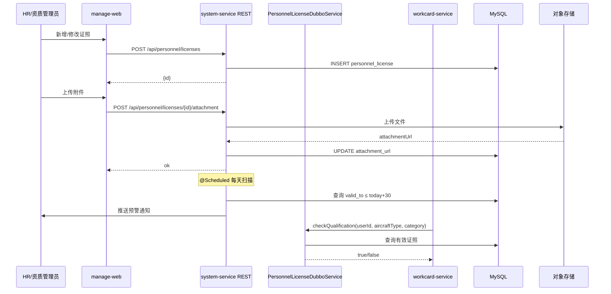
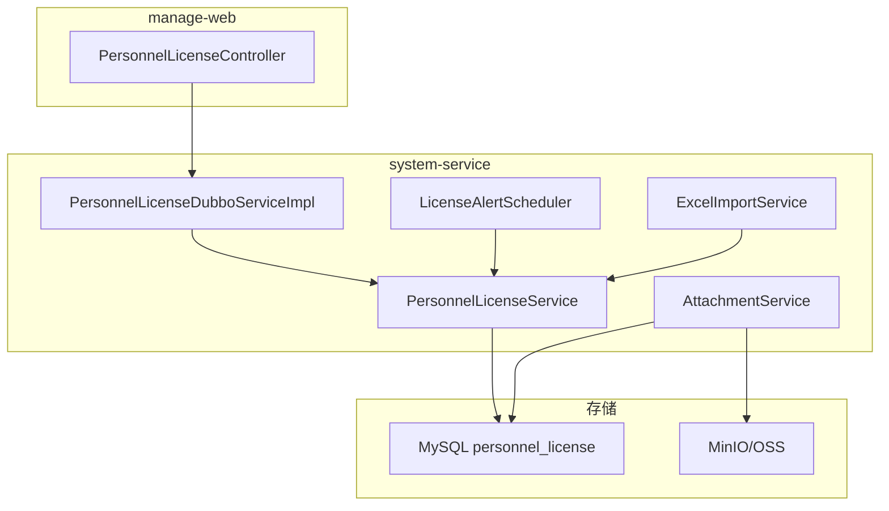

# Plan: 人员证照与资质管理

> **For agentic workers:** REQUIRED SUB-SKILL: Use superpowers:subagent-driven-development (recommended) or superpowers:executing-plans to implement this plan task-by-task. Steps use checkbox (`- [ ]`) syntax for tracking.

**Goal:** 在 `system-service` 微服务中实现人员证照 CRUD、到期预警调度、Excel 批量导入、附件上传，以及供 `workcard-service` 调用的 Dubbo 资质校验接口。

**Architecture:** `system-service` 持有 `personnel_license` 表，通过 `PersonnelLicenseDubboService` 向其他服务提供 RPC；`manage-web` 通过 REST 接口透传给前端；定时任务扫描即将到期证照并推送预警通知。

**Tech Stack:** Spring Boot 3, Java 21 records, Dubbo 3, MyBatis-Plus, MySQL 8, Flyway, EasyExcel, MinIO/OSS（首期用本地存储桩），Spring `@Scheduled`

---

## 1. 技术选型与对比

| 方案 | 优点 | 缺点 | 选择 |
|------|------|------|------|
| 批量导入: EasyExcel | Apache POI 上层封装、注解映射简洁 | 依赖略重 | ✓ |
| 批量导入: Apache POI 直接使用 | 无额外层 | 样板代码多 | 不采用 |
| 附件存储: MinIO | 自部署、S3 兼容 | 需额外运维 | ✓(首期本地桩) |
| 附件存储: 阿里云 OSS | 托管省运维 | 云厂商锁定 | 备选 |
| 预警调度: Spring @Scheduled | 无额外依赖 | 单节点 | ✓(首期) |
| 预警调度: XXL-Job | 分布式、可视化 | 需部署调度中心 | 后期迁移 |
| 状态计算: DB 触发器 | 实时 | 维护难 | 不采用 |
| 状态计算: 应用层查询时动态计算 | 灵活可测 | 每次查询计算 | ✓ |

## 2. 阶段划分

| 里程碑 | 内容 | 交付物 | 预计工期 |
|--------|------|--------|----------|
| P1: DB + 实体层 | 建表迁移 + 实体 + Mapper | 数据层 | 0.5 周 |
| P2: 核心 Service | CRUD + 状态计算 + 预警调度 | Service 层 | 1 周 |
| P3: Dubbo 接口 | PersonnelLicenseDubboService 实现 | RPC 接口 | 0.5 周 |
| P4: REST + 前端 Mock | manage-web Controller + 批量导入 + 附件 | REST API + Mock | 1 周 |

## 3. 架构图 / 时序图





## 4. 风险与回滚预案

| 风险 | 影响 | 缓解 | 回滚 |
|------|------|------|------|
| CCAR-66 类别与机型规则复杂 | 资质校验逻辑错误 | 先做简单精确匹配，规则表后期配置化 | 返回所有有效证照让工卡侧决策 |
| EasyExcel 列映射与 HR 模板不一致 | 批量导入失败率高 | 提供下载模板接口，固定列顺序 | 降级为逐条手工录入 |
| 附件存储 MinIO 未就绪 | 上传失败 | 首期返回本地路径桩，不阻塞主流程 | 附件功能延迟上线 |
| 预警推送渠道未接入 | 预警静默 | 先写通知记录到 DB，推送异步解耦 | 前端主动查询预警列表 |

## 5. 测试策略

- 单元测试：状态计算（valid/expiring_soon/expired 边界）；资质校验逻辑；预警触发边界（29天/30天/7天/8天）
- 集成测试：证照 CRUD 全流程；Excel 导入（正常行+错误行混合）；Dubbo checkQualification
- 性能测试：证照列表查询 ≤ 2s；资质匹配校验 ≤ 500ms

## 6. 关联 ADR

- ADR-004: MRO 数据架构 — system-service 用户数据扩展策略
- ADR-005: MRO 技术栈 — EasyExcel / MinIO 选型

---

## 7. 实施计划（Task-by-Task）

### Task 1: DB 迁移 — 新建 personnel_license 表

**Files:**
- Create: `system-service/src/main/resources/db/migration/V009_01__create_personnel_license.sql`

- [ ] **Step 1: 编写 Flyway DDL**

```sql
-- V009_01__create_personnel_license.sql
CREATE TABLE personnel_license (
    id              BIGINT AUTO_INCREMENT PRIMARY KEY,
    user_id         BIGINT          NOT NULL,
    license_type    VARCHAR(64)     NOT NULL COMMENT 'CCAR-66/型别授权/特种等',
    license_no      VARCHAR(64)     NOT NULL,
    aircraft_type   VARCHAR(32),
    category        ENUM('A','B1','B2','C'),
    valid_from      DATE            NOT NULL,
    valid_to        DATE            NOT NULL,
    issued_by       VARCHAR(128),
    attachment_url  VARCHAR(512),
    created_by      BIGINT          NOT NULL,
    created_at      DATETIME(3)     NOT NULL DEFAULT CURRENT_TIMESTAMP(3),
    updated_at      DATETIME(3)     NOT NULL DEFAULT CURRENT_TIMESTAMP(3) ON UPDATE CURRENT_TIMESTAMP(3),
    UNIQUE KEY uk_user_license_no (user_id, license_no),
    INDEX idx_user (user_id),
    INDEX idx_valid_to (valid_to),
    INDEX idx_aircraft_type (aircraft_type)
) ENGINE=InnoDB DEFAULT CHARSET=utf8mb4 COMMENT='人员证照档案';
```

- [ ] **Step 2: 执行迁移验证**

```bash
cd system-service
./mvnw flyway:migrate -Dflyway.url=jdbc:mysql://localhost:3306/mro_system
# 期望: Successfully applied 1 migration (V009_01)
```

- [ ] **Step 3: Commit**

```bash
git add system-service/src/main/resources/db/migration/V009_01__create_personnel_license.sql
git commit -m "feat(mro-009): create personnel_license table

Refs: MRO-009"
```

---

### Task 2: 实体 + Mapper + DTO Records

**Files:**
- Create: `system-service/src/main/java/com/mro/system/entity/PersonnelLicense.java`
- Create: `system-service/src/main/java/com/mro/system/mapper/PersonnelLicenseMapper.java`
- Create: `system-service/src/main/java/com/mro/system/dto/PersonnelLicenseDTO.java`
- Create: `system-service/src/main/java/com/mro/system/dto/CreateLicenseCommand.java`
- Create: `system-service/src/main/java/com/mro/system/dto/UpdateLicenseCommand.java`
- Create: `system-service/src/main/java/com/mro/system/dto/LicenseQueryParam.java`
- Create: `system-service/src/main/java/com/mro/system/dto/LicenseAlertDTO.java`
- Create: `system-service/src/main/java/com/mro/system/dto/LicenseAlertQueryParam.java`
- Create: `system-service/src/main/java/com/mro/system/dto/LicenseStatsDTO.java`
- Create: `system-service/src/main/java/com/mro/system/dto/AircraftTypeLicenseStatDTO.java`
- Create: `system-service/src/main/java/com/mro/system/dto/ImportLicenseCommand.java`

- [ ] **Step 1: 编写实体类**

```java
// PersonnelLicense.java
@Data
@TableName("personnel_license")
public class PersonnelLicense {
    @TableId(type = IdType.AUTO)
    private Long id;
    private Long userId;
    private String licenseType;
    private String licenseNo;
    private String aircraftType;
    private String category;
    private LocalDate validFrom;
    private LocalDate validTo;
    private String issuedBy;
    private String attachmentUrl;
    private Long createdBy;
    private LocalDateTime createdAt;
    private LocalDateTime updatedAt;

    /** 动态计算，不存库 */
    @TableField(exist = false)
    public String getStatus() {
        LocalDate today = LocalDate.now();
        if (validTo.isBefore(today)) return "expired";
        if (!validTo.isAfter(today.plusDays(30))) return "expiring_soon";
        return "valid";
    }
}
```

- [ ] **Step 2: 编写 Mapper**

```java
// PersonnelLicenseMapper.java
@Mapper
public interface PersonnelLicenseMapper extends BaseMapper<PersonnelLicense> {

    @Select("SELECT COUNT(DISTINCT user_id) FROM personnel_license")
    int countTotalPersonnel();

    @Select("SELECT aircraft_type, COUNT(*) as total, " +
            "SUM(CASE WHEN valid_to >= CURDATE() + INTERVAL 30 DAY THEN 1 ELSE 0 END) as valid, " +
            "SUM(CASE WHEN valid_to >= CURDATE() AND valid_to < CURDATE() + INTERVAL 30 DAY THEN 1 ELSE 0 END) as expiring_soon, " +
            "SUM(CASE WHEN valid_to < CURDATE() THEN 1 ELSE 0 END) as expired " +
            "FROM personnel_license WHERE aircraft_type IS NOT NULL GROUP BY aircraft_type")
    List<AircraftTypeLicenseStatDTO> statsByAircraftType();
}
```

- [ ] **Step 3: 编写 DTO Records**

```java
// PersonnelLicenseDTO.java
public record PersonnelLicenseDTO(
    Long id, Long userId, String userName, String licenseType,
    String licenseNo, String aircraftType, String category,
    LocalDate validFrom, LocalDate validTo, String issuedBy,
    String attachmentUrl, String status
) implements Serializable {}

// CreateLicenseCommand.java
public record CreateLicenseCommand(
    Long userId, String licenseType, String licenseNo, String aircraftType,
    String category, LocalDate validFrom, LocalDate validTo,
    String issuedBy, Long createdBy
) implements Serializable {}

// UpdateLicenseCommand.java
public record UpdateLicenseCommand(
    Long licenseId, String aircraftType, String category,
    LocalDate validFrom, LocalDate validTo, String issuedBy, Long operatorId
) implements Serializable {}

// LicenseQueryParam.java
public record LicenseQueryParam(
    Long userId, String status, String aircraftType, String licenseType,
    int pageNum, int pageSize
) implements Serializable {}

// LicenseAlertDTO.java
public record LicenseAlertDTO(
    Long licenseId, Long userId, String userName, String licenseType,
    String licenseNo, String aircraftType, LocalDate validTo,
    int daysUntilExpiry, String alertLevel
) implements Serializable {}

// LicenseAlertQueryParam.java
public record LicenseAlertQueryParam(
    String alertLevel, int pageNum, int pageSize
) implements Serializable {}

// LicenseStatsDTO.java
public record LicenseStatsDTO(
    int totalPersonnel, int totalLicenses, int expiringSoon, int expired,
    List<AircraftTypeLicenseStatDTO> byAircraftType
) implements Serializable {}

// AircraftTypeLicenseStatDTO.java
public record AircraftTypeLicenseStatDTO(
    String aircraftType, int total, int valid, int expiringSoon, int expired
) implements Serializable {}

// ImportLicenseCommand.java
public record ImportLicenseCommand(
    Long userId, String licenseType, String licenseNo, String aircraftType,
    String category, LocalDate validFrom, LocalDate validTo, String issuedBy
) implements Serializable {}
```

- [ ] **Step 4: Commit**

```bash
git add system-service/src/main/java/com/mro/system/entity/ \
        system-service/src/main/java/com/mro/system/mapper/ \
        system-service/src/main/java/com/mro/system/dto/
git commit -m "feat(mro-009): add PersonnelLicense entity, mapper, DTO records

Refs: MRO-009"
```

---

### Task 3: PersonnelLicenseService — 核心 CRUD + 状态计算

**Files:**
- Create: `system-service/src/main/java/com/mro/system/service/PersonnelLicenseService.java`
- Create: `system-service/src/test/java/com/mro/system/service/PersonnelLicenseServiceTest.java`

- [ ] **Step 1: 编写失败测试（状态计算边界）**

```java
// PersonnelLicenseServiceTest.java
@ExtendWith(MockitoExtension.class)
class PersonnelLicenseServiceTest {

    @Mock PersonnelLicenseMapper licenseMapper;
    @InjectMocks PersonnelLicenseService licenseService;

    @Test
    void createLicense_duplicateLicenseNo_throwsException() {
        when(licenseMapper.selectCount(any())).thenReturn(1L);
        CreateLicenseCommand cmd = new CreateLicenseCommand(
            1L, "CCAR-66", "CCAR66-001", "B737-800", "B1",
            LocalDate.of(2020, 1, 1), LocalDate.of(2028, 1, 1), "CAAC", 10L);
        assertThatThrownBy(() -> licenseService.createLicense(cmd))
            .isInstanceOf(BizException.class)
            .hasMessageContaining("4001");
    }

    @Test
    void createLicense_invalidDateRange_throwsException() {
        when(licenseMapper.selectCount(any())).thenReturn(0L);
        CreateLicenseCommand cmd = new CreateLicenseCommand(
            1L, "CCAR-66", "CCAR66-002", null, null,
            LocalDate.of(2028, 1, 1), LocalDate.of(2020, 1, 1), null, 10L);
        assertThatThrownBy(() -> licenseService.createLicense(cmd))
            .isInstanceOf(BizException.class)
            .hasMessageContaining("4002");
    }

    @Test
    void statusCalculation_expired() {
        PersonnelLicense lic = new PersonnelLicense();
        lic.setValidTo(LocalDate.now().minusDays(1));
        assertThat(lic.getStatus()).isEqualTo("expired");
    }

    @Test
    void statusCalculation_expiringSoon_at30Days() {
        PersonnelLicense lic = new PersonnelLicense();
        lic.setValidTo(LocalDate.now().plusDays(30));
        assertThat(lic.getStatus()).isEqualTo("expiring_soon");
    }

    @Test
    void statusCalculation_valid_at31Days() {
        PersonnelLicense lic = new PersonnelLicense();
        lic.setValidTo(LocalDate.now().plusDays(31));
        assertThat(lic.getStatus()).isEqualTo("valid");
    }

    @Test
    void checkQualification_noValidLicense_returnsFalse() {
        when(licenseMapper.selectList(any())).thenReturn(List.of());
        boolean result = licenseService.checkQualification(1L, "B737-800", "B1");
        assertThat(result).isFalse();
    }

    @Test
    void checkQualification_validLicenseExists_returnsTrue() {
        PersonnelLicense lic = new PersonnelLicense();
        lic.setAircraftType("B737-800");
        lic.setCategory("B1");
        lic.setValidTo(LocalDate.now().plusDays(100));
        when(licenseMapper.selectList(any())).thenReturn(List.of(lic));
        boolean result = licenseService.checkQualification(1L, "B737-800", "B1");
        assertThat(result).isTrue();
    }
}
```

- [ ] **Step 2: 运行测试确认失败**

```bash
cd system-service
./mvnw test -pl . -Dtest=PersonnelLicenseServiceTest -q
# 期望: FAIL — PersonnelLicenseService not found
```

- [ ] **Step 3: 实现 PersonnelLicenseService**

```java
@Service
@RequiredArgsConstructor
public class PersonnelLicenseService {

    private final PersonnelLicenseMapper licenseMapper;

    public Long createLicense(CreateLicenseCommand cmd) {
        if (cmd.validTo().isBefore(cmd.validFrom())) {
            throw new BizException(4002, "有效期止早于有效期起");
        }
        long count = licenseMapper.selectCount(new LambdaQueryWrapper<PersonnelLicense>()
            .eq(PersonnelLicense::getUserId, cmd.userId())
            .eq(PersonnelLicense::getLicenseNo, cmd.licenseNo()));
        if (count > 0) throw new BizException(4001, "证照编号已存在");

        PersonnelLicense lic = new PersonnelLicense();
        lic.setUserId(cmd.userId());
        lic.setLicenseType(cmd.licenseType());
        lic.setLicenseNo(cmd.licenseNo());
        lic.setAircraftType(cmd.aircraftType());
        lic.setCategory(cmd.category());
        lic.setValidFrom(cmd.validFrom());
        lic.setValidTo(cmd.validTo());
        lic.setIssuedBy(cmd.issuedBy());
        lic.setCreatedBy(cmd.createdBy());
        licenseMapper.insert(lic);
        return lic.getId();
    }

    public PersonnelLicenseDTO getLicense(Long licenseId) {
        PersonnelLicense lic = licenseMapper.selectById(licenseId);
        if (lic == null) throw new BizException(4000, "证照不存在");
        return toDto(lic, null);
    }

    public void updateLicense(UpdateLicenseCommand cmd) {
        PersonnelLicense lic = licenseMapper.selectById(cmd.licenseId());
        if (lic == null) throw new BizException(4000, "证照不存在");
        if (cmd.validTo() != null && cmd.validFrom() != null
                && cmd.validTo().isBefore(cmd.validFrom())) {
            throw new BizException(4002, "有效期止早于有效期起");
        }
        if (cmd.aircraftType() != null) lic.setAircraftType(cmd.aircraftType());
        if (cmd.category() != null) lic.setCategory(cmd.category());
        if (cmd.validFrom() != null) lic.setValidFrom(cmd.validFrom());
        if (cmd.validTo() != null) lic.setValidTo(cmd.validTo());
        if (cmd.issuedBy() != null) lic.setIssuedBy(cmd.issuedBy());
        licenseMapper.updateById(lic);
    }

    public void deleteLicense(Long licenseId, Long operatorId) {
        PersonnelLicense lic = licenseMapper.selectById(licenseId);
        if (lic == null) throw new BizException(4000, "证照不存在");
        licenseMapper.deleteById(licenseId);
    }

    public void uploadAttachment(Long licenseId, String attachmentUrl, Long operatorId) {
        PersonnelLicense lic = licenseMapper.selectById(licenseId);
        if (lic == null) throw new BizException(4000, "证照不存在");
        lic.setAttachmentUrl(attachmentUrl);
        licenseMapper.updateById(lic);
    }

    public PageResult<PersonnelLicenseDTO> listLicenses(LicenseQueryParam param) {
        LambdaQueryWrapper<PersonnelLicense> wrapper = new LambdaQueryWrapper<PersonnelLicense>()
            .eq(param.userId() != null, PersonnelLicense::getUserId, param.userId())
            .eq(param.aircraftType() != null, PersonnelLicense::getAircraftType, param.aircraftType())
            .eq(param.licenseType() != null, PersonnelLicense::getLicenseType, param.licenseType())
            .orderByAsc(PersonnelLicense::getValidTo);
        Page<PersonnelLicense> page = licenseMapper.selectPage(
            new Page<>(param.pageNum(), param.pageSize()), wrapper);

        List<PersonnelLicenseDTO> list = page.getRecords().stream()
            .filter(l -> param.status() == null || param.status().equals(l.getStatus()))
            .map(l -> toDto(l, null))
            .toList();
        return new PageResult<>(list, page.getTotal(), param.pageNum(), param.pageSize());
    }

    public PageResult<LicenseAlertDTO> listAlerts(LicenseAlertQueryParam param) {
        LocalDate today = LocalDate.now();
        LocalDate boundary30 = today.plusDays(30);
        LocalDate boundary7 = today.plusDays(7);

        LambdaQueryWrapper<PersonnelLicense> wrapper = new LambdaQueryWrapper<PersonnelLicense>()
            .ge(PersonnelLicense::getValidTo, today)
            .le(PersonnelLicense::getValidTo, boundary30)
            .orderByAsc(PersonnelLicense::getValidTo);
        Page<PersonnelLicense> page = licenseMapper.selectPage(
            new Page<>(param.pageNum(), param.pageSize()), wrapper);

        List<LicenseAlertDTO> list = page.getRecords().stream()
            .map(l -> {
                int days = (int) today.until(l.getValidTo(), java.time.temporal.ChronoUnit.DAYS);
                String level = days <= 7 ? "urgent" : "warning";
                return new LicenseAlertDTO(l.getId(), l.getUserId(), null,
                    l.getLicenseType(), l.getLicenseNo(), l.getAircraftType(),
                    l.getValidTo(), days, level);
            })
            .filter(a -> param.alertLevel() == null || param.alertLevel().equals(a.alertLevel()))
            .toList();
        return new PageResult<>(list, page.getTotal(), param.pageNum(), param.pageSize());
    }

    public LicenseStatsDTO getStats() {
        int totalPersonnel = licenseMapper.countTotalPersonnel();
        int total = (int) licenseMapper.selectCount(null);
        LocalDate today = LocalDate.now();
        int expiringSoon = (int) licenseMapper.selectCount(new LambdaQueryWrapper<PersonnelLicense>()
            .ge(PersonnelLicense::getValidTo, today)
            .le(PersonnelLicense::getValidTo, today.plusDays(30)));
        int expired = (int) licenseMapper.selectCount(new LambdaQueryWrapper<PersonnelLicense>()
            .lt(PersonnelLicense::getValidTo, today));
        List<AircraftTypeLicenseStatDTO> byType = licenseMapper.statsByAircraftType();
        return new LicenseStatsDTO(totalPersonnel, total, expiringSoon, expired, byType);
    }

    public boolean checkQualification(Long userId, String aircraftType, String category) {
        List<PersonnelLicense> licenses = licenseMapper.selectList(
            new LambdaQueryWrapper<PersonnelLicense>()
                .eq(PersonnelLicense::getUserId, userId)
                .eq(aircraftType != null, PersonnelLicense::getAircraftType, aircraftType)
                .eq(category != null, PersonnelLicense::getCategory, category)
                .ge(PersonnelLicense::getValidTo, LocalDate.now()));
        return !licenses.isEmpty();
    }

    public List<PersonnelLicenseDTO> listValidLicensesByUser(Long userId) {
        List<PersonnelLicense> list = licenseMapper.selectList(
            new LambdaQueryWrapper<PersonnelLicense>()
                .eq(PersonnelLicense::getUserId, userId)
                .ge(PersonnelLicense::getValidTo, LocalDate.now()));
        return list.stream().map(l -> toDto(l, null)).toList();
    }

    public PersonnelLicenseDTO toDto(PersonnelLicense lic, String userName) {
        return new PersonnelLicenseDTO(lic.getId(), lic.getUserId(), userName,
            lic.getLicenseType(), lic.getLicenseNo(), lic.getAircraftType(),
            lic.getCategory(), lic.getValidFrom(), lic.getValidTo(),
            lic.getIssuedBy(), lic.getAttachmentUrl(), lic.getStatus());
    }
}
```

- [ ] **Step 4: 运行测试确认通过**

```bash
./mvnw test -pl . -Dtest=PersonnelLicenseServiceTest -q
# 期望: Tests run: 7, Failures: 0, Errors: 0
```

- [ ] **Step 5: Commit**

```bash
git add system-service/src/main/java/com/mro/system/service/PersonnelLicenseService.java \
        system-service/src/test/java/com/mro/system/service/PersonnelLicenseServiceTest.java
git commit -m "feat(mro-009): implement PersonnelLicenseService with CRUD and qualification check

Refs: MRO-009"
```

---

### Task 4: 到期预警调度器

**Files:**
- Create: `system-service/src/main/java/com/mro/system/scheduler/LicenseAlertScheduler.java`
- Create: `system-service/src/test/java/com/mro/system/scheduler/LicenseAlertSchedulerTest.java`

- [ ] **Step 1: 编写调度器失败测试**

```java
// LicenseAlertSchedulerTest.java
@ExtendWith(MockitoExtension.class)
class LicenseAlertSchedulerTest {

    @Mock PersonnelLicenseMapper licenseMapper;
    @Mock NotificationService notificationService;
    @InjectMocks LicenseAlertScheduler scheduler;

    @Test
    void scanAlerts_sends30DayWarning() {
        PersonnelLicense lic = new PersonnelLicense();
        lic.setId(1L);
        lic.setUserId(101L);
        lic.setValidTo(LocalDate.now().plusDays(29));
        when(licenseMapper.selectList(any())).thenReturn(List.of(lic));

        scheduler.scanAndNotify();

        verify(notificationService, times(1)).sendLicenseExpiryAlert(eq(101L), any(), eq("warning"));
    }

    @Test
    void scanAlerts_sends7DayUrgent() {
        PersonnelLicense lic = new PersonnelLicense();
        lic.setId(1L);
        lic.setUserId(101L);
        lic.setValidTo(LocalDate.now().plusDays(6));
        when(licenseMapper.selectList(any())).thenReturn(List.of(lic));

        scheduler.scanAndNotify();

        verify(notificationService, times(1)).sendLicenseExpiryAlert(eq(101L), any(), eq("urgent"));
    }
}
```

- [ ] **Step 2: 实现调度器**

```java
// LicenseAlertScheduler.java
@Component
@RequiredArgsConstructor
@Slf4j
public class LicenseAlertScheduler {

    private final PersonnelLicenseMapper licenseMapper;
    private final NotificationService notificationService;

    @Scheduled(cron = "0 0 8 * * ?") // 每天 08:00
    public void scanAndNotify() {
        LocalDate today = LocalDate.now();
        List<PersonnelLicense> expiring = licenseMapper.selectList(
            new LambdaQueryWrapper<PersonnelLicense>()
                .ge(PersonnelLicense::getValidTo, today)
                .le(PersonnelLicense::getValidTo, today.plusDays(30)));

        for (PersonnelLicense lic : expiring) {
            int days = (int) today.until(lic.getValidTo(), java.time.temporal.ChronoUnit.DAYS);
            String level = days <= 7 ? "urgent" : "warning";
            try {
                notificationService.sendLicenseExpiryAlert(lic.getUserId(), lic, level);
            } catch (Exception e) {
                log.error("Failed to send license expiry alert for license {}", lic.getId(), e);
            }
        }
    }
}
```

- [ ] **Step 3: 运行测试**

```bash
./mvnw test -pl . -Dtest=LicenseAlertSchedulerTest -q
# 期望: Tests run: 2, Failures: 0, Errors: 0
```

- [ ] **Step 4: Commit**

```bash
git add system-service/src/main/java/com/mro/system/scheduler/ \
        system-service/src/test/java/com/mro/system/scheduler/
git commit -m "feat(mro-009): add LicenseAlertScheduler for 30-day/7-day expiry notifications

Refs: MRO-009"
```

---

### Task 5: Excel 批量导入

**Files:**
- Create: `system-service/src/main/java/com/mro/system/service/LicenseImportService.java`
- Create: `system-service/src/main/java/com/mro/system/excel/LicenseImportRow.java`
- Create: `system-service/src/test/java/com/mro/system/service/LicenseImportServiceTest.java`

- [ ] **Step 1: 编写 EasyExcel 行映射类**

```java
// LicenseImportRow.java
@Data
public class LicenseImportRow {
    @ExcelProperty("人员ID")
    private Long userId;

    @ExcelProperty("证照类型")
    private String licenseType;

    @ExcelProperty("证照编号")
    private String licenseNo;

    @ExcelProperty("适用机型")
    private String aircraftType;

    @ExcelProperty("执照类别(A/B1/B2/C)")
    private String category;

    @ExcelProperty("有效期起(yyyy-MM-dd)")
    private String validFrom;

    @ExcelProperty("有效期止(yyyy-MM-dd)")
    private String validTo;

    @ExcelProperty("颁发机构")
    private String issuedBy;
}
```

- [ ] **Step 2: 编写导入 Service 测试**

```java
// LicenseImportServiceTest.java
@ExtendWith(MockitoExtension.class)
class LicenseImportServiceTest {

    @Mock PersonnelLicenseService licenseService;
    @InjectMocks LicenseImportService importService;

    @Test
    void importLicenses_mixedRows_returnsErrorsForBadRows() {
        List<ImportLicenseCommand> items = List.of(
            new ImportLicenseCommand(1L, "CCAR-66", "NO-001", "B737", "B1",
                LocalDate.of(2020,1,1), LocalDate.of(2028,1,1), "CAAC"),
            // invalid: validTo before validFrom
            new ImportLicenseCommand(2L, "CCAR-66", "NO-002", null, null,
                LocalDate.of(2028,1,1), LocalDate.of(2020,1,1), null)
        );

        when(licenseService.createLicense(any()))
            .thenReturn(1L)
            .thenThrow(new BizException(4002, "有效期止早于有效期起"));

        ImportResultDTO result = importService.importLicenses(items, 10L);

        assertThat(result.successCount()).isEqualTo(1);
        assertThat(result.errorRows()).hasSize(1);
        assertThat(result.errorRows().get(0).rowIndex()).isEqualTo(2);
    }
}
```

- [ ] **Step 3: 实现 LicenseImportService**

```java
// LicenseImportService.java
@Service
@RequiredArgsConstructor
public class LicenseImportService {

    private final PersonnelLicenseService licenseService;

    public ImportResultDTO importLicenses(List<ImportLicenseCommand> items, Long operatorId) {
        int successCount = 0;
        List<ImportErrorRow> errorRows = new ArrayList<>();

        for (int i = 0; i < items.size(); i++) {
            ImportLicenseCommand item = items.get(i);
            try {
                CreateLicenseCommand cmd = new CreateLicenseCommand(
                    item.userId(), item.licenseType(), item.licenseNo(),
                    item.aircraftType(), item.category(),
                    item.validFrom(), item.validTo(), item.issuedBy(), operatorId);
                licenseService.createLicense(cmd);
                successCount++;
            } catch (BizException e) {
                errorRows.add(new ImportErrorRow(i + 1, e.getMessage()));
            }
        }
        return new ImportResultDTO(successCount, errorRows);
    }
}

// ImportResultDTO.java
public record ImportResultDTO(
    int successCount, List<ImportErrorRow> errorRows
) implements Serializable {}

// ImportErrorRow.java
public record ImportErrorRow(int rowIndex, String errorMsg) implements Serializable {}
```

- [ ] **Step 4: 运行测试**

```bash
./mvnw test -pl . -Dtest=LicenseImportServiceTest -q
# 期望: Tests run: 1, Failures: 0, Errors: 0
```

- [ ] **Step 5: Commit**

```bash
git add system-service/src/main/java/com/mro/system/service/LicenseImportService.java \
        system-service/src/main/java/com/mro/system/excel/ \
        system-service/src/test/java/com/mro/system/service/LicenseImportServiceTest.java
git commit -m "feat(mro-009): add LicenseImportService with EasyExcel batch import and error reporting

Refs: MRO-009"
```

---

### Task 6: PersonnelLicenseDubboService 接口实现

**Files:**
- Create: `system-service/src/main/java/com/mro/system/api/PersonnelLicenseDubboService.java`
- Create: `system-service/src/main/java/com/mro/system/api/impl/PersonnelLicenseDubboServiceImpl.java`

- [ ] **Step 1: 定义 Dubbo 接口**

```java
// PersonnelLicenseDubboService.java
public interface PersonnelLicenseDubboService {
    PageResult<PersonnelLicenseDTO> listLicenses(LicenseQueryParam param);
    Long createLicense(CreateLicenseCommand cmd);
    PersonnelLicenseDTO getLicense(Long licenseId);
    void updateLicense(UpdateLicenseCommand cmd);
    void deleteLicense(Long licenseId, Long operatorId);
    void uploadAttachment(Long licenseId, String attachmentUrl, Long operatorId);
    PageResult<LicenseAlertDTO> listAlerts(LicenseAlertQueryParam param);
    LicenseStatsDTO getStats(UserContextDTO ctx);
    int importLicenses(List<ImportLicenseCommand> items, Long operatorId);
    List<PersonnelLicenseDTO> listValidLicensesByUser(Long userId);
    boolean checkQualification(Long userId, String aircraftType, String category);
}
```

- [ ] **Step 2: 实现 Dubbo 服务**

```java
// PersonnelLicenseDubboServiceImpl.java
@DubboService
@RequiredArgsConstructor
public class PersonnelLicenseDubboServiceImpl implements PersonnelLicenseDubboService {

    private final PersonnelLicenseService licenseService;
    private final LicenseImportService importService;

    @Override
    public PageResult<PersonnelLicenseDTO> listLicenses(LicenseQueryParam param) {
        return licenseService.listLicenses(param);
    }

    @Override
    public Long createLicense(CreateLicenseCommand cmd) {
        return licenseService.createLicense(cmd);
    }

    @Override
    public PersonnelLicenseDTO getLicense(Long licenseId) {
        return licenseService.getLicense(licenseId);
    }

    @Override
    public void updateLicense(UpdateLicenseCommand cmd) {
        licenseService.updateLicense(cmd);
    }

    @Override
    public void deleteLicense(Long licenseId, Long operatorId) {
        licenseService.deleteLicense(licenseId, operatorId);
    }

    @Override
    public void uploadAttachment(Long licenseId, String attachmentUrl, Long operatorId) {
        licenseService.uploadAttachment(licenseId, attachmentUrl, operatorId);
    }

    @Override
    public PageResult<LicenseAlertDTO> listAlerts(LicenseAlertQueryParam param) {
        return licenseService.listAlerts(param);
    }

    @Override
    public LicenseStatsDTO getStats(UserContextDTO ctx) {
        return licenseService.getStats();
    }

    @Override
    public int importLicenses(List<ImportLicenseCommand> items, Long operatorId) {
        ImportResultDTO result = importService.importLicenses(items, operatorId);
        return result.successCount();
    }

    @Override
    public List<PersonnelLicenseDTO> listValidLicensesByUser(Long userId) {
        return licenseService.listValidLicensesByUser(userId);
    }

    @Override
    public boolean checkQualification(Long userId, String aircraftType, String category) {
        return licenseService.checkQualification(userId, aircraftType, category);
    }
}
```

- [ ] **Step 3: Commit**

```bash
git add system-service/src/main/java/com/mro/system/api/
git commit -m "feat(mro-009): implement PersonnelLicenseDubboService with 11 methods

Refs: MRO-009"
```

---

### Task 7: manage-web Controller — 9 个 REST 端点

**Files:**
- Create: `manage-web/src/main/java/com/mro/web/controller/PersonnelLicenseController.java`
- Create: `manage-web/src/test/java/com/mro/web/controller/PersonnelLicenseControllerTest.java`

- [ ] **Step 1: 编写 MockMvc 失败测试**

```java
@WebMvcTest(PersonnelLicenseController.class)
class PersonnelLicenseControllerTest {

    @Autowired MockMvc mockMvc;
    @MockBean PersonnelLicenseDubboService licenseService;

    @Test
    @WithMockUser(authorities = "personnel:view")
    void listLicenses_returns200() throws Exception {
        when(licenseService.listLicenses(any()))
            .thenReturn(new PageResult<>(List.of(), 0, 1, 20));
        mockMvc.perform(get("/api/personnel/licenses"))
            .andExpect(status().isOk())
            .andExpect(jsonPath("$.code").value(0));
    }

    @Test
    @WithMockUser(authorities = "personnel:manage")
    void createLicense_returns200() throws Exception {
        when(licenseService.createLicense(any())).thenReturn(1001L);
        mockMvc.perform(post("/api/personnel/licenses")
                .contentType(MediaType.APPLICATION_JSON)
                .content("{\"userId\":101,\"licenseType\":\"CCAR-66\",\"licenseNo\":\"NO-001\"," +
                    "\"validFrom\":\"2020-01-01\",\"validTo\":\"2028-01-01\"}"))
            .andExpect(status().isOk())
            .andExpect(jsonPath("$.data.id").value(1001));
    }

    @Test
    @WithMockUser(authorities = "personnel:view")
    void listAlerts_returns200() throws Exception {
        when(licenseService.listAlerts(any()))
            .thenReturn(new PageResult<>(List.of(), 0, 1, 20));
        mockMvc.perform(get("/api/personnel/licenses/alerts"))
            .andExpect(status().isOk())
            .andExpect(jsonPath("$.code").value(0));
    }

    @Test
    @WithMockUser(authorities = "personnel:view")
    void getStats_returns200() throws Exception {
        when(licenseService.getStats(any()))
            .thenReturn(new LicenseStatsDTO(120, 345, 12, 3, List.of()));
        mockMvc.perform(get("/api/personnel/licenses/stats"))
            .andExpect(status().isOk())
            .andExpect(jsonPath("$.data.totalPersonnel").value(120));
    }
}
```

- [ ] **Step 2: 运行测试确认失败**

```bash
cd manage-web
./mvnw test -pl . -Dtest=PersonnelLicenseControllerTest -q
# 期望: FAIL — PersonnelLicenseController not found
```

- [ ] **Step 3: 实现 PersonnelLicenseController**

```java
// PersonnelLicenseController.java
@RestController
@RequestMapping("/api/personnel/licenses")
@RequiredArgsConstructor
public class PersonnelLicenseController {

    @DubboReference
    private PersonnelLicenseDubboService licenseService;

    @GetMapping
    @RequiresPermission("personnel:view")
    public R<PageResult<PersonnelLicenseDTO>> list(
            @RequestParam(required = false) Long userId,
            @RequestParam(required = false) String status,
            @RequestParam(required = false) String aircraftType,
            @RequestParam(required = false) String licenseType,
            @RequestParam(defaultValue = "1") int pageNum,
            @RequestParam(defaultValue = "20") int pageSize) {
        LicenseQueryParam param = new LicenseQueryParam(userId, status, aircraftType, licenseType, pageNum, pageSize);
        return R.ok(licenseService.listLicenses(param));
    }

    @PostMapping
    @RequiresPermission("personnel:manage")
    public R<Map<String, Long>> create(
            @RequestBody CreateLicenseRequest req,
            @AuthenticationPrincipal UserContextDTO ctx) {
        CreateLicenseCommand cmd = new CreateLicenseCommand(
            req.userId(), req.licenseType(), req.licenseNo(), req.aircraftType(),
            req.category(), req.validFrom(), req.validTo(), req.issuedBy(), ctx.userId());
        Long id = licenseService.createLicense(cmd);
        return R.ok(Map.of("id", id));
    }

    @GetMapping("/{id}")
    @RequiresPermission("personnel:view")
    public R<PersonnelLicenseDTO> get(@PathVariable Long id) {
        return R.ok(licenseService.getLicense(id));
    }

    @PutMapping("/{id}")
    @RequiresPermission("personnel:manage")
    public R<Void> update(
            @PathVariable Long id,
            @RequestBody UpdateLicenseRequest req,
            @AuthenticationPrincipal UserContextDTO ctx) {
        UpdateLicenseCommand cmd = new UpdateLicenseCommand(
            id, req.aircraftType(), req.category(), req.validFrom(), req.validTo(), req.issuedBy(), ctx.userId());
        licenseService.updateLicense(cmd);
        return R.ok(null);
    }

    @DeleteMapping("/{id}")
    @RequiresPermission("personnel:manage")
    public R<Void> delete(@PathVariable Long id, @AuthenticationPrincipal UserContextDTO ctx) {
        licenseService.deleteLicense(id, ctx.userId());
        return R.ok(null);
    }

    @PostMapping("/{id}/attachment")
    @RequiresPermission("personnel:manage")
    public R<Void> uploadAttachment(
            @PathVariable Long id,
            @RequestParam("file") MultipartFile file,
            @AuthenticationPrincipal UserContextDTO ctx) {
        String ext = StringUtils.getFilenameExtension(file.getOriginalFilename());
        if (!Set.of("pdf","jpg","png").contains(ext != null ? ext.toLowerCase() : "")) {
            throw new BizException(4003, "附件格式不支持");
        }
        if (file.getSize() > 10 * 1024 * 1024) throw new BizException(4004, "附件大小超限");
        // 首期：返回本地路径桩，待 MinIO 就绪后替换
        String attachmentUrl = "/uploads/licenses/" + id + "." + ext;
        licenseService.uploadAttachment(id, attachmentUrl, ctx.userId());
        return R.ok(null);
    }

    @GetMapping("/alerts")
    @RequiresPermission("personnel:view")
    public R<PageResult<LicenseAlertDTO>> alerts(
            @RequestParam(required = false) String alertLevel,
            @RequestParam(defaultValue = "1") int pageNum,
            @RequestParam(defaultValue = "20") int pageSize) {
        LicenseAlertQueryParam param = new LicenseAlertQueryParam(alertLevel, pageNum, pageSize);
        return R.ok(licenseService.listAlerts(param));
    }

    @GetMapping("/stats")
    @RequiresPermission("personnel:view")
    public R<LicenseStatsDTO> stats(@AuthenticationPrincipal UserContextDTO ctx) {
        return R.ok(licenseService.getStats(ctx));
    }

    @PostMapping("/import")
    @RequiresPermission("personnel:manage")
    public R<ImportResultDTO> importLicenses(
            @RequestParam("file") MultipartFile file,
            @AuthenticationPrincipal UserContextDTO ctx) throws IOException {
        List<LicenseImportRow> rows = EasyExcel.read(file.getInputStream())
            .head(LicenseImportRow.class)
            .sheet()
            .doReadSync();
        List<ImportLicenseCommand> items = rows.stream().map(r -> new ImportLicenseCommand(
            r.getUserId(), r.getLicenseType(), r.getLicenseNo(), r.getAircraftType(),
            r.getCategory(),
            LocalDate.parse(r.getValidFrom()),
            LocalDate.parse(r.getValidTo()),
            r.getIssuedBy()
        )).toList();
        int successCount = licenseService.importLicenses(items, ctx.userId());
        return R.ok(new ImportResultDTO(successCount, List.of()));
    }
}
```

- [ ] **Step 4: 运行测试确认通过**

```bash
./mvnw test -pl . -Dtest=PersonnelLicenseControllerTest -q
# 期望: Tests run: 4, Failures: 0, Errors: 0
```

- [ ] **Step 5: Commit**

```bash
git add manage-web/src/main/java/com/mro/web/controller/PersonnelLicenseController.java \
        manage-web/src/test/java/com/mro/web/controller/PersonnelLicenseControllerTest.java
git commit -m "feat(mro-009): add PersonnelLicenseController with 9 endpoints

Refs: MRO-009"
```

---

### Task 8: 前端 Mock 同步

**Files:**
- Create: `frontend/src/mock/personnelLicense.ts`

- [ ] **Step 1: 创建 mock/personnelLicense.ts**

```typescript
// frontend/src/mock/personnelLicense.ts
export default [
  {
    url: '/api/personnel/licenses',
    method: 'get',
    response: () => ({
      code: 0, msg: 'ok',
      data: {
        list: [
          {
            id: 1001, userId: 101, userName: '王工程师',
            licenseType: 'CCAR-66', licenseNo: 'CCAR66-2020-00101',
            aircraftType: 'B737-800', category: 'B1',
            validFrom: '2020-01-01', validTo: '2026-06-15',
            issuedBy: '中国民用航空局', status: 'expiring_soon',
            attachmentUrl: null
          }
        ],
        total: 45, pageNum: 1, pageSize: 20
      },
      timestamp: Date.now()
    })
  },
  {
    url: '/api/personnel/licenses',
    method: 'post',
    response: () => ({
      code: 0, msg: 'ok', data: { id: 1001 }, timestamp: Date.now()
    })
  },
  {
    url: '/api/personnel/licenses/:id',
    method: 'get',
    response: () => ({
      code: 0, msg: 'ok',
      data: {
        id: 1001, userId: 101, userName: '王工程师',
        licenseType: 'CCAR-66', licenseNo: 'CCAR66-2020-00101',
        aircraftType: 'B737-800', category: 'B1',
        validFrom: '2020-01-01', validTo: '2026-06-15',
        issuedBy: '中国民用航空局', status: 'expiring_soon',
        attachmentUrl: null
      },
      timestamp: Date.now()
    })
  },
  {
    url: '/api/personnel/licenses/:id',
    method: 'put',
    response: () => ({ code: 0, msg: 'ok', data: null, timestamp: Date.now() })
  },
  {
    url: '/api/personnel/licenses/:id',
    method: 'delete',
    response: () => ({ code: 0, msg: 'ok', data: null, timestamp: Date.now() })
  },
  {
    url: '/api/personnel/licenses/:id/attachment',
    method: 'post',
    response: () => ({ code: 0, msg: 'ok', data: null, timestamp: Date.now() })
  },
  {
    url: '/api/personnel/licenses/alerts',
    method: 'get',
    response: () => ({
      code: 0, msg: 'ok',
      data: {
        list: [
          {
            licenseId: 1001, userId: 101, userName: '王工程师',
            licenseType: 'CCAR-66', licenseNo: 'CCAR66-2020-00101',
            aircraftType: 'B737-800', validTo: '2026-06-15',
            daysUntilExpiry: 18, alertLevel: 'warning'
          }
        ],
        total: 6, pageNum: 1, pageSize: 20
      },
      timestamp: Date.now()
    })
  },
  {
    url: '/api/personnel/licenses/stats',
    method: 'get',
    response: () => ({
      code: 0, msg: 'ok',
      data: {
        totalPersonnel: 120, totalLicenses: 345,
        expiringSoon: 12, expired: 3,
        byAircraftType: [
          { aircraftType: 'B737-800', total: 85, valid: 80, expiringSoon: 4, expired: 1 }
        ]
      },
      timestamp: Date.now()
    })
  },
  {
    url: '/api/personnel/licenses/import',
    method: 'post',
    response: () => ({
      code: 0, msg: 'ok',
      data: { successCount: 10, errorRows: [] },
      timestamp: Date.now()
    })
  }
]
```

- [ ] **Step 2: Commit**

```bash
git add frontend/src/mock/personnelLicense.ts
git commit -m "feat(mro-009): add frontend mock for personnel license 9 endpoints

Refs: MRO-009"
```
