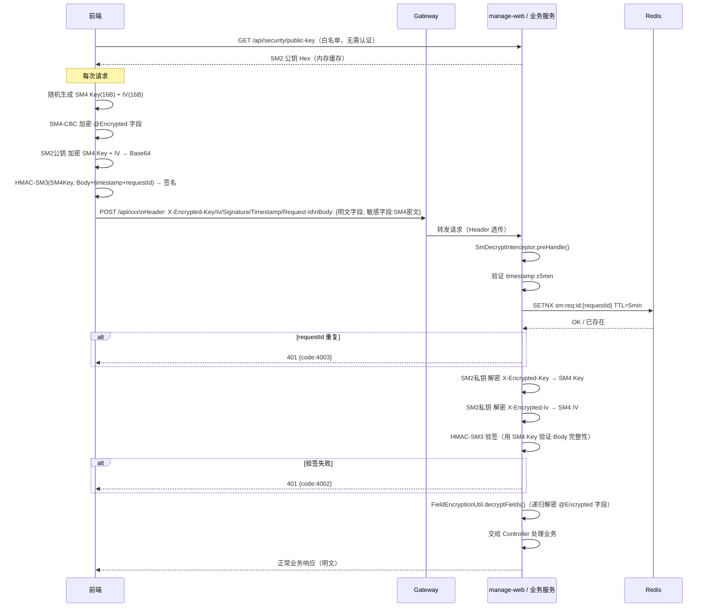

# Plan: 前后端传输国密加密（SM2+SM4+HMAC-SM3）

## 1. 技术选型与对比

| 方案 | 优点 | 缺点 | 选择 |
|------|------|------|------|
| hutool-crypto + BouncyCastle | API 简洁，封装完善，国内使用最广，SM2/SM4/SM3 全覆盖 | 需引入 BC Provider | ✅ 选用 |
| 手写 JCE + BouncyCastle | 灵活，无额外封装层 | 代码量大，容易出错 | ✗ |
| sm-crypto（前端） | npm 周下载 10万+，API 简单，支持 SM2/SM4/SM3/HMAC | 开源未经国密局认证 | ✅ 选用（生产可替换商业 SDK） |
| forge / node-forge（前端） | 生态成熟 | 不支持国密算法 | ✗ |

**HMAC-SM3 签名方案选型说明：**
前端无 SM2 私钥，无法做 SM2 签名。采用 HMAC-SM3（以 SM4 密钥为 HMAC 密钥）：后端解出 SM4 密钥后可直接验签，无需额外密钥交换，实现最简。

## 2. 阶段划分

| 里程碑 | 内容 | 交付物 | 预计工期 |
|--------|------|--------|----------|
| M1 后端基础设施 | SM2Util / SM4Util / SM3Util 工具类；密钥生成脚本；application.yml 配置；公钥分发接口 | 3 个工具类 + 1 个接口 + 配置 | 1天 |
| M2 后端拦截器 | FieldEncryptionUtil 改为 SM4；SmDecryptInterceptor 实现（验时间戳 + requestId + HMAC + 解密）；注册拦截器 | SmDecryptInterceptor + 单元测试 | 1天 |
| M3 前端国密服务 | SmEncryptionService 实现；Axios 拦截器接入；公钥内存缓存 | SmEncryptionService.js + 单测 | 1天 |
| M4 联调验收 | 前后端联调；集成测试；关闭原 RSA 方案 | 联调报告 + 验收清单全绿 | 1天 |

## 3. 架构图 / 时序图

### 3.1 整体加密流程时序图



### 3.2 组件依赖图

```
manage-web
├── SmDecryptInterceptor          ← 拦截 /api/**
│   ├── SM2Util                   ← 解密 SM4 Key/IV
│   ├── SM3Util (HMAC-SM3)        ← 验签
│   └── FieldEncryptionUtil       ← 递归解密 @Encrypted 字段
│       └── SM4Util               ← 字段解密
├── SecurityController            ← GET /api/security/public-key
└── application.yml               ← security.sm2.private-key / public-key

前端
├── SmEncryptionService
│   ├── sm-crypto (sm2)           ← 加密 SM4 Key/IV
│   ├── sm-crypto (sm4)           ← 字段加密
│   └── sm-crypto (sm3/hmac)      ← HMAC-SM3 签名
└── request.js (Axios拦截器)      ← 自动调用 SmEncryptionService
```

## 4. 风险与回滚预案

| 风险 | 影响 | 缓解 | 回滚 |
|------|------|------|------|
| sm-crypto 库 SM4-CBC 与后端 hutool SM4-CBC 不兼容（IV 处理差异） | 联调解密失败 | M3 完成后立即写前后端加解密一致性集成测试，优先联调 | 检查 IV 拼接方式，调整任一端实现 |
| SM2 C1C3C2 模式前后端不一致 | SM2 解密失败 | sm-crypto `doEncrypt` 第三参数传 `1`（C1C3C2）；hutool 默认 C1C3C2，需确认版本 | 统一指定模式参数 |
| HMAC-SM3 签名数据拼接顺序不一致 | 验签失败 | 规定拼接顺序：`Body JSON字符串 + timestamp字符串 + requestId`，两端严格按此顺序 | 检查拼接逻辑 |
| Redis 不可用导致 requestId 校验失败 | 所有加密请求返回 4003 | Redis 异常时降级：仅依赖 timestamp 防重放，记录告警日志 | 配置 Redis 高可用 |
| SM2 密钥配置缺失导致服务启动失败 | 服务不可用 | Fail Fast：启动时校验 `security.sm2.private-key` 非空，缺失时拒绝启动并打印明确错误信息 | 补充 Nacos 配置后重启 |

## 5. 测试策略

### 单元测试（每个工具类独立）
- `SM2UtilTest`：加密→解密往返；边界值（最大长度数据）
- `SM4UtilTest`：加密→解密往返；空字符串；中文字符
- `SM3UtilTest`：HMAC-SM3 一致性；篡改消息后验证失败
- `SmDecryptInterceptorTest`（Mock Redis）：timestamp 超期→4001；requestId 重复→4003；HMAC 失败→4002；正常流程→解密成功
- `FieldEncryptionUtilTest`：含 `@Encrypted` 嵌套对象；含集合字段

### 集成测试
- 前端 `SmEncryptionService.buildEncryptedRequest` 输出 → 后端 `SmDecryptInterceptor` 解密 → `@Encrypted` 字段还原一致性
- 使用真实 SM2 密钥对，通过 HTTP 发起请求，验证 Controller 收到明文数据

### 端到端
- 启动前后端，登录后发起含敏感字段（mobile、idCard）的保存请求，抓包确认敏感字段密文传输，数据库入库明文正确

## 6. 关联 ADR

- ADR-001: 密码 BCrypt 策略（安全基线参考）
- ADR-008: Gateway 鉴权策略（公钥接口白名单配置参考）
