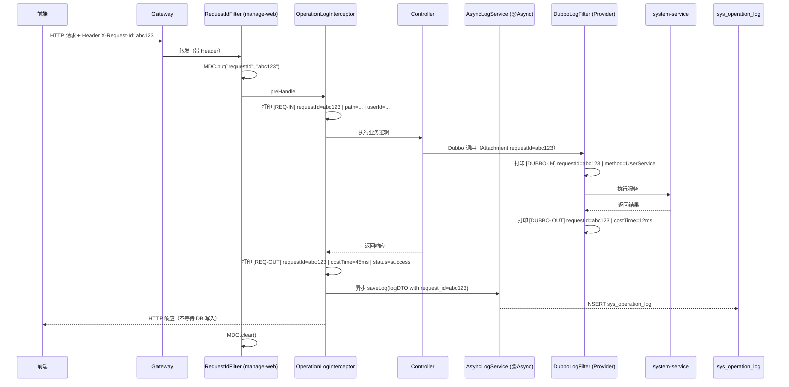
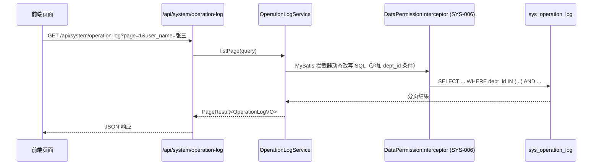

# Plan: 用户操作日志

## 1. 技术选型与对比

### 1.1 HTTP 日志拦截方案

| 方案 | 优点 | 缺点 | 选择 |
|------|------|------|------|
| HandlerInterceptor（preHandle + afterCompletion） | 天然两阶段，可分别打印 REQ-IN / REQ-OUT；与 Spring MVC 生命周期对齐 | 需要 `ContentCachingResponseWrapper` 读取响应体 | ✅ 选用 |
| Spring AOP + @OperationLog 注解 | 精确控制哪些接口记录 | 注解方式无法在执行前打印请求体（AOP @Before 尚无响应）；需每个方法加注解 | 退出控制台打印场景 |
| Filter 全局拦截 | 覆盖最全 | 无法方便地读取 Spring MVC 上下文（用户信息等） | 仅用于 requestId 写入 MDC |

> 结论：requestId 读取用 **Filter**（最早执行），HTTP 日志打印 + 数据库写入用 **HandlerInterceptor**。

### 1.2 异步数据库写入方案

| 方案 | 优点 | 缺点 | 选择 |
|------|------|------|------|
| @Async + Spring 线程池 | 零额外依赖，配置简单 | 服务重启瞬间队列中日志可能丢失（可接受） | ✅ 选用 |
| MQ（RocketMQ/Kafka） | 高并发可靠，削峰 | 引入额外中间件，首期不必要 | 后续扩展 |

### 1.3 Dubbo 过滤器注册方式

| 方案 | 优点 | 缺点 | 选择 |
|------|------|------|------|
| Dubbo SPI（META-INF/dubbo/...Filter） + 全局 filter 配置 | 标准扩展机制，无侵入，全服务统一生效 | 需要在每个微服务模块重复添加 SPI 文件 | ✅ 选用 |
| 在每个 @DubboService 上单独配置 filter | 粒度精细 | 容易遗漏，维护成本高 | 不选 |

> 建议将 `DubboLogFilter` 抽取到公共模块 `mro-common`，各微服务依赖即可，SPI 文件随模块携带。

### 1.4 前端技术

沿用项目栈：Vue 3 + Element Plus + Tailwind CSS，Mock-first（ADR-003）。

## 2. 阶段划分

| 里程碑 | 内容 | 交付物 | 预计工期 |
|--------|------|--------|----------|
| M1 — 数据层 | 创建 `sys_operation_log` 表 DDL（含 `request_id` 字段）；Entity / Mapper / Service 基础 CRUD | SQL 迁移脚本、MyBatis Mapper | 0.5 天 |
| M2 — requestId Filter | 实现 `RequestIdFilter`：从 `X-Request-Id` Header 读取 requestId → `MDC.put("requestId", id)`；请求结束 `MDC.clear()`；无 Header 时记 `-` | RequestIdFilter | 0.5 天 |
| M3 — HTTP 拦截器 | 实现 `OperationLogInterceptor`（HandlerInterceptor）：preHandle 打印 REQ-IN（requestId/path/time/userId/body 截断 512）；afterCompletion 打印 REQ-OUT（requestId/result 截断 1024/costTime/status）并异步写入 DB；使用 `ContentCachingResponseWrapper` 读取响应体 | OperationLogInterceptor、AsyncLogService | 1 天 |
| M4 — Dubbo 过滤器 | 实现 `DubboLogFilter`（抽到 `mro-common`）：调用前打印 DUBBO-IN（requestId/method/params 截断 512）；正常返回打印 DUBBO-OUT（requestId/method/costTime/result 截断 512）；异常打印 DUBBO-ERR（ERROR 级别）；SPI 注册 | DubboLogFilter、SPI 配置文件 | 0.5 天 |
| M5 — 后端查询接口 | 实现列表分页查询接口（带 SYS-006 数据权限过滤）、详情查询接口 | OperationLogController、查询 Service | 0.5 天 |
| M6 — 前端 Mock | 新建 `src/mock/api/operationLog.js`；Mock 列表（含 request_id 字段）+ 详情数据 | Mock 文件 | 0.5 天 |
| M7 — 前端页面 | 操作日志列表页（搜索栏、表格、分页）；详情抽屉（格式化 JSON + costTime 展示）；菜单权限 `log:list` 接入 | Vue 页面组件、api 模块 | 1 天 |
| M8 — 联调验收 | 切换 `VITE_USE_MOCK=false`；验证 spec 第 9 节所有验收条目；重点验证 requestId 跨 REQ-IN → DUBBO-IN → REQ-OUT 一致性 | 联调通过记录 | 0.5 天 |

## 3. 架构图 / 时序图

### 3.1 requestId 全链路传递

### 3.2 日志查询时序

## 4. 风险与回滚预案

| 风险 | 影响 | 缓解 | 回滚 |
|------|------|------|------|
| `ContentCachingResponseWrapper` 内存占用过大 | 大响应体（如文件下载）OOM | 响应体超 1024 字符截断后不再缓存原始体；文件下载接口加入白名单跳过读取 | 白名单中加入该接口路径 |
| HandlerInterceptor 抛出异常影响主业务 | 主业务接口报错 | preHandle / afterCompletion 全程 try-catch，异常仅打印不上抛 | 注释掉 `WebMvcConfigurer.addInterceptors` 注册即可全局关闭 |
| @Async 线程池满导致日志丢失 | 部分日志缺失 | 有界队列（capacity=1000）+ CallerRunsPolicy 降级同步写入 | 调整线程池参数 |
| Dubbo Attachment 在 Virtual Threads 下丢失 | DUBBO-IN 日志无 requestId | 验证 Dubbo 3.x + Java 21 Virtual Threads Attachment 传播；若有问题改用 InheritableThreadLocal 显式传递 | DubboLogFilter 降级：requestId 记 `-`，不影响业务 |
| SYS-006 数据权限未就绪 | 日志查询无法按权限过滤 | M5 预留 dept_id 字段；SYS-006 未就绪时暂不加 @DataScope | 去掉 @DataScope 注解，默认全量返回 |

## 5. 测试策略

- **单元测试**：
  - `RequestIdFilter`：验证有 Header 时 MDC 写入正确；无 Header 时 MDC 值为 `-`；请求结束后 MDC 已清空。
  - `OperationLogInterceptor`：Mock HttpServletRequest/Response，验证 REQ-IN / REQ-OUT 日志内容格式正确；验证超长 body/result 截断行为；验证异步写入触发。
  - `DubboLogFilter`：Mock Invoker/Invocation，验证正常返回打印 DUBBO-OUT、异常打印 DUBBO-ERR（ERROR 级别）；验证 requestId 从 Attachment 读取。

- **集成测试**：
  - 启动 Spring 容器，调用任意 `/api/` 接口，验证 `sys_operation_log` 表有对应记录且 `request_id` 字段正确。
  - 验证不同数据权限类型的用户查询结果符合预期（全部 / 本部门 / 本人）。
  - 验证同一请求的 REQ-IN、REQ-OUT、DUBBO-IN requestId 三者一致。

- **端到端（前端）**：
  - Mock 模式：列表页各搜索条件组合验证；详情面板 JSON 展示验证（含 request_id 字段）。
  - 联调模式：切换 `VITE_USE_MOCK=false`，验证接口响应与 Mock 格式一致。

## 6. 关联 ADR

- ADR-003: 前端先行 + Mock-first（M6 前端 Mock 阶段强制遵守）
- ADR-006: BFF + 微服务架构（OperationLogInterceptor 在 manage-web，DubboLogFilter 在各微服务）
- ADR-007: Java 21 特性（Virtual Threads MDC 兼容性需验证）
- ADR-008: Gateway 鉴权 HTTP（requestId 由前端生成，Gateway 透传）
- SYS-006: 数据权限过滤（M5 后端查询接口依赖）
- SYS-009: Log4j2 配置规范（MDC requestId 格式 `%X{requestId}` 依赖本 Spec 配置）
