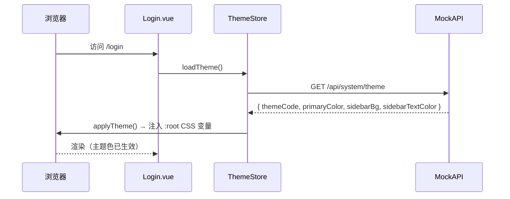
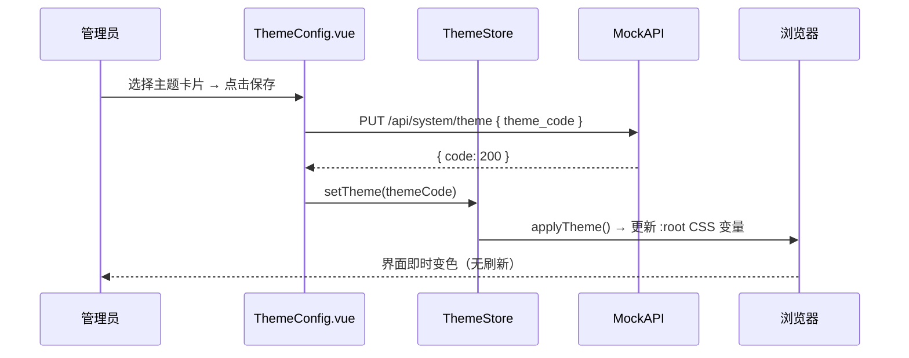

# Plan: 前端主题配置

## 1. 技术选型与对比

| 方案 | 优点 | 缺点 | 选择 |
|------|------|------|------|
| CSS 变量动态注入（`:root` + `document.documentElement.style.setProperty`） | 浏览器原生支持，无额外依赖；Element Plus 官方推荐的主题覆盖方式；切换零闪烁 | 需枚举所有 EP 衍生变量（light-1~9、dark-2） | ✅ 选用 |
| SCSS 变量编译多套主题文件 | 类型安全 | 需发版；无法运行时切换 | ❌ 不适用 |
| CSS-in-JS（UnoCSS 主题） | 灵活 | 与现有 Tailwind + Element Plus 栈有冲突 | ❌ 不适用 |

**核心技术决策：**
- 前端通过 `src/utils/theme.js` 封装 `applyTheme(themeData)` 函数，调用 `document.documentElement.style.setProperty` 注入以下 CSS 变量：
  - `--el-color-primary`、`--el-color-primary-light-{1~9}`、`--el-color-primary-dark-2`
  - `--sidebar-bg`、`--sidebar-text-color`（Sidebar.vue 读取）
- 主题配置通过 `src/stores/theme.js`（Pinia）持有，全局响应式。
- GET `/api/system/theme` 公开接口，登录页和主界面均可调用。

## 2. 阶段划分

| 里程碑 | 内容 | 交付物 | 预计工期 |
|--------|------|--------|----------|
| M1 | Mock + API 模块 + 主题工具函数 | `src/mock/api/theme.js`、`src/api/theme.js`、`src/utils/theme.js`、`src/stores/theme.js` | 0.5 天 |
| M2 | 登录页 & 主界面自动加载主题 | Login.vue / main.js 接入 applyTheme；Sidebar.vue 读取 CSS 变量 | 0.5 天 |
| M3 | 主题配置管理页面 | `src/pages/system/ThemeConfig.vue`、路由注册、菜单项 | 1 天 |

## 3. 架构图 / 时序图

### 主题加载时序（登录页）

### 主题切换时序（管理员）

## 4. 风险与回滚预案

| 风险 | 影响 | 缓解 | 回滚 |
|------|------|------|------|
| Element Plus 版本升级后衍生变量名变更 | 主题色注入失效 | 封装到 `theme.js` 集中维护变量名列表，升级时统一检查 | 恢复上一版 EP 版本 |
| Sidebar.vue 目前使用硬编码颜色（非 CSS 变量） | 侧边栏主题色不生效 | M2 中统一将 Sidebar 颜色改为读取 CSS 变量 | 保持原硬编码样式 |
| GET 接口公开后被滥用 | 低（仅返回主题颜色，无敏感信息） | 接口仅返回颜色枚举，无业务数据 | 加回 JWT 校验并在登录页使用默认主题 |

## 5. 测试策略

- **手动验证（Mock 环境）**：切换 7 种主题，确认主色、侧边栏、EP 按钮/链接颜色均变化。
- **降级测试**：Mock 返回 500，确认前端使用 internet 默认主题，无白屏。
- **持久化测试**：保存主题 → 刷新页面，确认主题不丢失。
- **权限测试**：manager 账号（无 system:theme:edit）在主题页无保存按钮，直接 PUT 返回 403。

## 6. 关联 ADR

- ADR-003：前端先行 + Mock-first 开发（Mock 文件与接口契约同步）
