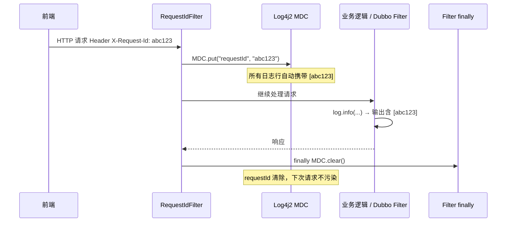

# Plan: Log4j2 应用运行日志配置规范

## 1. 技术选型与对比

### 1.1 日志实现框架

| 方案 | 优点 | 缺点 | 选择 |
|------|------|------|------|
| Log4j2 + SLF4J 门面 | 异步 Logger（LMAX Disruptor）性能最优；支持热重载；`%X{requestId}` MDC 原生支持；2.24.0+ 支持 Virtual Threads | 需排除 Spring Boot 默认的 Logback | ✅ 选用 |
| Logback + SLF4J | Spring Boot 默认，零配置 | 异步性能弱于 Log4j2；无内置 monitorInterval 热重载 | 不选 |
| JUL（java.util.logging） | JDK 内置 | 功能贫乏，生态差 | 不选 |

### 1.2 APP_NAME 变量注入方式

| 方案 | 优点 | 缺点 | 选择 |
|------|------|------|------|
| `log4j2-spring.xml` + `<springProperty>` 读取 `spring.application.name` | 与 Spring Boot 配置中心（Nacos）集成，动态读取 | 文件名必须为 `log4j2-spring.xml`，需 Spring Boot 加载后才解析，startup 早期日志不含 APP_NAME | ✅ 选用 |
| `log4j2.xml` 内 `<property>` 硬编码 | 简单直接，无依赖 | 每个服务需单独维护配置文件，APP_NAME 维护在两处 | 不选 |
| JVM 启动参数 `-DAPP_NAME=xxx` | 运维灵活 | 需要在每个服务启动脚本中维护，易遗漏 | 备用方案 |

> 结论：使用 `log4j2-spring.xml`，通过 `<springProperty name="APP_NAME" source="spring.application.name"/>` 动态读取，`spring.application.name` 统一在 Nacos 配置中心管理。

### 1.3 Mapper SQL 日志异步方案

| 方案 | 优点 | 缺点 | 选择 |
|------|------|------|------|
| `<AsyncLogger>` + LMAX Disruptor | Log4j2 原生异步，性能最优，零代码改动 | 需引入 `disruptor` 依赖 | ✅ 选用 |
| `<AsyncAppender>` 包裹 RollingFile | 兼容性好 | 仍在调用线程序列化消息，性能略低于 AsyncLogger | 备选 |

## 2. 阶段划分

| 里程碑 | 内容 | 交付物 | 预计工期 |
|--------|------|--------|----------|
| M1 — 公共模块配置模板 | 在 `mro-common` 中提供 `log4j2-spring.xml` 模板（含四级 RollingFile、AsyncLogger、MDC 格式）；编写配置说明文档 | `mro-common/src/main/resources/log4j2-spring.xml.template` | 0.5 天 |
| M2 — 各服务接入 | 各服务 `pom.xml` 排除 `spring-boot-starter-logging`，引入 `spring-boot-starter-log4j2`（≥2.24.0）和 `disruptor`；复制模板为本服务 `log4j2-spring.xml`，修改 `APP_NAME` 对应的 `spring.application.name` | 各服务 pom.xml、log4j2-spring.xml（共 13 个服务） | 1 天 |
| M3 — MDC requestId 验证 | 与 SYS-007 联调：验证 HTTP 请求日志行中 `[requestId]` 字段正确；验证 Dubbo 调用链日志 requestId 传递；验证 MDC.clear() 后无泄漏 | 联调验证记录 | 0.5 天 |
| M4 — Virtual Threads 兼容验证 | 在 Java 21 + `spring.threads.virtual.enabled=true` 环境下运行集成测试；验证异步线程中 MDC requestId 不丢失 | 测试报告 | 0.5 天 |
| M5 — 验收 | 执行 spec 第 9 节全部验收条目；检查各服务日志目录结构、归档文件命名、级别过滤正确性 | 验收通过记录 | 0.5 天 |

## 3. 架构图 / 时序图

### 3.1 Log4j2 日志分发流程

```mermaid
flowchart TD
    A[业务代码 log.info / log.debug] --> B[SLF4J 门面]
    B --> C[Log4j2 实现]
    C --> D{Logger 路由}
    D -->|com.mro.*.mapper| E[AsyncLogger\nTRACE 级]
    D -->|其他| F[Root Logger\nINFO 级]
    E --> G[Console Appender]
    E --> H[RollingFileDebug]
    F --> G
    F --> I[RollingFileInfo\nINFO+]
    F --> H
    F --> J[RollingFileWarn\nWARN+]
    F --> K[RollingFileError\nERROR+]
    H --> L[/opt/logs/mro-{APP}/debug.log\n归档 max=30]
    I --> M[/opt/logs/mro-{APP}/info.log\n归档 max=7]
    J --> N[/opt/logs/mro-{APP}/warn.log\n归档 max=20]
    K --> O[/opt/logs/mro-{APP}/error.log\n归档 max=7]
```

### 3.2 MDC requestId 注入时机



## 4. 风险与回滚预案

| 风险 | 影响 | 缓解 | 回滚 |
|------|------|------|------|
| Log4j2 与 Spring Boot 3.x 版本冲突 | 服务启动失败 | 严格按 Spring Boot 官方版本矩阵选择 `spring-boot-starter-log4j2` 版本；M2 阶段每个服务接入后立即冒烟测试 | 回退 `pom.xml` 依赖版本 |
| `log4j2-spring.xml` 在 Nacos 配置未加载时 `APP_NAME` 为空 | 日志目录路径为 `/opt/logs/mro-null/` | 在 `log4j2-spring.xml` 中为 `APP_NAME` 设置默认值 `unknown-service`；同时配置 `logging.config` 确保 Spring Boot 识别文件 | 降级为 JVM 参数 `-DAPP_NAME=xxx` |
| Virtual Threads 下 MDC 丢失 | requestId 在异步线程日志中为空 | Log4j2 2.24.0+ 默认启用 `InheritableThreadLocal` 模式，需验证；若不支持，改用 `ThreadContext.putAll()` 显式传递 | 降级记录 `-`，不影响业务 |
| disruptor 依赖冲突 | AsyncLogger 初始化失败 | 指定 `disruptor` 版本与 Log4j2 2.24.0 官方推荐版本对齐 | 改用 `<AsyncAppender>` 替代 `<AsyncLogger>` |
| debug.log 磁盘占用过大 | 磁盘告警 | 生产环境 Mapper AsyncLogger level 调整为 INFO（关闭 SQL 日志）；200MB 单文件 + max=30 总量约 6GB，需确保磁盘容量 | 临时调高 ThresholdFilter level 减少输出 |

## 5. 测试策略

- **单元测试**：
  - 验证 `log4j2-spring.xml` 配置文件语法正确（Log4j2 配置解析无报错）。
  - 验证 `APP_NAME` 变量替换后日志目录路径正确。

- **集成测试**：
  - 启动任意一个服务，检查 `/opt/logs/mro-{服务名}/` 下四个日志文件均已创建。
  - 写入 INFO 日志，验证出现在 info.log 但不出现在 warn.log / error.log。
  - 写入 DEBUG 日志，验证仅出现在 debug.log 和 Console。
  - 触发 Mapper SQL 查询，验证 SQL 日志出现在 debug.log 但不出现在 info.log（`additivity=false`）。
  - 修改 `log4j2-spring.xml` 中 Root level 为 DEBUG，等待 ≤30 秒，验证热重载生效。

- **Virtual Threads 专项测试**：
  - 在 `spring.threads.virtual.enabled=true` 环境下，发起携带 `X-Request-Id` 的请求，验证所有日志行（含异步 Mapper SQL）中 requestId 与请求 Header 值一致。

## 6. 关联 ADR

- ADR-003: 前端先行 + Mock-first（本 Spec 为纯后端基础设施，与 Mock 策略无冲突）
- ADR-006: BFF + 微服务架构（Log4j2 需在 13 个服务中统一配置）
- ADR-007: Java 21 特性（Virtual Threads 启用后 MDC 传递需额外验证）
- SYS-007: 用户操作日志（依赖本 Spec 的 MDC requestId 格式 `%X{requestId}` 输出）
